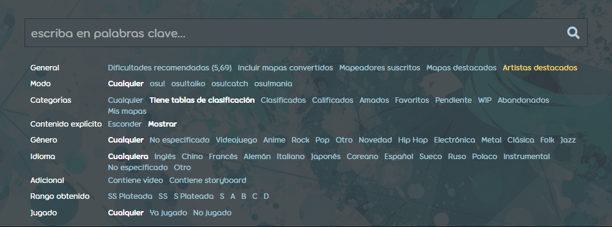

---
tags:
  - genres
  - languages
  - metadata
---

# Género e idioma

Los [mapas](/wiki/Beatmap) enviados al sitio web tienen campos de **género** e **idioma** para ayudar a clasificar las canciones. Se consideran parte de los [metadatos](/wiki/Client/Beatmap_editor/Song_Setup#song-and-map-metadata) de un mapa.

El género y el idioma no tienen ninguna función en el juego, pero estarán disponibles como opciones de búsqueda en [osu!(lazer)](/wiki/Client/Release_stream/Lazer).

## Listado de mapas

El [listado de mapas](https://osu.ppy.sh/beatmapsets) tiene filtros disponibles para el género y el idioma en el menú desplegable `Más opciones de búsqueda`.

## Cambiar el género y el idioma de un mapa

El género y el idioma se pueden cambiar en el sitio web haciendo clic en el ícono del lápiz al pasar el ratón sobre los detalles de un mapa. La capacidad para hacerlo está determinada por el [grupo del usuarios](/wiki/People/osu!_team#user-groups) y la [categoría](/wiki/Beatmap/Category#categorias-presentes) del mapa:

- Los propietarios de los conjuntos de mapas están permitidos cuando el mapa está en la categoría [Trabajo en progreso](/wiki/Beatmap/Category#trabajos-en-progreso-y-pendientes), [Pendiente](/wiki/Beatmap/Category#trabajos-en-progreso-y-pendientes), o [Abandonado](/wiki/Beatmap/Category#abandonados), y no tiene ninguna [nominación](/wiki/Beatmap_ranking_procedure#nominations).
- Los [Beatmap Nominators](/wiki/People/Beatmap_Nominators) están permitidos cuando el mapa está en la categoría [Calificado](/wiki/Beatmap/Category#calificados), Trabajo en progreso, o Pendiente.
- Los miembros del [Project Loved Team](/wiki/People/Project_Loved_Team) están permitidos cuando el mapa está en la categoría [Amado](/wiki/Beatmap/Category#amadoss).
- Los miembros del [Nomination Assessment Team](/wiki/People/Nomination_Assessment_Team) y del [Global Moderation Team](/wiki/People/Global_Moderation_Team) están permitidos en todas las categorías.

Un mapa no puede ser [nominado](/wiki/Beatmap_ranking_procedure#nominations) si tiene el género o idioma `No especificado`.

## Lista de géneros

| Género | Características de las canciones aplicables |
| :-- | :-- |
| No especificado | Ninguna canción es aplicable. Este género es un marcador de posición hasta que se establezca uno adecuado. |
| Videojuego | Hecha para o popularizada por un videojuego. Esto también se usa para arreglos y remezclas de esas canciones. |
| Anime | Hecha para o popularizada por un anime o medio similar. |
| Rock | Centrándose principalmente en guitarras, batería y bajo, típicamente «construido sobre una base de ritmos simples no sincopados» y caracterizado por «actuaciones en vivo y un enfoque en temas serios y progresivos». ([*Rock* en Wikipedia](https://es.wikipedia.org/wiki/Rock#Características)). |
| Pop | Destacada en la cultura pop, y compuesta para ser pegadiza mediante el uso de una estructura simple y coros o melodías repetidas. |
| Otro | No pertenece a ninguno de los géneros enumerados. |
| Novedad | Cómica o inusual. En osu!, esta categoría incluye principalmente canciones como YouTube Poops, Niconico MAD y música meme. |
| Hip Hop | «Música rítmica estilizada que comúnmente acompaña al rap», a veces «muestreo de ritmos o líneas de bajo de discos». ([*Hip hop* en Wikipedia](https://es.wikipedia.org/wiki/Hip_hop)). |
| Electrónica | Compuesta digitalmente o con instrumentos electrónicos. |
| Metal | Tiene un sonido pesado, hace uso de ruidosas y distorsionadas guitarras eléctricas y bajos fuertes, y contiene ritmos de batería rápidos o densos. |
| Clásica | Formal, estructurada en torno a la teoría musical avanzada y con raíces en la antigua cultura occidental o inspirándose en ella. |
| Folk | Tradicional o personal, informal, y que refleja la identidad de una cultura o grupo de personas. |
| Jazz | Centrándose en la improvisación y tomando prestados estilos rítmicos africanos y cubanos. Por lo general, presenta pianos e instrumentos que se usarían en bandas de marcha. |

## Lista de idiomas

- Inglés
- Chino
- Francés
- Alemán
- Italiano
- Japonés
- Coreano
- Español
- Sueco
- Ruso
- Polaco
- Instrumental
- No especificado
- Otro (incluyendo canciones con múltiples idiomas prominentes)
