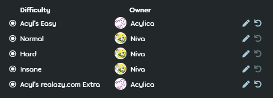

---
tags:
  - GD
  - guest beatmap
  - guest difficulties
  - guest map
outdated_translation: true  
outdated_since: 027b9fddf66f3afb730270124a3771ae09ad8f77 
---

# Guest difficulties

*Pour les règlements concernant les guest difficulties, voir : [Critères de classement](/wiki/Ranking_criteria)*

Les **guest difficulties**, abrégé en *GD*, sont des [difficultés](/wiki/Beatmap/Difficulty) d'une [beatmap](/wiki/Beatmap) qui ne sont pas créée par l'[hôte de la beatmap](/wiki/Beatmap/Beatmap_host). Elles peuvent généralement être identifiées par leur nom de difficulté contenant le nom d'utilisateur du créateur invité.

Bien qu'elles ne soient pas obligatoires, les guest difficulties peuvent être bénéfiques en de nombreuses occasions, car elles présentent souvent des styles de mapping complètement différents les uns des autres, ce qui permet de diversifier la beatmap et de réduire l'épuisement du mapping. Les guest difficulties sont le plus souvent demandées par le biais de messages privés entre mappeurs, mais elles peuvent aussi être demandées par d'autres moyens, comme le canal `#mapping` du jeu ou les [files d'attente de modding](/wiki/Community/Forum/Modding_Queues).

Les guest difficulties ne doivent pas être confondues avec les difficultés qui mettent en scène plusieurs mappeurs, qui sont plutôt connues sous le nom de [collabs](/wiki/Beatmap/Beatmap_collaborations).

## Propriétaire

::: Infobox

:::

Sur la page de [discussion d'une beatmap](/wiki/Beatmap_discussion), l'hôte de la beatmap peut transférer la propriété des guest difficulties à leurs mappeurs respectifs par le biais du bouton `Difficulty Owner`. Cela permet aux propriétaires des guest difficulties de résoudre eux-mêmes les problèmes en suspens dans leurs difficultés.

Le propriétaire d'une guest difficulty ne peut pas être modifié si la beatmap est [qualifiée](/wiki/Beatmap/Category#qualified), [classée](/wiki/Beatmap/Category#ranked), ou [loved](/wiki/Beatmap/Category#loved).
