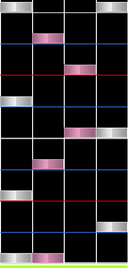

# Stream

*For specific stream types unrelated to 4-key, refer to [chordstreams](mania/chordstreams).*

**Streams** are constant notes within the same snap interval that occur for at least one beat, avoiding an occurance of a [minijack](/wiki/Beatmap/Pattern/Mania/Jacks/en.md#Minijack). There are many different types of streams that impose different levels of strain on the player. When a stream is used on its own, it's likely referring to a **single note stream**.

A **roll** is a common variation of a stream consisting of notes that go from the first to the last column or last to the first column.

**Streams** that appear shorter than one beat are typically referred to as **bursts**, which are a shorter and quick succession of notes. They commonly use snaps higher than 1/4th.

## Jumpstream

**Jumpstreams** are streams that involve [jumps](/wiki/Beatmap/Pattern/Mania/Chords/en.md#Jumps). Usually, the stream itself is on 1/4th snaps whilst the jumps land on snaps greater than 1/4th. This is the most common type of stream pattern used in 4-key osu!mania.

 It's also loosely referred to as a type of chordstream, which mixes different types of chords and streams.

## Handstream

**Handstreams** are streams that involve [hands](/wiki/Beatmap/Pattern/Mania/Chords/en.md#Hands), and may involve jumps as well. Similar to jumpstreams, the stream itself is on 1/4th snaps whilst the chords can land on snaps greater than 1/4th.

This is also a type of chordstream.

## Quadstream

**Quadstreams** is a term that is almost exclusively used for 4K osu!mania. Similar to the previous two types of streams, it's a stream that involves the usage of quads as well as other smaller chords. Contrastingly, it creates [minijacks](/wiki/Beatmap/Pattern/Mania/Jacks/en.md#Minijack) between the quad and the succession of notes.

