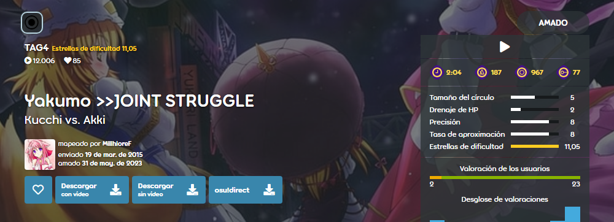

---
tags:
  - multiplayer
  - co-op
  - multijugador
  - cooperativo
---

# Beatmaps TAG

*No confundir con las etiquetas, que son [parte de los metadatos de un beatmap](/wiki/Client/Beatmap_editor/Song_setup).*

Los **beatmaps TAG** (o simplemente *TAG*) son beatmaps que han sido creados específicamente para los [modos Tag co-op o Tag-team VS](/wiki/Client/Interface/Multiplayer#tag-co-op-/-tag-team-vs) de las [salas multijugador](/wiki/Client/Interface/Multiplayer). Por lo tanto, estos beatmaps a menudo requieren el juego cooperativo entre dos o más jugadores en la sala para poder ser completados.

En estos modos, cada jugador es responsable de una cadena de un [combo](/wiki/Beatmapping/Combo), y a lo largo de la canción, los jugadores alternan entre las distintas cadenas de combo. Por esta razón, los beatmaps TAG están diseñados de tal manera que sus cadenas de combo están colocadas muy separadas entre sí, lo que hace casi imposible que un solo jugador pase el beatmap.

Las [dificultades](/wiki/Beatmap/Difficulty) TAG suelen indicarse mediante el uso del término `TAG` en el nombre de la dificultad del beatmap. La mayoría de las veces, `TAG` irá seguido de un número, que generalmente indica para cuántos jugadores está destinada la dificultad (por ejemplo, `TAG2` para dos jugadores o `TAG4` para cuatro jugadores).

Debido a sus características, las dificultades TAG suelen ser no clasificadas, [aprobadas](/wiki/Beatmap/Category#approved) o [amadas](/wiki/Beatmap/Category#loved). Sin embargo, en raras ocasiones, un beatmap TAG que siga los [criterios de clasificación](/wiki/Ranking_criteria) y sea considerado adecuado para ser clasificado por los [Beatmap Nominators](/wiki/People/Beatmap_Nominators) puede llegar a la sección de [clasificados](/wiki/Beatmap/Category#ranked).
