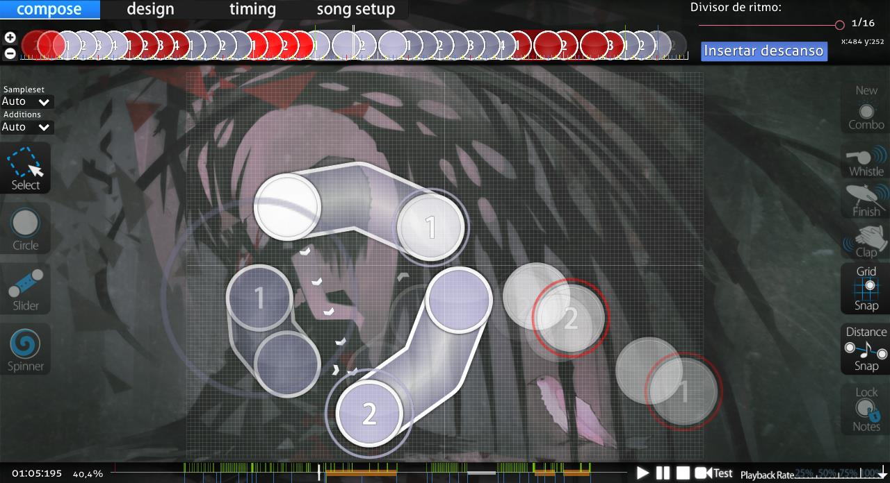
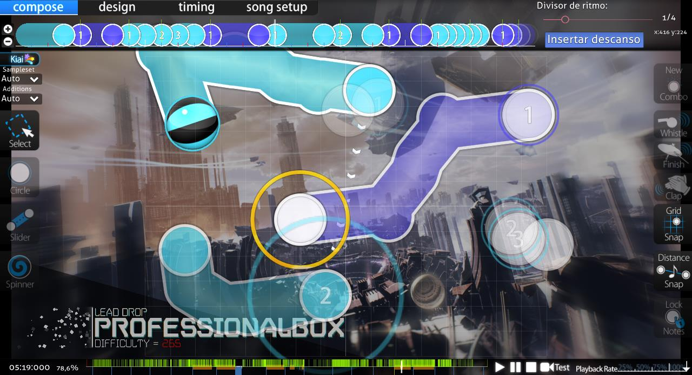

# Mapas técnicos

*Aviso: Para el propósito de este artículo, el término «tech map» se tratará como un término general que incluye todas estas definiciones.*

**Mapa técnico** (a menudo abreviado como «tech maps») es un término que no tiene una definición clara y acordada entre la comunidad de osu!. Dependiendo del usuario, un «tech map» puede ser tan amplio como un [beatmap](/wiki/Beatmap) que simplemente contiene [patrones](/wiki/Beatmap/Pattern) no genéricos, o tan específico como un beatmap que es denso en número de [objetos](/wiki/Gameplay/Hit_object) y contiene muchas formas irregulares de [sliders](/wiki/Gameplay/Hit_object/Slider) que cambian rápida y drásticamente las velocidades (a menudo a alta intensidad).

Los mapas técnicos suelen asociarse con géneros de canciones que ofrecen sonidos complejos y de ritmo rápido (por ejemplo, drum-and-bass, dubstep y drumstep), ya que a menudo le permiten al mapper explorar todos y cada uno de los sonidos individuales en detalle para beneficio del beatmap. Aunque no se requiere explícitamente música de este tipo.

Independientemente de la definición, muchos jugadores afirman que los tech maps son injustos (en términos de habilidad) debido al principal aumento de la dificultad que se deriva principalmente o únicamente de patrones confusos o sliders irregulares. Asimismo, esto significa que no son muy populares para ganar grandes cantidades de [pp](/wiki/Performance_points) a la vez debido a la forma en que funciona el sistema actual y cómo infravalora los beatmaps de esta naturaleza.

## Definiciones

Debido a la naturaleza amplia del término «tech map», existen muchos aspectos diferentes que podrían describirlo. Las listas siguientes describen diferentes definiciones de «tipos» populares de jugadores.

### Definición más amplia

*Aviso: La definición «más amplia» solo requiere que uno o dos de los aspectos enumerados estén presentes para poder definir un beatmap como técnico.*

- Patrones no genéricos o difíciles de leer (se muestra un ejemplo a continuación)
  - Un «flow» difícil para el beatmap
- Sliders SV
  - Estos pueden contener slider art
- Formas irregulares de sliders
- Cambios rápidos y bruscos en la velocidad del slider
- Alta intensidad general
  - Extremadamente denso en el recuento de objetos en gran parte del mapa (excluyendo [streams](/wiki/Beatmap/Pattern/osu!/Stream))

Buenos ejemplos de mapas técnicos que se ajustan a esta definición son [Silentroom - Nhelv (Nyxa) \[iniquitatem\]](https://osu.ppy.sh/beatmapsets/917915#osu/2009432) y [RUMI - Densetsu no Matsuri (Net0) \[Oni\]](https://osu.ppy.sh/beatmapsets/781683#osu/1641637).

### Definición más restrictiva/específica

*Aviso: La definición «más restrictiva/específica» requiere que **todos** los aspectos enumerados estén presentes para poder definir un beatmap como técnico.*

- Formas irregulares de sliders
- Cambios rápidos y bruscos en la velocidad del slider
- Sliders SV
- Patrones difíciles de leer (a menudo descritos como de «flow» difícil) (se muestra un ejemplo a continuación)

")

Buenos ejemplos de mapas técnicos que se ajustan a esta definición son [Camelia - Exit This Earth's Atomosphere (Camellia's "PLANETARY//200STEP" Remix) (ProfessionalBox) \[Primordial Nucleosynthesis\]](https://osu.ppy.sh/beatmapsets/855677#osu/1787848) y [LeaF - MARENOL (Yugu) \[Extra\]](https://osu.ppy.sh/beatmapsets/1136149#osu/2404722).
