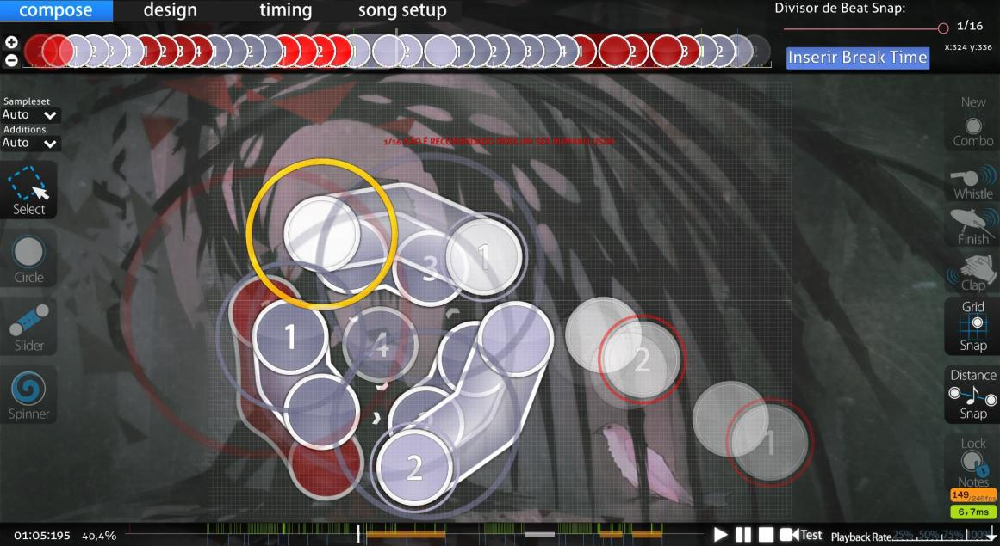

# Mappe tecniche

*Nota: Ai fini di questo articolo, il termine "mappa tech" verrà trattato come un termine ombrello che include tutte queste definizioni.*

**Mappe tecniche** (spesso abbreviato in "mappe tech") è un termine che non ha una definizione chiara e condivisa dall'intera community di osu!. A seconda dell'utente, il termine "mappa tech" può essere ampio come una [beatmap](/wiki/Beatmap) che contiene semplicemente [pattern](/wiki/Beatmap/Pattern) non generici, o specifico come una beatmap densa di [note](/wiki/Gameplay/Hit_object) e contenente molti [slider](/wiki/Gameplay/Hit_object/Slider) irregolari che cambiano rapidamente e drasticamente velocità (spesso ad alta intensità).

Le mappe tech sono spesso associate a generi musicali che offrono suoni complessi e veloci (ad esempio, drum-and-bass, dubstep e drumstep), in quanto spesso consentono al mapper di esplorare nel dettaglio ogni singolo suono a vantaggio della beatmap. Anche se questo tipo di musica non è esplicitamente richiesto.

Indipendentemente dalla definizione, molti giocatori sostengono che le mappe tech siano ingiuste (in termini di abilità) a causa dell'aumento della difficoltà derivante principalmente o esclusivamente da pattern confusionari o slider irregolari. Di conseguenza, non sono molto gettonate per ottenere grandi quantità di [pp](/wiki/Performance_points) in una volta sola, a causa del modo in cui il sistema attuale funziona e di come sottovaluta le beatmap di questa natura.

## Definizioni

Data l'ampia natura del termine "mappa tech", ci sono molti aspetti diversi che possono descrivere il termine. Gli elenchi che seguono descrivono le diverse definizioni dei "tipi" di giocatori più diffusi.

### Definizione più ampia

*Nota: La definizione "più ampia" richiede solo la presenza di uno o due degli aspetti elencati per definire una beatmap come tech.*

- Pattern non generici o difficili da leggere (esempio riportato di seguito)
  - Uno "scorrimento" duro per la beatmap
- Slider SV
  - Questi potrebbero contenere slider art
- Forme di slider irregolari
- Variazioni rapide e nette nella velocità degli slider
- Alta intensità generale
  - Densità di oggetti estremamente alta in gran parte della mappa (esclusi gli [stream](/wiki/Beatmap/Pattern/osu!/Stream))

Buoni esempi di mappe tech che rientrano in questa definizione sono [Silentroom - Nhelv (Nyxa) \[iniquitatem\]](https://osu.ppy.sh/beatmapsets/917915#osu/2009432) e [RUMI - Densetsu no Matsuri (Net0) \[Oni\]](https://osu.ppy.sh/beatmapsets/781683#osu/1641637).

### Definizione più restrittiva/specifica

*Nota: La definizione "più restrittiva/specifica" richiede la presenza di **tutti** gli aspetti elencati per definire una beatmap come tech.*

- Forme di slider irregolari
- Variazioni rapide e nette nella velocità degli slider
- Slider SV
- Pattern difficili da leggere (spesso descritti come aventi uno "scorrimento" duro) (esempio mostrato di seguito)

")

Buoni esempi di mappe tech che rientrano in questa definizione sono [Camelia - Exit This Earth's Atomosphere (Camellia's "PLANETARY//200STEP" Remix) (ProfessionalBox) \[Primordial Nucleosynthesis\]](https://osu.ppy.sh/beatmapsets/855677#osu/1787848) e [LeaF - MARENOL (Yugu) \[Extra\]](https://osu.ppy.sh/beatmapsets/1136149#osu/2404722).
