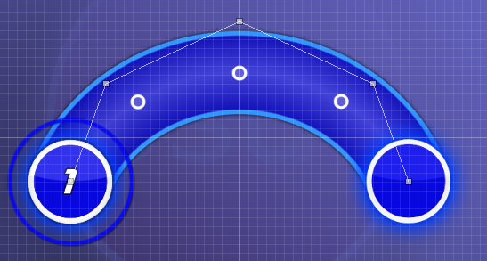
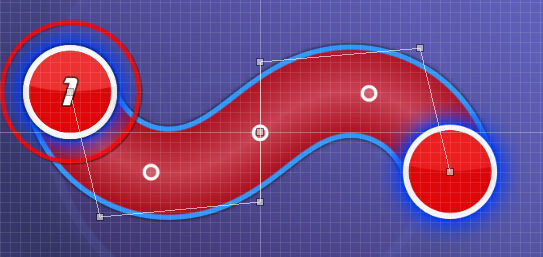
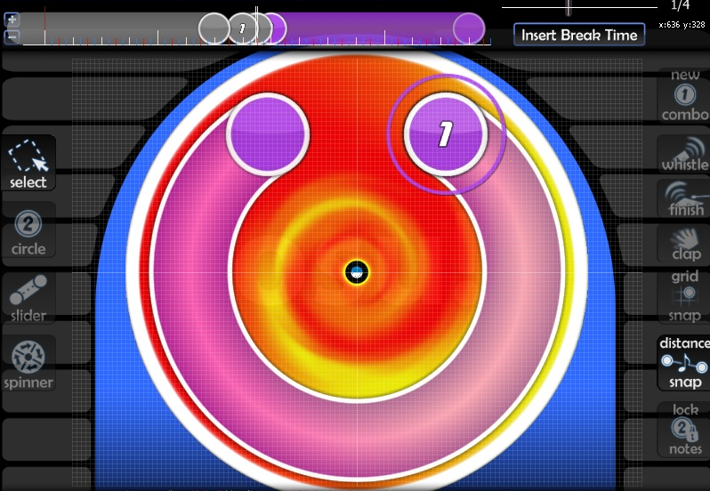
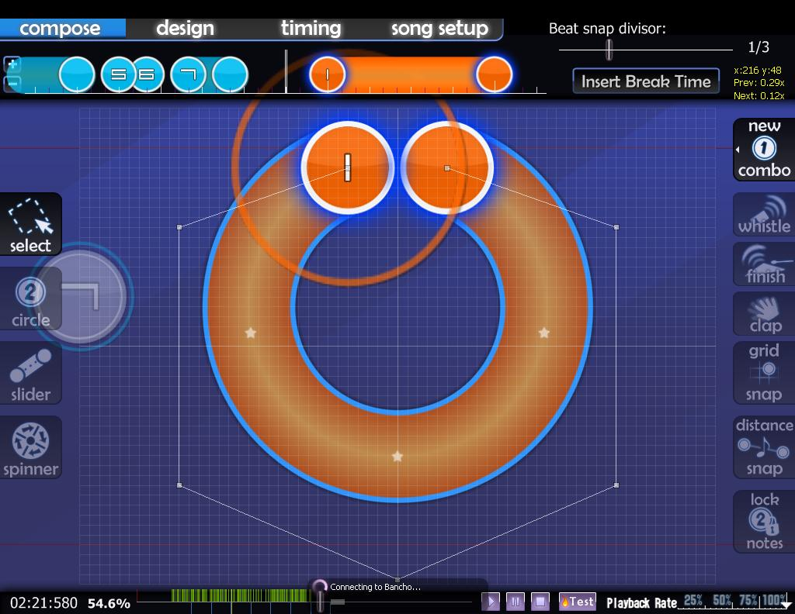

# Cómo hacer buenos sliders

Este artículo es un manual sobre cómo hacer buenos sliders.
En su forma más básica, todo lo que necesita es una [curva de Bézier](https://es.wikipedia.org/wiki/Curva_de_Bézier).

Mensaje de [Ephemeral](https://osu.ppy.sh/users/102335) traducido al español:

> Alinea siempre los puntos finales de los sliders al valor más pequeño posible, es decir, si los arrastras más hacia atrás, el slider se reducirá. El punto se centrará en el final del slider y facilitará mucho la realización de curvas transitables.

  Además, hacer esto hace que la selección inversa en los sliders no se estropee.
  Lo cual es bueno.

## Arcos

Usa la misma técnica para cualquier slider simétrico en un eje.

Esta es la forma más fácil de hacer.
Básicamente, lo primero que hay que hacer es colocar todos los puntos simétricamente en la rejilla.
Selecciónalo y presiona `Ctrl` + `H` cuando creas que lo tienes preciso para asegurarte de que los puntos se encuentran en rejillas simétricas.
Luego, mueve los puntos hasta que el slider tenga la longitud adecuada y quede un poco por debajo del punto final.
Es importante que siempre que muevas un punto, muevas el punto correspondiente exactamente igual para mantener todos los puntos simétricos entre sí.
Asegúrate de presionar `Ctrl` + `H` a menudo para comprobar que no te has equivocado.

Para hacer que el slider end y el punto final se alineen, mantén presionada la tecla Mayús para desactivar el anclaje de la rejilla y mueve el punto superior hacia abajo hasta que el slider end esté justo en el último punto.
Cuando creas que está perfecto, selecciona y presiona `Ctrl` + `H` unas cuantas veces y comprueba si el punto final se mueve.
Si no es así, felicidades, tienes un slider precioso.
Enséñaselo a tus amigos.
Si se mueve así, desplaza el punto superior hasta que funcione.

Si quieres un arco en un ángulo, normalmente es más fácil hacerlo vertical como en el ejemplo de arriba, haz clic `Editar`, luego en `Rotar` para hacerlo en el ángulo que quieras.

## Ondas

Usa la misma técnica para cualquier slider que sea rotacionalmente simétrico.

Las ondas se hacen de forma muy similar a los arcos, solo que sus puntos deben ser rotacionalmente simétricos entre sí, en lugar de estar volteados horizontalmente.
Si presionas `Ctrl` + `H` + `J` rota el slider 180 grados para que puedas comprobar que los puntos coinciden.

Para alinear el slider end y el punto final elige dos puntos simétricos iguales.
Desactiva el anclaje de la rejilla y muévelos hacia dentro poco a poco hasta que el slider end y el último punto estén uno encima del otro.

## Blankets

*Página principal: [Combos blanket](/wiki/Beatmapping/Mapping_techniques/Formations#combos-blanket)*

Los blankets son más fáciles de hacer si primero examinas el slider para que sea más o menos correcto, y luego te desplazas a un punto de la línea de tiempo en el que el círculo de aproximación del ritmo se alinee con el borde más cercano del punto de inicio del slider.
Puede ser útil ajustar el divisor de ritmo a 1/8 para que quede bien.
Luego, solo tienes que ajustar los puntos hasta que todo el slider se alinee con el círculo de aproximación tan perfectamente como puedas.

Ten en cuenta que si quieres que un slider cubra **y** sea perfectamente simétrico, preocúpate primero de la simetría y luego ajusta los puntos simétricamente para mejorar el blanket.

---

Mensaje de [Gonzvlo](https://osu.ppy.sh/users/237733) traducido al español:

> Como variante de los blankets, a veces uso un spinner para hacer círculos bonitos.

## Círculos

Cortesía de mm201.

El número de puntos de control depende del ángulo cubierto por tu arco:

- 0 grados: 2 puntos.
- 0-20 grados: 3 puntos.
- 20-170 grados: 4 puntos.
- 170-200 grados: 5 puntos.
- 200-300 grados: 6 puntos.
- 300-350 grados: 7 puntos.

Nada de esto es realmente exacto, solo una idea general.
De forma similar a las ondas, cuanto más lejos esté el punto de control del inicio/final en orden, más se aleja de la curva.
Asegúrate de que la primera y la última línea de control apuntan en la dirección en la que quieres que empiece tu bucle.
Las otras, ajústalas a ojo hasta que estén casi redondas.
Usar un círculo de aproximación como guía puede ayudar en este sentido.

Al igual que con la mayoría de las formas, mantén un punto de control (dos si el número de puntos es par) para sacarlo del ajuste de la rejilla y poder alinear el punto final.

## Doblados

Usa la misma técnica para cualquier slider con puntas rectas y puntas curvas.

Cuando quieras un slider con una transición entre una punta curva y una punta recta, usa un punto rojo donde cambie.
Lo más importante es **poner siempre el punto rojo y los puntos a ambos lados en línea recta**.
Exactamente recto.
Usa una regla si es necesario.
No queremos curvas cerradas aquí, gracias.
Pero sí, aparte de eso, es bastante sencillo.

## Corazones

Usa la misma técnica para cualquier slider que sea simétrico, pero el punto de inicio esté en la línea central.

Una forma agradable para usar a veces.
Así se hace una.

### Cómo hacer una forma de corazón

Primero, haz una forma de corazón básica, ligeramente más larga de lo que necesites, con los puntos de inicio y final en el mismo lugar en la parte inferior.
Intenta copiar estos puntos de manera aproximada si tienes problemas.
Poner solo un punto rojo en la cima está bien, pero yo prefiero usar una curva doblada. :P

---

Después, copia y pega este slider a la marca inmediatamente después de sí mismo y voltéalo horizontalmente así.

---

Luego, agarra el punto final del primer slider y tira de él hacia atrás hasta la longitud que quieras que tenga tu slider.

---

¿Ves cómo es asimétrico y feo?
Bueno, juega con los puntos de la mitad de la cola del slider hasta que se alinee perfectamente con el slider de atrás.

---

Si has conseguido todo eso, ¡ya está!
Elimina el slider de atrás y edita/escala por si quieres rellenar algún hueco.

## Ondulaciones

Hay un par de maneras de hacer esto, dependiendo de qué tipo de ondulación estás buscando.

### Tipo 1

Los puntos de inicio y final deben estar en la misma línea.

Lo importante aquí es que cada arco que compone la ondulación esté formado por cuatro puntos, y a medida que te acerques al centro, más altos tendrán que ser los cuatro puntos.
Una vez que tengas la forma básica, solo tienes que ir probando hasta que quede uniforme y la cola del slider se alinee con el último punto.
Al igual que con los arcos, no olvides estar presionando `Ctrl` + `H` todo el tiempo para asegurarte de que los puntos son simétricos.
Aparte de eso, es más que nada práctica.
Una vez que hayas hecho unas cuantas ondulaciones bonitas, serás capaz de acabar con ellas en un santiamén.

### Tipo 2

Los puntos de inicio y final deben estar en líneas separadas.

Al igual que en el [tipo 1](#tipo-1), cada arco se compone de cuatro puntos, pero según los mappers experimentados, ayuda si están un poco torcidos, como en la imagen de arriba.
Estos son rotacionalmente simétricos, como las ondas, así que usa `Ctrl` + `H` + `J` para comprobar los puntos.

### Tipo 3

Ondulaciones súper estrechas.

A veces, las ondulaciones son demasiado estrechas para usar el método anterior, por lo que se necesitan puntos rojos.
Asegúrate de que los puntos de cada sección entre cada par de puntos rojos son idénticos, aparte de los finales.
Puedes comprobarlo duplicando el slider y moviéndolos de un lado a otro, comprobando que se alinean hasta el final, o simplemente contando las rejillas.
Además, asegúrate de que cada punto rojo y los dos puntos situados a ambos lados forman una línea recta perfecta, para evitar irregularidades indeseadas.
Las secciones hacia el final realmente necesitan ser examinadas a ojo, y deben ser las que ajustes cuando quieras hacer que la cola aterrice en el último punto.
Esto requiere mucho trabajo, pero espero que lo consigas.

## Vueltas

Es más fácil decirlo que hacerlo.

Lo que hay que recordar al formar una vuelta es que los puntos suben mucho más que la vuelta:

- Cuanto más alejado esté cada punto de los extremos, más lejos deberán estar del slider.

El mayor problema que suelen presentar las vueltas son los agujeros.
Lo que buscas es una forma de lágrima abierta y redondeada como el slider de arriba.
Si el agujero de la vuelta se parece a alguno de estos, tu vuelta no es tan impresionante como la captura de pantalla anterior:

