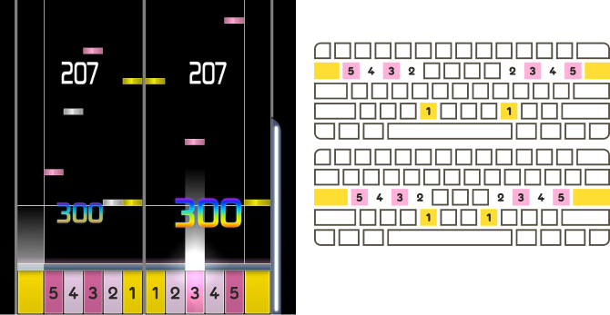
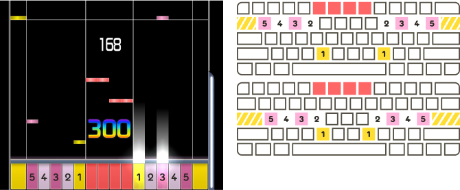
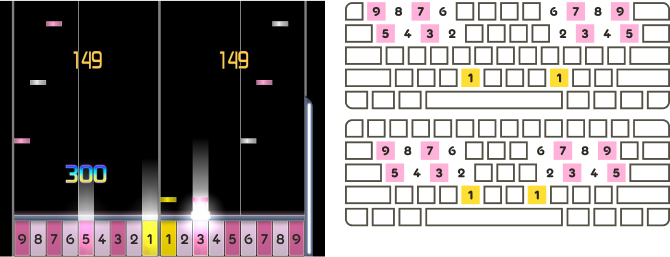

---
tags:
  - 12K+
  - co op
  - co-op
  - column layout
  - column layouts
  - coop
  - key layout
  - key layouts
  - key mode
  - key modes
  - keymode
  - keymodes
  - play style
  - play styles
---

<!--
the images in this article are from <https://www.figma.com/file/f4YtoQAXdAudBpkvwED7uY/osu!mania-playstyles>

for translators~

if you're able to use figma:
- duplicate "Wiki images (EN)" and rename to your language
- edit the text in the images
- make sure the font family and size matches the normal content font on the osu wiki

if you need help with that or just don't want to mess with it, let me know

—clayton
-->

# osu!mania 10K+ playstyles

This article documents common playstyles used by [osu!mania](/wiki/Game_mode/osu!mania) [beatmaps](/wiki/Beatmap) with 10 or more keys.

In this context, a **playstyle** is a suggested set of [key bindings](/wiki/Game_mode/osu!mania#controls) and order of keys in the [playfield](/wiki/Game_mode/osu!mania#playfield). Most osu!mania beatmaps with more than 10 keys are mapped with a particular playstyle in mind — the player has less fingers than there are keys, so extra consideration is usually required regarding where the player's hands will be positioned on the [keyboard](/wiki/Gameplay/Input_device/Keyboard) throughout the map.

The player can choose to ignore the intended playstyle, but it becomes increasingly hindering to do so at higher [levels of difficulty](/wiki/Beatmap/Difficulty#difficulty-levels), and may result in [patterns](/wiki/Beatmap/Pattern) that feel awkward to play or are nearly impossible to hit.

Each playstyle requires the player to adjust their [key bindings](/wiki/Game_mode/osu!mania#controls) appropriately, and encourages the use of customised [skins](/wiki/Skin). In this article, gameplay images use a slightly modified default skin to help illustrate various playstyles.

## 10K (10 keys) {#10K}

**10K** is the playstyle where each hand is responsible for 5 keys.

While 10K is treated by the [game client](/wiki/Client) as a "[co-op](/wiki/Game_mode/osu!mania#co-op)" mode, mappers usually treat it as a regular key mode. This is because each key can be hit by a unique finger, and no special layout or key binding consideration is necessary.

## 10K2S (12 keys) {#10K2S}

**10K2S** is a 12-key playstyle similar to [10K](#10K), but includes a ***s**cratch*<!-- TODO: link --> key on each outer edge of the stage.

Each hand rests on the middle 10 keys. The two scratch keys are commonly hit by moving a pinky finger outward.

## DP (14 or 16 keys) {#DP}

**DP** or **Double Play**, named after the play mode in *[beatmania IIDX](https://en.wikipedia.org/wiki/Beatmania_IIDX "\"beatmania IIDX\" on Wikipedia")*, is a 14-key or 16-key playstyle where each hand is responsible for 7 keys, arranged into lower rows of 4 keys and upper rows of 3 keys. The lower and upper rows are interleaved such that the first key is lower, the second is upper, the third is lower, and so on. An additional *scratch*<!-- TODO: link --> key may be included on each outer edge of the stage.

Along with [EZ2AC](#EZ2AC), this playstyle is more broadly referred to as "14K" or "14K2S".

Each hand usually rests on the keys labeled 1-2-4-6-7 in the diagrams above. Key 5 can be hit with the ring finger, and key 3 can be hit with the thumb or index finger. The two scratch keys, if included, are commonly hit by moving a pinky finger outward.

## EZ2AC (14 or 16 keys) {#EZ2AC}

**EZ2AC**, named after the later entries in the *[EZ2DJ](https://en.wikipedia.org/wiki/EZ2DJ "\"EZ2DJ\" on Wikipedia")* series, is a 14-key or 16-key playstyle similar to [10K](#10K) or [10K2S](#10K2S), but includes a separate set of 4 keys in the middle of the stage.

This playstyle is also referred to as "Space Mix" or "14K MANIAC", both of which are names from the *EZ2DJ* series. Along with [DP](#DP), it is more broadly referred to as "14K" or "14K2S".

Each hand rests on the same keys as 10K or 10K2S. One or both hands may have to move away from their usual positions to hit the middle 4 keys.

## 10K8K (18 keys) {#10K8K}

**10K8K** or **8K10K** is an 18-key playstyle similar to [10K](#10K), but includes 8 additional keys positioned above or below the 4 outermost keys on each side of the stage. The additional keys are not interleaved; they are either all outside or all inside respective to the group of keys that they were positioned above or below.

This playstyle is also referred to as "4K10K4K".

Each hand rests on the same keys as 10K. All fingers except the thumbs have to move up or down to hit the additional sets of 4 keys.

## 9K9K (18 keys) {#9K9K}

**9K9K** is an 18-key playstyle similar to 14-key [DP](#DP), but the lower and upper rows of each side of the stage include 5 and 4 keys respectively, instead of 4 and 3. It resembles a hypothetical DP mode for *[pop'n music](https://en.wikipedia.org/wiki/Pop%27n_Music "\"Pop'n Music\" on Wikipedia")*.

This playstyle has many common resting positions for the hands. Playing maps of this playstyle requires frequent repositioning.
