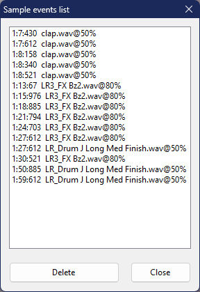

# 作曲 (Compose)

::: Infobox
 标签页")
:::

::: Infobox
 标签页")
:::

[谱面编辑器](/wiki/Client/Beatmap_editor)的**作曲 (Compose) 标签页**是[谱面制作者](/wiki/Beatmapping)在调整谱面[测轴](/wiki/Beatmapping/Timing)设置后，在谱面上花费最多时间的地方。在这个标签页中，可以查看[打击物件的排列](/wiki/Beatmap/Pattern)、[打击音效](/wiki/Beatmapping/Hitsound)以及谱面设计其他方面的东西。

osu!、osu!taiko、osu!catch 使用的编辑器工具是相同的，而 osu!mania 有单独的标签页布局，更适合此游戏模式使用。你可以通过将谱面难度的[适用模式](/wiki/Client/Beatmap_editor/Song_setup#高级-(advanced))更改为 `osu!mania` 来使用此布局。

## 功能

*要大致总览作图过程，请见：[作图](/wiki/Beatmapping)*

### 物件时间轴

可以使用时间轴左侧的 `+`/`-` 按钮放大或缩小时间轴，你也可以在按住 `Alt` 键的同时滚动滚轮进行缩放。时间轴中间的双白线指示着当前时间戳。除此之外，你也可以用鼠标左键选择并移动时间轴上的打击物件，用鼠标右键删除物件。

### 节拍细分

| 名称 | 描述 |
| :-- | :-- |
| [节拍细分设置](/wiki/Client/Beatmap_editor/Beat_snap_divisor) | 限制时间轴节拍线的数目，它决定了物件可以放在一整拍中的几等分位置。将滑块向右移动，则会增加节拍线的密集程度。 |
| `插入休息时间` | 在当前时间戳处添加[休息时段](/wiki/Beatmap/Break)。 |
| x/y | 显示选中物件在游玩区域的位置。若没有选择物件，则显示光标所在位置。 |

按住 `Alt` 键可将滑块切换至[间距锁定](/wiki/Client/Beatmap_editor/Distance_snap)模式。间距因数可在 0.1x 至 6.0x 间调节。

### 左侧工具栏

| 按钮（键盘快捷键） | 描述 |
| :-- | :-- |
| `Sampleset（音效组）` | 覆盖所选物件的[音效组](/wiki/Beatmapping/Sampleset)设置（包括 hitnormal 音效设置）。选择 `Auto` 则会将音效组重置为活跃[计时点](/wiki/Client/Beatmap_editor/Timing#计时点)处的设置。 |
| `Additions（附加音效）` | 覆盖所选物件的音效组设置，只影响附加音效（whistle、finish 与 clap）。选择 `Auto` 则会将音效组重置为活跃计时点处的设置。 |
| `Select` (`1`) | `左键单击`或`左键拖动`：选择或移动物件、控制点。`右键单击`：删除物件或控制点。`Ctrl` + `左键单击`：选择多个物件。选中滑条时 `Ctrl` + `左键单击`：添加[控制点](/wiki/Gameplay/Hit_object/Slider/Slider_anchor)。 |
| `Circle` (`2`) | `左键单击`：在当前时间戳处添加[打击圈](/wiki/Gameplay/Hit_object/Hit_circle)。 |
| `Slider` (`3`) | `左键`/`右键单击`：在当前时间戳处添加[滑条](/wiki/Gameplay/Hit_object/Slider)头或滑条尾。放置滑条时`左键单击`：添加控制点。 |
| `Spinner` (`4`) | `左键`/`右键单击`：在当前时间戳处开始或终止[转盘](/wiki/Gameplay/Hit_object/Spinner)。 |

### 游玩区域

### 右侧工具栏

| 按钮（键盘快捷键） | 用法 | 描述 |
| :-- | :-- | :-- |
| `New Combo` (`Q`) | 选择单个物件时`左键单击`，或放置物件时`右键单击`。 | 从当前物件开始新[连击](/wiki/Beatmapping/Combo)（大致相当于乐谱中的小节线）。 |

#### 打击音效

| 按钮（键盘快捷键） | 用法 |
| :-- | :-- |
| `Whistle` (`W`) | （先选取一个物件）**左键：** 在此物件上使用吹哨音 | 在所选取物件上添加哨音。 |
| `Finish` (`E`) | （先选取一个物件）**左键：** 在此物件上使用收尾音 | 在所选取物件上添加收尾（钹）音。 |
| `Clap` (`R`) | （先选取一个物件）**左键：** 在此物件上使用拍掌音 | 在所选取物件上添加拍手音。 |

#### 辅助工具

| 按钮（键盘快捷键） | 用法 | 描述 |
| :-- | :-- | :-- |
| `Grid Snap（网格对齐）` (`T`) | **按住 `Shift`：** 暂时启用 **按住 `Ctrl`**：暂时停用 | 物件会自动被校准到网格间。 |
| `Distance Snap（间距锁定）` (`Y`) | **按住 `Alt`：** 暂时启用，同时将 Beat Snap Divisor 改为 Distance Snap 的数值设定 **`Alt` + 滚轮：** 调整 Distance Snap 数值 | 两个连续圈圈的距离会自动依节奏上的差距控制。最好在时间轴暂停时使用。 |
| `Lock Notes（锁定物件）` (`L`) | （先选取一个物件）**左键：** 锁定此物件 | 将所选取物件锁定在目前位置和时间上。 |

### 歌曲时间轴

在**下方中央**显示的是**标记和音乐控制按钮**。至于 "Test" 钮，则是在目前所在时间开始进行测试，同时谱面更改会被储存。

界面左下角会以`<分>:<秒>:<毫秒>`的格式显示当前歌曲中的位置。点击时间时会弹出一个小窗口，用于复制或粘贴[物件时间戳](/wiki/Modding/Timestamp)，以便快速选择与导航。时间戳旁边显示的是歌曲进行百分比，当由于[故事板](/wiki/Storyboard)存在，当前时间位于音乐范围外时，则会显示 `intro` 或 `outro`。

中间区域含有带标记的时间轴与音乐控制按钮。光标悬停在时间轴上时，会出现书签操作相关的按钮。时间轴右侧的 `Test` 按钮用于从当前时间点开始[测试谱面](/wiki/Client/Beatmap_editor/Test_mode)。

你可以在右下角将播放速度设置为 25%、50%、75% 或 100%。

#### 颜色标记

| 颜色 | 描述 |
| :-- | :-- |
| 白色 | 当前时间戳 |
| 黄色 | 预览点 |
| 绿色 | [继承时间点](/wiki/Client/Beatmap_editor/Timing#继承时间点（绿线）) |
| 红色 | [非继承时间点](/wiki/Client/Beatmap_editor/Timing#非继承时间点（红线）) |
| 蓝色 | 书签 |

#### 颜色区段

| 颜色 | 描述 |
| :-- | :-- |
| 灰色 | [休息时段](/wiki/Beatmap/Break) |
| 橙色 | [Kiai 时间](/wiki/Gameplay/Kiai_time) |

#### 书签操作

| 颜色 | 描述 |
| :-- | :-- |
| `Ctrl` + `B` | 在当前位置新增书签。 |
| `Ctrl` + `Shift` + `B` | 移除（2 秒内）最近的书签。 |
| `Ctrl` + `右方向键` | 转到下一个书签。 |
| `Ctrl` + `左方向键` | 转到上一个书签。 |

## 功能 (osu!mania)

*关于论坛上的 osu!mania 作图指南，参见：[[Tutorial] osu!mania mapping, Basics](https://osu.ppy.sh/community/forums/topics/118868)、[[Tutorial] osu!mania mapping, Keysounding](https://osu.ppy.sh/community/forums/topics/139139)*

与其他模式的编辑器相比，osu!mania 专用的编辑器有一些不同，在本节中将会讲述。

### 节拍细分

*主页面：[节拍细分](/wiki/Client/Beatmap_editor/Beat_snap_divisor)*

在 osu!mania 中，节拍细分区域也会显示所选物件附加的音效文件名与音量。可以使用 [`Sample import（音效导入）`](#音效导入)对话框对每个物件应用这样的音效（键盘音 (keysounds)）。

### 左侧工具栏

| 按钮（键盘快捷键） | 用法 |
| :-- | :-- |
| `Sampleset` | 覆盖所选物件的[音效组](/wiki/Beatmapping/Sampleset)设置（包括 hitnormal 音效设置）。选择 `Auto` 则会将音效组重置为活跃[计时点](/wiki/Client/Beatmap_editor/Timing#计时点)处的设置。 |
| `Additions` | 覆盖所选物件的音效组设置，只影响附加音效（whistle、finish 与 clap）。选择 `Auto` 则会将音效组重置为活跃计时点处的设置。 |
| `Select` (`1`) | `左键单击`或`左键拖动`：移动物件所在时间戳与位置。`右键单击`：删除物件。`Ctrl` + `左键单击`：选择多个物件。 |
| `Circle` (`2`) | `左键单击`：放置物件。 |
| `Hold` (`3`) | 按住`左键`：放置长按音符并调整其长度。松开左键可放置音符尾。 |

### 游玩区域

#### 分区

| 名称 | 描述 |
| :-- | :-- |
| 左侧 | 物件密度（时间轴） |
| 中央 | 游玩区域，叠加在[节拍细分](/wiki/Client/Beatmap_editor/Beat_snap_divisor)线上层显示 |

#### 颜色

*另见：[节拍细分](/wiki/Client/Beatmap_editor/Beat_snap_divisor)*

| 线条颜色 | 描述 |
| :-- | :-- |
| 白色（粗） | 小节线 |
| 白色 | [拍](/wiki/Music_theory/Beat)线 |
| 绿色 | 当前时间戳 / [判定](/wiki/Gameplay/Judgement)线 |

| 物件颜色 | 描述 |
| :-- | :-- |
| 蓝色 | 已选中物件 |
| 白色/粉红色/黄色 | 未选中物件颜色 |

### 设置音效

**设置音效 (Sampling)** 指的是给每个物件添加音效的过程。要添加音效，请在按住 `Alt` 键的同时点击物件。这样会打开一个弹出窗口，其中列出了可用的音效。

#### 音效导入

音效导入窗口的左侧列出了谱面文件夹中的所有音频文件。可以使用窗口右侧的设置按钮将其应用到选中物件。

##### 基本

| 名称 | 描述 |
| :-- | :-- |
| `CustomSet` | 忽略左侧音效设置与当前计时点设置，应用默认音效组与音量设置。*注意，要使此操作正常进行，必须启用 `Use basic sample`。* |
| `Volume` | 声音文件的响度。使用 8 到 100 范围内的整数值。 |
| `Use basic sample` | 仅将音量或音效组更改应用到所选物件。 |

##### 按钮

| 名称 | 描述 |
| :-- | :-- |
| `Play` | 播放选中的音频文件。 |
| `Import` | 从其他位置向谱面文件夹添加音效。 |
| `Delete` | 删除音频文件。 |
| `Apply` | 将所选音效应用到当前物件。 |
| `Sample` | 将所选音效作为[故事板音频事件](/wiki/Storyboard/Scripting/Audio)添加到当前时间戳。 |
| `Sample list` | 显示[故事板中的声音事件](#音效事件列表-(sample-events-list))。 |
| `Reset` | 从所选物件移除自定义音效。 |
| `Cancel` | 关闭窗口。 |

#### 音效事件列表 (Sample events list)

*另见：[故事板音频音效](/wiki/Storyboard/Scripting/Audio)*

`Sample events list（音效事件列表）`窗口显示了来自故事板的声音事件，这些事件存储在当前难度的 `.osu` 文件或谱面的 `.osb` 文件中。
