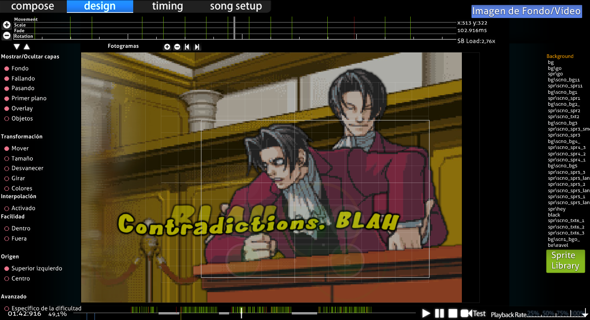
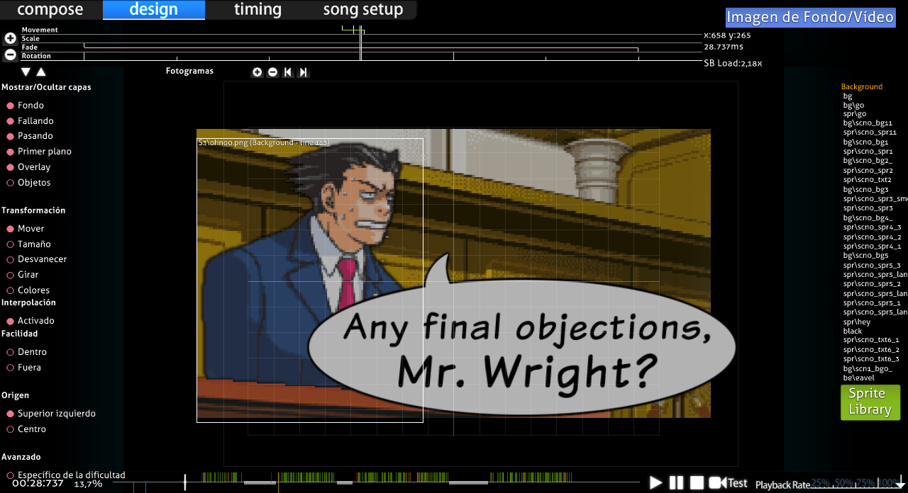
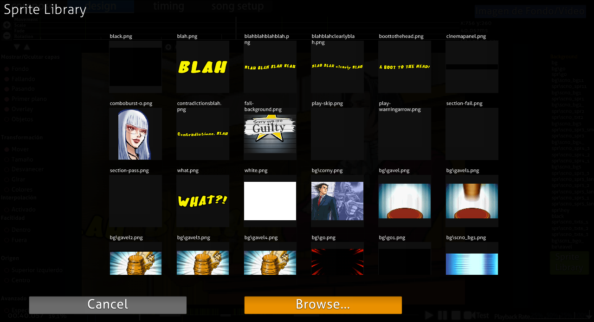

# Pestaña de diseño

El **editor de storyboards** es una sección del [editor de beatmaps](/wiki/Client/Beatmap_editor) del juego en la pestaña Design, que permite un [storyboarding](/wiki/Storyboard) sencillo. Es una buena introducción al concepto fundamental antes de las [secuencias de comandos](/wiki/Storyboard/Scripting).

Sería favorable hacer cursos intensivos de todos los comandos usando imágenes aleatorias al menos una vez antes de intentar crear un storyboard serio. Te ayudaría a memorizar y comprender mejor su uso.

## Para empezar

1. Coloca todos los elementos/imágenes de tu storyboard en la carpeta de canciones de tu mapa y crea una subcarpeta llamada «SB» para ellos.
2. Accede a tu mapa a través del editor y ve a la pantalla «Design».
3. Encuentra la marca correcta en la línea de tiempo arriba donde quieres que aparezca el elemento del storyboard, luego haz clic en «Sprite Library» y selecciona tu imagen. Asegúrate de que tu elemento no supere los 800x600 píxeles. Ese es el umbral máximo.
4. Ahora, selecciona el comando de lo que quieres que haga tu elemento (Mover, Tamaño, Desvanecer, Girar o Colores) y presiona «+» en «Fotogramas» para colocar un punto para el comando en el momento actual en el que se encuentra. «-» en «Fotogramas» elimina el punto nuevamente y los botones de flechas te permiten saltar entre más puntos en el mismo comando para el mismo elemento SB.
5. Ahora busca el punto de tiempo en el que quieres que finalice el comando (más adelante), de modo que tendrás 2 puntos y la línea de color correspondiente entre esos puntos. Verde para Mover, rojo para Tamaño, rosa para Desvanecer, amarillo para Girar y rosa claro para Colores.
6. En los puntos de comando puedes cambiar los factores de la función manteniendo presionado el botón izquierdo del ratón y moviendo el cursor hacia arriba (factor creciente) o hacia abajo (factor decreciente)
7. Repite los pasos 3-6 para otros elementos. Para eliminar, usa `Suprimir` o Editar -> Eliminar en el menú superior.

**Nota:** Si tienes un buen ojo, una marca hacia arriba significa el inicio de una transformación, y una marca hacia abajo significa el final de una transformación. Una marca completa en una línea de transformación de color significa un cambio en la transformación (por ejemplo, subir -> bajar).

## Características

(Empezando desde el orden de arriba hacia abajo de izquierda a derecha)

### Arriba a la izquierda (línea de tiempo de transformación)

**Muestra la línea de tiempo para las transformaciones del objeto seleccionado.**

#### Línea de tiempo

| Nombre | Descripción |
| :-- | :-- |
| Botones `+`/`-` a la izquierda | Aumenta/disminuye el zoom de la línea de tiempo |
| Botones de flecha `Arriba`/`Abajo` abajo a la izquierda | Desplaza hacia arriba/abajo la línea de tiempo de la transformación (para ver la línea de tiempo de Mover/Colores). |
| Centro | Línea de tiempo de transformación para el objeto SB seleccionado. |

#### Control de fotogramas

Esto se usará para **añadir puntos de anclaje (puntos de inicio/final).** Funciona prácticamente de la misma manera que los marcadores. Los botones están justo debajo de la línea de tiempo.

| Nombre | Descripción |
| :-- | :-- |
| Botones `+`/`-` | Añade/elimina puntos de anclaje para la transformación seleccionada. |
| Botones de flecha `Izquierda`/`Derecha` | Salta hacia atrás/adelante hasta el punto de anclaje más cercano de la transformación seleccionada. |

Si hay una transformación, esa transformación se ilumina con su color y tendrá dos medias líneas separadas que determinan la duración. La línea blanca completa determina los puntos de transición de la transformación (por ejemplo, subir -> bajar).

### Arriba a la derecha (lecturas)

Muestra las **lecturas** y un **interruptor para añadir una imagen/vídeo de fondo.** El interruptor se explica por sí mismo.

Para las lecturas, **x/y** son las *propias* coordenadas de tu ratón en el beatmap y cambiarán frenéticamente a medida que muevas el ratón. **{número}ms** es la marca de tiempo en milisegundos. **SB Load** es la cantidad de potencia de procesamiento necesaria para reproducir *solo* el storyboard. Generalmente, mantén la carga de SB lo más baja posible (1,00~2,00) durante el tiempo de juego y déjala rodar durante el tiempo de descanso/introducción/finalización.

### Centro izquierda (utilidades)

#### Mostrar/Ocultar capas

Estos **deshabilitarán/habilitarán la visualización de capas.** Si no quieres ver la escena de pass (que siempre está encima de la escena de fail en el editor), desactiva «Pasando» y disfruta de la escena de fallo. Esto es útil cuando quieres ver comandos para los diferentes objetos pero hay algo en el camino.

Todos los interruptores se muestran a continuación:-

- Fondo
- Fallando
- Pasando
- Primer plano
- Overlay
- Objetos (desactivado automáticamente)

**Nota:** Objetos > Primer plano > Pasando/Fallando > Fondo, donde «>» bloquea esa capa. Además, cualquier objeto nuevo (que no sea de «Compose») introducido se establece en «Primer plano» de forma predeterminada. Para transferir, arrastra y suelta en la pestaña de la capa deseada.

#### Transformación (basada en el tiempo)

Estos son los comandos usados para tu objeto. Se han implementado cinco de los comandos; Mover, Tamaño, Desvanecer, Girar y Colores. Para usar el loop y los parámetros, deberás realizar algunas secuencias de comandos para usarlos.

Para usarlos:-

1. Haz clic en el elemento del storyboard
2. Selecciona tu transformación (MTDGC)
3. Establece una línea de tiempo para la transformación (usa el «+» del control de fotogramas)
4. Establece el uso del efecto (mueve el ratón hacia arriba o hacia abajo para activarlo)
5. Aclara y repite.

##### Efectos de transformación (basados en el tiempo)

| Comando | Uso |
| :-- | :-- |
| Mover | Traslación de a \[dónde ir (por ejemplo, arriba)\]. |
| Tamaño | Ampliación proporcional (un cuadrado sigue siendo un cuadrado). |
| Desvanecer | Desvanecido de entrada/salida. (oscuro vs. brillante) |
| Girar | Gira una cierta cantidad de «radianes» (no grados). |
| Colores | Fuerza a la coloración del elemento. Puede cambiar de color gradualmente usando un color diferente como punto final. «Efecto permanente». Explicación básica. |

##### Efectos adicionales (pasa el cursor sobre la barra izquierda)

| Comando | Uso |
| :-- | :-- |
| Escalado libre | Ampliación irregular (un cuadrado se convierte en un rectángulo). |
| Voltear horizontal/verticalmente | Reflexión en el eje x/y respectivamente |

##### Comandos adicionales

| Comando | Uso |
| :-- | :-- |
| Interpolación | Tienes dos fotogramas clave (es decir, inicio/fin). ¿Quieres animar entre ellos? Si es así, activa Interpolación. Si no, apágalo. |
| Facilidad Dentro/Fuera | Comienza lento/rápido y luego rápido/lento cerca del punto final. Útil con desvanecido de entrada. |
| Origen | Punto de origen. Esquina «superior izquierda» o «centro» de la imagen |
| Específico de la dificultad | Guarda todos los SB en el archivo `.osu` de esta dificultad en lugar del archivo `.osb`. (Consulta la nota a continuación) |

**Nota:**

- Color: «Efecto permanente», el color que establezcas seguirá vigente incluso después de que finalice su línea de tiempo. Esto es bastante útil para imágenes transparentes.
- `.osb`: Base de «diseño» (BG, Vídeo, SB) para cada dificultad del beatmap a seguir.
- `.osu`: Archivo de dificultad específica. Contiene *mucha* información.

### Centro (storyboard del beatmap)

Esta es la **representación visual del storyboard y los cambios basados ​​en la línea de tiempo y los cambios de capa.** Coloca tus objetos aquí y crea el storyboard.

### Centro-derecha (objetos)

**Lista de objetos SB en sus respectivas capas**. Para agregar los objetos SB, haz clic en «Sprite Library». Para asignar el nuevo sprite (objeto SB), simplemente arrastra y suelta en la capa respectiva. Los nuevos sprites están en la capa «Primer plano» de forma predeterminada. Al hacer clic en el nombre del objeto, se mostrará y se reenviará a la ubicación y el periodo de tiempo del objeto. Los duplicados usan el mismo nombre que el sprite original. Para eliminar, usa `Suprimir` o Editar -> Eliminar en el menú superior.

**Nota:** Objetos > Primer plano > Pasando/Fallando > Fondo, donde «>» bloquea esa capa.

#### Librería de sprites

Haz clic en el botón «Browse...» para buscar el objeto que quieres usar. Puedes duplicar el objeto haciendo clic en su miniatura en la ventana de la librería de sprites.

### Abajo (línea de tiempo de reproducción)

Reproduce el beatmap. El final del storyboarding requiere secuencias de comandos. La velocidad de playback ralentiza la canción en un % de la velocidad original. Deberías estar familiarizado con esto si has mapeado antes en Compose.

## Limitaciones

- No hay soporte para efectos de sonido, esto no es un gran problema ya que los efectos de sonido pueden distraer a los jugadores, especialmente si están cerca de [objetos](/wiki/Gameplay/Hit_object). El uso de efectos de sonido debe ser realizado únicamente por mappers avanzados y con la guía de un BAT.
- No hay soporte para [loop](/wiki/Storyboard/Scripting/Compound_Commands) o [trigger](/wiki/Storyboard/Scripting/Compound_Commands).
- No hay comandos [Move-X](/wiki/Storyboard/Scripting/Commands)/[Move-Y](/wiki/Storyboard/Scripting/Commands).
- La coordenada del sprite es *siempre* 320,240. Deberás usar el comando Move una vez para establecer la ubicación (no se requiere punto final).
  - Si *también* estás haciendo [secuencias de comandos](/wiki/Storyboard/Scripting), necesitarás *leer una línea adicional* por cada objeto hecho en la pestaña Design.

## Fuentes

- [Explicación básica de m980](https://osu.ppy.sh/community/forums/posts/67660)
- [Guía de storyboarding del manual básico de Kite](https://osu.ppy.sh/community/forums/topics/46111)
