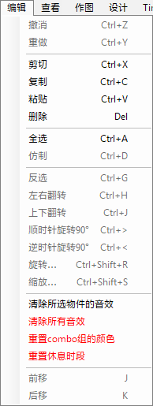

# 谱面编辑器菜单

## 文件

**基本的文件命令。**

### 文件命令

| 名称 | 描述 |
| :-- | :-- |
| 清除所有物件 (`Ctrl` + `N`) | 清除当前难度中的所有物件。 |
| 打开一个难度... | **用于编辑：**在难度间快速切换。**用于参考**（仅限 osu!mania）将所选难度物件盖在（当前）已打开难度上方。 |
| 保存 (`Ctrl` + `S`) | 保存当前更改（`.osu` 与 `.osb` 均保存）。 |
| 另存为新难度... | 将当前难度的更改保存到新难度。重新加载时，旧难度会保留上次保存的状态。 |

### 恢复命令

| 名称 | 描述 |
| :-- | :-- |
| 恢复到上次保存的状态 (`Ctrl` + `L`) | 取消当前更改，恢复到上一次保存时的状态。用于一般错误（打击物件）。 |
| 恢复到上次保存的状态（完全） (`Ctrl` + `Shift` + `L`) | 取消当前更改，恢复到上一次保存时的状态。用于复杂错误（时间轴测定、故事板）。 |

### 排疑命令

| 名称 | 描述 |
| :-- | :-- |
| 测试地图 (F5) | 测试谱面。会保存当前更改以便测试。 |
| 打开 AiMod (`Ctrl` + `Shift` + `A`) | 打开 AiMod。 |

### 谱面打包命令

| 名称 | 描述 |
| :-- | :-- |
| 上传地图... (`Ctrl` + `Shift` + `U`) | 将谱面上传到 [制作中 (WIP) 区域](https://osu.ppy.sh/community/forums/10)。需要在网页上登录 osu! 账户来浏览“谱面”论坛。 |
| 导出图包... | 将谱面导出为 `.osz` 文件。此文件会被保存到 “Exports” 文件夹，然后你会从谱面编辑器转到 osu!/Exports 文件夹。 |
| 解压图包 | ? |
| 导入... | **bms/bme:** （仅限 osu!mania）打开 .bms/.bme 文件，导入为 osu!mania 难度。 |

### 程序员命令

| 名称 | 描述 |
| :-- | :-- |
| 打开歌曲文件夹 | 打开 osu!/Songs 中的歌曲文件夹。 |
| 在记事本中打开 `.osu` 文件 | 在微软记事本中打开谱面的难度文件。 |
| 在记事本中打开 `.osb` 文件 | 在微软记事本中打开基础（故事板）文件。 |

### 紧急退出命令

| 名称 | 描述 |
| :-- | :-- |
| 退出 (`Esc`) | 退出谱面编辑器。可能会提示你保存最近更改。有时会*忽略*设计 (Design) 标签页下的更改。 |

## 编辑

编辑命令。与微软的默认快捷键相同。

### 撤销/重做命令

请注意，若要避免编辑马拉松图时程序崩溃，可以在[设置](/wiki/Client/Options)侧栏中禁用这些命令。

| 名称 | 描述 |
| :-- | :-- |
| 撤消 (`Ctrl` + `Z`) | 撤销一步。 |
| 重做 (`Ctrl` + `Y`) | 重做一步。 |

### 编辑命令（使用前先选择物件）

| 名称 | 描述 |
| :-- | :-- |
| 剪切 (`Ctrl` + `X`) | 剪切物件。 |
| 复制 (`Ctrl` + `C`) | 复制物件。 |
| 粘贴 (`Ctrl` + `V`) | 粘贴物件。 |
| 删除 (`Delete`) | 删除物件。 |

### 特殊命令

| 名称 | 描述 |
| :-- | :-- |
| 全选 (`Ctrl` + `A`) | 选择所有物件。 |
| 仿制 (`Ctrl` + `D`) | 复制 + 粘贴。 |

### 旋转命令

| 名称 | 描述 |
| :-- | :-- |
| 反选 (`Ctrl` + `G`) | **滑条：**颠倒编号位置。**全选后使用：**你的整个谱面都会倒过来。比如： 10 秒处的一个圆圈会被移动到歌曲最后 10 秒，反之亦然。 |
| 左右翻转 (`Ctrl` + `H`) | （关于过游玩区域原点的 Y 轴）左右翻转物件，反之亦然。 |
| 上下翻转 (`Ctrl` + `J`) | （关于过游玩区域原点的 X 轴）上下翻转物件，反之亦然。 |
| 顺时针旋转 90° (`Ctrl` + `>`) | 将物件向右旋转 90°。 |
| 逆时针旋转 90° (`Ctrl` + `<`) | 将物件向左旋转 90°。 |
| 旋转... (`Ctrl` + `Shift` + `R`) | 设置没放好的物件的旋转角度 (+/- 180°)。可以调整旋转方向 \[顺/逆时针\] 和原点 \[（游玩区域/选区）中心\]。 |
| 缩放... (`Ctrl` + `Shift` + `S`) | 设置没放好的物件的放大倍数 (0.500x - 1.200x)。可以调整原点 \[（游玩区域/选区）中心\]，也可以选择（将放大倍数）“应用到” X 轴 和/或 Y 轴。 |

### 重置命令

| 名称 | 描述 |
| :-- | :-- |
| 清除所选物件的音效 | 删除当前所选物件的音效。 |
| 清除所有音效 | 删除此难度所有物件的所有音效。 |
| 重置 combo 组的颜色 | 取消所有物件的串颜色设置。 |
| 重置休息时段 | 取消休息时段。对为防止过度掉血而自动设置的休息时段无效。 |

### 移动命令

| 名称 | 描述 |
| :-- | :-- |
| 前移 (`J`) | 基于节拍细分设置，将物件向后移一拍。 |
| 后移 (`K`) | 基于节拍细分设置，将物件向前移一拍。 |

## 查看

风景区。

### 标签页切换命令

| 名称 | 描述 |
| :-- | :-- |
| 作图 (`F1`) | 转到作图 (Compose) 标签页。 |
| 设计 (`F2`) | 转到设计 (Design) 标签页。 |
| Timing (`F3`) | 转到测定时间轴 (Timing) 标签页。 |

### 设置命令

| 名称 | 描述 |
| :-- | :-- |
| 地图设置... (`F4`) | 转到歌曲设置窗口。 |
| Timing 设置... (`F6`) | 转到测定时间轴 (Timing) 窗口。 |

### 特殊命令

| 名称 | 描述 |
| :-- | :-- |
| 音量 | 调整音乐与音效的音量。 |
| 网格大小 | 设置网格大小。1（最疏）/2/3/4（最密）分别对应大/中/小/极小网格。 |
| 显示视频/故事板 | 显示背景视频与故事板。由于它们会使人分散注意力，通常禁用此选项。 |
| 暗化背景 | 通过暗化背景，使打击物件更容易看到。 |
| 显示音效名 | 显示物件附加的音效。在 osu!mania 中非常有用。 |
| 渐出滑条 | 像在游玩时一样给滑条添加动画。 |
| 击打动画 | 像在游玩时一样添加击打圆圈时的动画（当到达圆圈时间戳时）。 |
| 物件间轨迹 (Follow points) | 像在游玩时一样显示轨迹点（并显示动画）。 |
| 堆叠效果 | 像在游玩时一样堆叠重合的圆圈（取决于难度设置）。 |

## 作图

*主页面：[作图 (Compose)](/wiki/Client/Beatmap_editor/Compose)*

### 标尺命令

| 名称 | 描述 |
| :-- | :-- |
| 节拍细分 | [节拍细分](/wiki/Client/Beatmap_editor/Beat_snap_divisor) |
| 播放速度 | 与回放速度 (Playback Rate) 相同。 |
| 对齐到网格 (T) | 允许物件与当前网格线对齐。 |

### 特殊命令

| 名称 | 描述 |
| :-- | :-- |
| 添加多边形圆圈 (`Ctrl` + `Shift` + `D`) | 创建圆圈的环形 flow。可以调整间距 (0.1x - 2.0x){物件之间的间距}、偏移角度 (0° - 180°){旋转角度}、重复数和物件数 (3 - 14/282){圆圈的数目}。 |
| 把滑条转成连打... | （先选择滑条）将滑条变成连打串。有两个选项可供选择：按物件数、按物件间距。**按物件数：**用给定的圆圈数 (1 - 17/100) 调整滑条 flow。**按物件间距：**用给定的物件间间距 (0.10x - 5.00x) 调整滑条 flow。由于这依赖于节拍细分设置（一拍 = 一个物件），可能会放置大量圆圈。**节拍细分：**物件的时轴调节器。 |
| 启动实时做图模式 (`Ctrl` + Tab) | 对 osu!/osu!catch/osu!taiko 谱面：在编辑器中播放歌曲时，用 osu!taiko 按键在光标位置放置圆圈、大果或太鼓打击物件。物件的音效取决于按下的按键。对 osu!mania 谱面：在编辑器中播放歌曲时，用 osu!mania 按键在对应位置放置打击物件，但无法放置滑条（长按音符）。 |
| 导入音效 | [导入自定义音效。](/wiki/Client/Beatmap_editor/Compose) |

## 设计

*主页面：[设计 (Design)](/wiki/Client/Beatmap_editor/Design)*

| 名称 | 描述 |
| :-- | :-- |
| 整体平移所有 storyboard 元素的时间... | 以毫秒为单位移动故事板*所有元素*。如果改变了 .mp3 文件或偏移量，此命令会很有用。 |

## 测定时间轴 (Timing)

*主页面：[测定时间轴 (Timing)](/wiki/Client/Beatmap_editor/Timing)*

 菜单")

### 节拍器命令

| 名称 | 描述 |
| :-- | :-- |
| 节拍类型 | 华尔兹 (3/4) 或标准 (4/4) 的节拍类型。对于另类的节拍类型，请使用 Timing 设置页面。 |
| 节拍器 | 启用/禁用节拍器“嘀，嘀，（嘀），嗒”的声音。 |

### 标记命令

| 名称 | 描述 |
| :-- | :-- |
| 添加 Timing 区间（即红线） (`Ctrl` + `P`) | 添加红线（新的 BPM） |
| 添加继承区间（即绿线） (`Ctrl` + `Shift` + `P`) | 添加绿线（新的调节设置） |
| 重置当前区间 | 重置小节开头红线的 BPM 设置。如果不设置新 BPM 时保存谱面，则会删除红线。 |
| 删除 Timing 区间 (`Ctrl` + `I`) | 删除红线或绿线（两条线中的前一条） |
| 重新对齐当前 Timing 区间 | 依照当前新的测定时间轴设置重新对齐当前区间。 |

### 测定时间轴设置

| 名称 | 描述 |
| :-- | :-- |
| Timing 设置... (F6) | [测定时间轴 (Timing) 设置页面。](/wiki/Client/Beatmap_editor/Timing) |

### 特殊命令

| 名称 | 描述 |
| :-- | :-- |
| 全部重新对齐 | 将所有物件与对应的区间对齐。 |
| 整体平移所有物件的时间... | 以毫秒为单位移动所有物件。 |
| 重新计算滑条长度 | 让 osu! 重新计算滑条长度。（改变 BPM、滑条速度、滑条速度因子后使用，效果最佳）**注意：**这么做会缩短所有滑条的长度，无一例外！请在使用后检查你的谱面！ |
| 删除所有 Timing 区间 | 清除所有测定时间轴 (Timing) 设置。 |

### 预览命令

| 名称 | 描述 |
| :-- | :-- |
| 把当前位置设为预览点 | 将当前时间戳设为黄线（歌曲选择页面的节选展示）。 |

## 网络相关

会打开你的浏览器。主要让你转到谱面帖（需要在网页登录）。

| 名称 | 描述 |
| :-- | :-- |
| 谱面信息页 | 前往此谱面的信息页。链接是 `https://osu.ppy.sh/beatmaps/###`，其中 “###” 是谱面 ID。 |
| 谱面讨论帖 | 前往此谱面的讨论帖。 |

## 帮助

| 名称 | 描述 |
| :-- | :-- |
| 显示游戏内帮助 (H) | 打开游戏内的帮助参考页面。 |
| 常见问题... | 转到[作图](/wiki/Beatmapping)页面。 |
