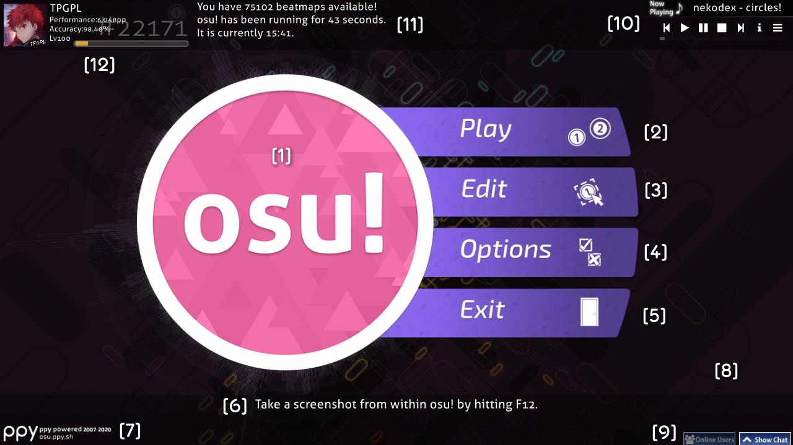
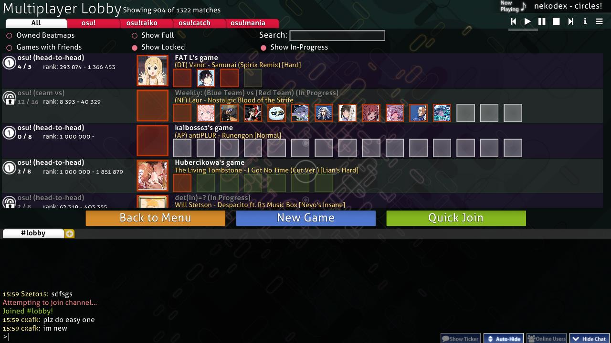
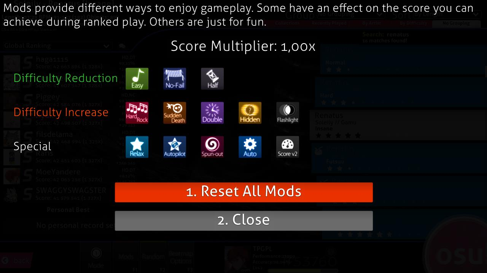

# Benutzeroberfläche

Dieser Artikel erklärt alles, was du über die Benutzung des Spiel-Clients von osu! wissen musst. Hier findest du Informationen über die Songauswahl, die Rangliste sowie dem Ergebnisbildschirm. Beim Starten des Spiel-Clients siehst du den folgenden Bildschirm:

## Hauptmenü

- \[1\] Der [osu!-Cookie](/wiki/Client/Interface/Cookie). Beim Draufklicken wird das Hauptmenü geöffnet. Er pulsiert abhängig von den [BPM](/wiki/Beatmapping/Beats_per_minute) der Musik und Balken erstrecken sich um den Cookie, die das Audiospektrum visualisieren. Wenn kein Song spielt, pulsiert der Cookie mit langsamen 60 BPM.
- \[2\] Klicke auf `Play` (oder drücke `P`), um osu! entweder mit dir selbst oder mit anderen zu spielen.
- \[3\] Klicke auf `Edit` (oder drücke `E`), um eine [Beatmap](/wiki/Beatmap) zu editieren.
- \[4\] Klicke auf `Options` (oder drücke `O`), um die [Optionsleiste](/wiki/Client/Options) zu öffnen.
- \[5\] Klicke auf `Exit` (oder drücke `Esc`), um das Spiel zu verlassen.
- \[6\] Ein zufälliger, nützlicher Tipp.
- \[7\] Das [ppy](https://ppy.sh/)-Logo zusammen mit den Urheberrechtsinformationen. Beim Draufklicken wird man zur  [osu!-Webseite](https://osu.ppy.sh/home) weitergeleitet.
- \[8\] Sobald Verbindungsprobleme mit dem [Bancho-Server](/wiki/Bancho_(server)) auftreten, wird hier ein gebrochenes Kettenglied angezeigt.
- \[9\] Der [Chat](/wiki/Client/Interface/Chat_console) und zur linken Seite der Button für das erweiterte Chat-Fenster, welches alle aktuellen Online-Nutzer auflistet. Diese sind auch über `F8` bzw. `F9` entsprechend umschaltbar.
- \[10\] Die Jukebox. Im Hauptmenü spielt sie Musik in zufälliger Reihenfolge. Siehe weiter unten für mehr Informationen über die Buttons in diesem Menü.
- \[11\] Die Anzahl der verfügbaren [Beatmap-Schwierigkeitsgrade](/wiki/Beatmap/Difficulty) (trotz dessen, was hier steht), wie lange du schon spielst, und deine Systemuhr.
- \[12\] Dein Profil. Beim Draufklicken werden die [Benutzereinstellungen](#benutzereinstellungen) angezeigt.

---

Die Jukebox hat die folgenden Buttons:

| Button | Beschreibung |
| :-: | :-- |
|  | Vorheriger Song |
|  | Song abspielen |
|  | Pause |
|  | Stoppe und setze den aktuellen Song auf den Anfang zurück. |
|  | Nächster Song |
|  | Schalte zwischen dem dauerhaften Anzeigen der Information des aktuellen Songs und dem Ausblenden nach einiger Zeit hin und her. |
|  | Springe zu einem bestimmten Song. Du kannst nach Songs suchen oder nach Sammlungen filtern. |

Die Jukebox kann auch über [Tastenkürzel](/wiki/Client/Keyboard_shortcuts#jukebox) bedient werden.

### Benutzereinstellungen

Greife auf diesen Dialog durch das Klicken deines Profils in der linken oberen Ecke im Hauptmenü zu. Du kannst jedes Element auch durch das Drücken der entsprechenden Nummer auswählen:

- `1. Profil anzeigen`: Siehe deine Profilseite auf der Webseite an.
- `2. Ausloggen`: Logge dich aus deinem Account aus. Nach dem Ausloggen wird dich das Spiel auffordern, dich einzuloggen.
- `3. Avatar ändern`: Öffne die [Seite zum Editieren des Avatars](https://osu.ppy.sh/home/account/edit#avatar) auf der Webseite.
- `4. Schließen`: Schließe diesen Dialog.

## Spielmenü

Nach dem Drücken von `Play` im Hauptmenü kannst du zwischen 3 Optionen auswählen:

- Klicke auf `Solo` (oder drücke `P`), um für dich selbst zu spielen. Das führt dich weiter zur [Songauswahl](#songauswahl).
- Klicke auf `Multi` (oder drücke `M`), um mit anderen Leuten zu spielen. Du wirst zur [Mehrspieler](/wiki/Gameplay/Multiplayer)-Lobby weitergeleitet.
- Klicke auf `Back`, um zum Hauptmenü zurückzugelangen.

### Mehrspieler-Lobby

*Hauptseite: [Mehrspieler](/wiki/Gameplay/Multiplayer)*

Die Mehrspieler-Lobby erlaubt dir sowohl mit als auch gegen andere Spieler zu spielen.

### Songauswahl

Das Symbol für den aktuell ausgewählten [Spielmodus](/wiki/Game_mode) kann in den Optionen unten links, über `Mode`, eingesehen werden. Das Symbol für den Modus ist auch leicht in der Mitte des Bildschirms sichtbar. Das sind die 4, die du sehen wirst:

-  ist [osu!](/wiki/Game_mode/osu!)
-  ist [osu!taiko](/wiki/Game_mode/osu!taiko)
-  ist [osu!catch](/wiki/Game_mode/osu!catch)
-  ist [osu!mania](/wiki/Game_mode/osu!mania)

Da es auf diesem Bildschirm zu viele Elemente gibt und es sonst zu unübersichtlich ist, werden im Folgenden einzelne Teile des Bildschirms in Unterabschnitten behandelt, beginnend von oben nach unten und von links nach rechts.

### Beatmap-Informationen

Dieser Bereich zeigt **Informationen zu der Beatmap und der ausgewählten Schwierigkeitsstufe an.** Standardmäßig wird die Beatmap angezeigt, welche in der Jukebox abgespielt wird. Das Symbol oben links zeigt die [Beatmap-Kategorie](/wiki/Beatmap/Category) an, wobei diese Beatmap [gerankt](/wiki/Beatmap/Category#ranked) ist.

Der Songtitel wird normalerweise in romanisierter Sprache angezeigt (unteres Bild), aber wenn du `Metadaten in Originalsprache` in den [Optionen](/wiki/Client/Options) auswählst, dann wird der Titel in Unicode dargestellt (oberes Bild). Der Schwierigkeitsstufenname der Beatmap wird zwischen eckigen Klammern (`[]`) angezeigt. Der Ersteller, der die Beatmap kreiert hat, wird unter dem Titel angezeigt und hier sind außerdem noch weitere Informationen zu sehen. Von links nach rechts bedeuten die Werte Folgendes:

- **Dauer**: Die Gesamtlänge der Beatmap, von Anfang bis Ende, die Pausen mit eingeschlossen. Nicht zu verwechseln mit der [Drain-Zeit](/wiki/Gameplay/Drain_time).
- **BPM**: *Beats Pro Minute*, das Tempo des Songs. Wenn hier zwei BPM sowie ein BPM in Klammern angezeigt wird, dann bedeutet das, dass sich die BPM während des Songs ändern. Es werden die langsamsten und die schnellsten BPM gezeigt und der Wert in den Klammern ist der häufigste BPM-Wert in der Beatmap.
- **Objekte**: Die Gesamtanzahl an [Hit-Objekten](/wiki/Hit_object) in der Beatmap.
- **Circles**: Die Gesamtanzahl der [Hit-Circles](/wiki/Hit_object/Hit_circle) (osu! und osu!taiko), [Früchte](/wiki/Hit_object/Fruit) (osu!catch) oder reguläre Noten (osu!mania) in der Beatmap.
- **Slider**: Die Gesamtanzahl der [Slider](/wiki/Hit_object/Slider) (osu!), Trommelschläge (osu!taiko), [Juice-Streams](/wiki/Hit_object/Juice_stream) (osu!catch) oder Hold-Notes (osu!mania) in der Beatmap.
- **Spinner**: Die Gesamtanzahl der [Spinner](/wiki/Hit_object/Spinner) (osu!), Dendens (osu!taiko) oder [Banana-Shower](/wiki/Hit_object/Banana) (osu!catch) in der Beatmap.
- **OD**: Die [allgemeine Schwierigkeit](/wiki/Beatmapping/Overall_difficulty) von der Beatmap.
- **HP**: Die [HP Drain-Rate](/wiki/Beatmapping/HP_drain_rate). Siehe den Artikel über [Gesundheit](/wiki/Gameplay/Health) für mehr Details.
- **Star Rating**: Die [Sternebewertung](/wiki/Beatmapping/Star_rating) der Beatmap. Die Menge an Sternen ist auch leicht erkennbar im Beatmap-Karussell.

### Gruppe und Sortierung

Klicke auf einen der Tabs, **um deine Songliste nach gewissen Kriterien zu sortieren**.

#### Gruppe

Diese Optionen organisieren Beatmaps nach mehreren erweiterbaren Gruppen:

| Gruppierung | Beschreibung |
| :-: | :-- |
| `Ohne Gruppierung` | Beatmaps werden nicht gruppiert, aber dennoch in der Reihenfolge des ausgewählten Sortiermodus sortiert. |
| `Nach Schwierigkeit` | Beatmaps werden nach ihrer Sternebewertung gruppiert, wobei die Sternebewertung zu einer Ganzzahl abgerundet wird. |
| `Nach Künstler` | Beatmaps werden nach dem ersten Buchstaben im Künstlernamen gruppiert. |
| `Zuletzt gespielt` | Beatmaps werden danach gruppiert, wann du sie zuletzt gespielt hast. |
| `Sammlungen` | Das wird die von dir erstellten Sammlungen anzeigen. *Beachte, dass dies Beatmaps verstecken wird, die nicht in einer Sammlung enthalten sind!* |
| `Nach BPM` | Beatmaps werden nach ihrer BPM in Vielfachen von 60 gruppiert. |
| `Nach Ersteller` | Beatmaps werden nach dem ersten Buchstaben des Beatmap-Erstellers gruppiert. |
| `Nach Importdatum` | Beatmaps werden danach gruppiert, wann sie hinzugefügt wurden, von heute bis vor 5+ Monaten. |
| `Nach Länge` | Beatmaps werden nach ihrer Länge gruppiert: 1 Minute oder weniger, 2 Minuten oder weniger, 3, 4, 5, 10 und 10 Minuten oder mehr. |
| `Nach Modus` | Beatmaps werden nach ihrem Spielmodus gruppiert. |
| `Nach erreichtem Rang` | Beatmaps werden nach dem auf ihnen höchsten erreichten [Rang](/wiki/Gameplay/Grade) gruppiert. |
| `Nach Titel` | Beatmaps werden nach dem ersten Buchstaben im Titel gruppiert. |
| `Favoriten` | Nur Beatmaps, die du online favorisiert hast, werden angezeigt. |
| `Meine Maps` | Nur Beatmaps, die du erstellt hast (d. h. dessen Ersteller mit deinem Profilnamen übereinstimmt), werden angezeigt. |
| `Ranked-Status` | Beatmaps werden nach ihrem Status gruppiert: ranked, pending, not submitted, unknown oder loved. |

The ersten 5 Gruppierungen sind in den Tabs unter Gruppe und Sortierung verfügbar.

#### Sortierung

Sortiere Beatmaps in einer bestimmten Reihenfolge.

| Sortierkriterium | Beschreibung |
| :-: | :-- |
| `Nach Künstler` | Beatmaps werden alphabetisch nach dem Künstler sortiert. |
| `Nach BPM` | Beatmaps werden von der niedrigsten zur höchsten BPM sortiert. Für Beatmaps mit sich verändernden BPM wird der größte Wert verwendet. |
| `Nach Ersteller` | Beatmaps werden alphabetisch nach dem Ersteller sortiert. |
| `Nach Importdatum` | Beatmaps werden danach sortiert, wann sie zuletzt hinzugefügt wurden, von der Ältesten zur Neuesten. |
| `Nach Schwierigkeit` | Beatmaps werden nach ihrer Sternebewertung sortiert, von der Leichtesten zur Schwersten. *Beachte, dass dadurch die Schwierigkeitsgrade einer Beatmap aufgeteilt werden!* |
| `Nach Länge` | Beatmaps werden nach ihrer Länge sortiert, von der Kürzesten zur Längsten. |
| `Nach erreichtem Rang` | Beatmaps werden nach dem auf ihnen höchsten erreichten Rang sortiert, vom Schlechtesten zum Besten. |
| `Nach Titel` | Beatmaps werden alphabetisch nach dem Songtitel sortiert. |

### Suche

*Tipp: Du kannst die Chatkonsole oder die Optionsleiste nicht offen haben, wenn du nach etwas suchen möchtest. Ansonsten wird alles, was du tippst, als Text für den Chat oder als Suchanfrage in den Optionen interpretiert.*

Nur Beatmaps, die den Kriterien deiner Suche entsprechen, werden angezeigt. Standardmäßig wird jede Suche mit den Künstlern, den Titeln, den Erstellern sowie den Tags der Beatmaps abgeglichen.

Zusätzlich zum Durchschauen dieser Kategorien kannst du auch Filter benutzen, um andere Metadaten zu durchsuchen. Das funktioniert über die Verbindung der unterstützten Filter mit einem Wert (z. B. `ar=9`).

Unterstützte Filter:

| Filter | Beschreibung |
| :-: | :-- |
| `artist` | Name des Künstlers |
| `creator` | Name des Beatmap-Erstellers |
| `title` | Songtitel |
| `difficulty` | Name des Schwierigkeitsgrads der Beatmap |
| `ar` | [Approach-Rate](/wiki/Beatmapping/Approach_rate) |
| `cs` | [Circle-Size](/wiki/Beatmapping/Circle_size) |
| `od` | [Allgemeine Schwierigkeit](/wiki/Beatmapping/Overall_difficulty) |
| `hp` | [HP Drain-Rate](/wiki/Beatmapping/HP_drain_rate) |
| `key`, `keys` | Anzahl der Keys (nur osu!mania und konvertierte Beatmaps) |
| `star`, `stars` | [Sternebewertung](/wiki/Beatmapping/Star_rating) |
| `bpm` | Beats pro Minute |
| `length` | Länge in Sekunden |
| `drain` | [Drain-Zeit](/wiki/Gameplay/Drain_time) in Sekunden |
| `mode` | Spielmodus. Das kann `osu`, `taiko`, `catch` oder `mania` sein sowie `o`/`t`/`c`/`m` in Kurzform. |
| `status` | Beatmap-Status. Der Wert kann `ranked`, `approved`, `pending`, `notsubmitted`, `unknown` oder `loved` sein bzw. `r`/`a`/`p`/`n`/`u`/`l` in Kurzform. |
| `played` | Die Zeit in Tagen, seit wann zuletzt gespielt wurde |
| `unplayed` | Zeigt nur ungespielte Beatmaps an. Dabei muss ein Vergleich mit einem leeren Wert verwendet werden (z. B. `unplayed=`). Der Vergleich selbst wird ignoriert. |
| `speed` | Gespeicherte Scrollgeschwindigkeit in osu!mania. Immer 0 für ungespielte Beatmaps oder wenn die Option [`osu!mania-Scrollgeschwindigkeit für jede Beatmap merken`](/wiki/Client/Options#gameplay) ausgeschaltet ist. |

Unterstützte Vergleiche:

| Vergleich | Beschreibung |
| :-: | :-- |
| `=` oder `==` | Gleich |
| `!=` | Nicht gleich |
| `<` | Weniger als |
| `>` | Größer als |
| `<=` | Weniger als oder gleich |
| `>=` | Größer als oder gleich |

Du kannst auch eine Schwierigkeitsstufen- oder Beatmap-ID in deine Suche eingeben, um ein einzelnes Ergebnis zu bekommen.

### Rangliste

Eine Vielzahl von Dingen wird in diesem Bereich angezeigt:

- Wenn `Not submitted` angezeigt wird, dann handelt es sich um eine Beatmap, welche noch nicht über das [Beatmap Submission System](/wiki/Submission) auf die osu!-Webseite hochgeladen oder vom Ersteller gelöscht wurde.
- `Update to latest version` erscheint, wenn eine neue Version der Beatmap zur Verfügung steht. Klicke auf die Box, um die Beatmap zu aktualisieren.
  - *Hinweis: Sobald du eine Beatmap aktualisiert, werden alle dazugehörigen lokalen Scores gelöscht. Replays für lokale Scores können mit einem Rechtsklick darauf exportiert werden.*
- Wenn `Latest pending version` erscheint, bedeutet das, dass die Beatmap auf die osu!-Webseite hochgeladen wurde, aber noch nicht gerankt ist.
- Wenn Replays für die Beatmap in der Ansichtseinstellung existieren, dann werden diese anstatt einer Box angezeigt, die den Status gerankt/gespielt der Beatmap angibt. Das wird im oberen Bild gezeigt.
  - Unter den öffentlichen Ranglisten (z. B. Global, Friends, usw.) wird dein höchster Score unten dargestellt sowie dein Rang auf der Rangliste.
- Wenn `Kein Rekord vorhanden` erscheint, bedeutet es, dass noch keine Replays für die aktuelle Ansichtseinstellung vorhanden ist (das ist meistens in der lokalen Ansichtseinstellung zu sehen, wenn du gerade eine Beatmap heruntergeladen oder editiert hast).

Dies sind die Ansichtseinstellungen:

- Lokale Rangliste
- Nationale Rangliste\*
- Globale Rangliste
- Globale Rangliste (Aktive Mods)\*
- Freundesrangliste\*

\*Benötigt [osu!supporter](/wiki/osu!supporter).

Klicke auf das Sprechblasensymbol, um einen **Schnellzugang zu dieser Beatmap im Web** für die ausgewählte Beatmap zu erhalten:

- Drücke `1` oder klicke auf die Fläche `Beatmap-Übersicht/Rekorde`, um die Beatmapseite für den ausgewählten Schwierigkeitsgrad in deinem Browser zu sehen.
- Drücke `2` oder klicke auf die Fläche `Beatmap-Thema`, um die [Modding](/wiki/Modding)-Seite der Beatmap einzusehen.
- Drücke `3` oder `Esc` oder klicke auf die Fläche `Abbrechen`, um zur Songauswahl zurückzukehren.

### Beatmap-Karussell

Das Beatmap-Karussell zeigt alle verfügbaren Beatmaps an. Unterschiedliche Beatmaps können unterschiedlich farbige Boxen haben:

| Farbe der Box | Beschreibung |
| :-: | :-- |
| **Pink** | Diese Beatmap wurde bis jetzt noch nicht gespielt. |
| **Orange** | Mindestens ein Schwierigkeitsgrad der Beatmap wurde abgeschlossen. |
| **Hellblau** | Andere Schwierigkeitsgrade in derselben Beatmap werden angezeigt, sobald eine Beatmap erweitert wurde. |
| **Weiß** | Aktuell ausgewählte Beatmap. |

Du kannst durch die Beatmapliste mit dem Mausrad navigieren, in dem du die Maus ziehst, während du die linke Maustaste gedrückt hältst oder die rechte Maustaste drückst (bekannt als absolutes Scrollen), was die Scrollbar zu der Y-Position deiner Maus setzt. Eine weitere Möglichkeit, durch die Beatmapliste zu manövrieren, sind die Pfeiltasten nach oben und unten. Klicke auf eine Beatmap, um sie auszuwählen. Dann klicke sie nochmal, drücke `Enter` oder auf den osu!-Cookie in der unteren rechten Ecke, um die Beatmap zu spielen.

### Gameplay-Toolbox

Diese Sektion wird auch als Werkzeugbox bezeichnet. Wir werden uns in der Reihenfolge von links nach rechts durcharbeiten.

Drücke `ESC` oder auf den Button `Zurück`, um zum Hauptmenü zurückzukehren.

Klicke auf den Button `Mode`, um eine Liste der verfügbaren Spielmodi in osu! anzuzeigen. Alternativ kannst du auch `Strg` und `1` (osu!), `2` (osu!taiko), `3` (osu!catch) oder `4` (osu!mania) drücken, um den Spielmodus zu ändern. Beim Wechseln zu einem anderen Modus wird auch die [Rangliste](/wiki/Ranking) ausgetauscht, was durch die Veränderung des angezeigten Rangs ersichtlich ist.

Klicke auf den Button `Mods` oder drücke `F1`, um in die **[Modauswahl](/wiki/Game_modifier)** zu gelangen.

In diesem Bereich kannst du Modifikationen (kurz "Mods") zum Spielverlauf hinzufügen. Einige Mods verringern die Schwierigkeit und verwenden einen Multiplikator, der den von dir erreichten Punktestand verringert. Dagegen steigern manche Mods die Schwierigkeit, aber verwenden einen Multiplikator, der den von dir erreichten Punktestand erhöht. Außerdem beeinflussen manche Mods den Spielverlauf auf eine andere Weise. [Relax](/wiki/Game_modifier/Relax) und [Auto Pilot](/wiki/Game_modifier/Autopilot) fallen unter diesen Kategorie.

Bewege deinen Cursor über das Modsymbol, um dir die Beschreibung dazu anzeigen zu lassen. Klicke auf das Modsymbol, um die Mod zu aktivieren oder zu deaktivieren. Einige Mods, wie z. B. Double Time, haben mehrere Variationen — klicke nochmals auf die Mod, um durch die Variationen durchzuwechseln. Der Punktemultiplikator zeigt den kombinierten Effekt an, die alle selektierten Mods auf deinen Punktestand haben werden. Klicke auf `Mods zurücksetzen` oder drücke `1`, um alle aktuell ausgewählten Mods zu deaktivieren. Klicke auf `Schließen`, drücke `2` oder `ESC`, um zurück zur Songauswahl zu gelangen.

Klicke auf den Button `Random` oder drücke `F2`, damit das Spiel **zufällig durch alle Beatmaps blättert und eine davon auswählt.**

*Tipp: Du kannst `Shift` und den Button `Random` oder `F2` drücken, um zu der vorher gewählten Beatmap zurückzukehren.*

Klicke auf `Beatmap Options`, drücke `F3` oder mit Rechtsklick auf die Beatmap, um **die möglichen Optionen für die ausgewählte Beatmap** zu öffnen.

- Drücke `1` oder klicke auf `Sammlungen verwalten`, um den Sammlungsmanager zu öffnen — hier kannst du bereits existierende Sammlungen verwalten sowie ausgewählte Schwierigkeitsgrade oder die gesamte Beatmap zu einer Sammlung hinzufügen oder entfernen.
- Drücke `2` oder klicke auf `Löschen...`, um \[1\] den aktuell ausgewählten Schwierigkeitsgrad, \[2\] die aktuell ausgewählte Beatmap oder \[3\] **alle sichtbaren Beatmaps** zu löschen.
  - Beachte, dass gelöschte Beatmaps in den Papierkorb verschoben werden.
- Drücke `3` oder klicke auf `Aus Ungespielt entfernen`, um die ungespielte Beatmap als gespielt zu markieren (d. h., dass sich die Boxfarbe von pink zu orange verändert).
- Drücke `4` oder klicke auf `Alle lokalen Rekorde löschen`, um alle lokalen Rekorde zu löschen, die du auf der Beatmap erlangt hast.
- Drücke `5` oder klicke auf `Bearbeiten`, um die ausgewählte Beatmap im osu!-Editor zu öffnen.
- Drücke `6` oder klicke auf `Abbrechen`, um zurück zur Songauswahl zu gelangen.

Klicke auf **dein Benutzerprofil**, um das Menu für die **Benutzereinstellungen** zu öffnen.

Klicke auf den **[osu!-Cookie](/wiki/Client/Interface/Cookie)**, um **die ausgewählte Beatmap zu starten**.

## Ergebnisanzeige

In diesem Bereich wird dein Rang angezeigt, den du nach einem erfolgreichen Abschluss der Beatmap erlangt hast. Du kannst auf deine Online-Ergebnisse durch Herunterscrollen oder durch Drücken des offensichtlichen Buttons zugreifen.

Weiter unten sind die Ergebnisanzeigen aus den anderen Spielmodi.

### Erweiterte Ergebnisanzeige

Dies ist deine Online-Rangliste. Du kannst durch Herunterscrollen von der Ergebnisanzeige aus darauf zugreifen. Deine lokale Rangliste listet wie gewöhnlich deinen Score sowie deinen Namen auf.

- \[1\] Dein Benutzerprofil. Dort werden deine [Performance-Punkte (pp)](/wiki/Performance_points), der globale Rang, der gesamte Punktestand, die allgemeine [Genauigkeit](/wiki/Gameplay/Accuracy) und der Levelbalken angezeigt.
- \[2\] `Save replay to Replays folder`: Du kannst dir das Replay später anschauen, indem du es entweder über die lokale Rangliste öffnest oder in das Verzeichnis `Replays` wechselst und dort mit einem Doppelklick ausführst.
- \[3\] `Add as online favourite`: Füge die Beatmap zu deiner Favoritenliste hinzu, die auf deiner osu!-Profilseite in der Sektion `Beatmaps` zu finden ist.
- \[4\] Lokale Rangliste: Alle deine Resultate werden auf deinem Computer gespeichert. Navigiere zur [Songauswahl](#songauswahl) und wähle `Lokale Rangliste` von dem Dropdown-Menü über dem Scoreboard aus, um diese einzusehen.
- \[5\] Sektion `Beatmap Ranking`. Nur für Beatmaps mit Online-Ranglisten ([qualified](/wiki/Beatmap/Category#qualified), [ranked](/wiki/Beatmap/Category#ranked) oder [loved](/wiki/Beatmap/Category#loved)) verfügbar. Du musst außerdem online sein, um diese Sektion sehen zu können. Siehe unten für mehr Details.<!-- TODO: See if links here have to be adjusted as soon as the Category article is available -->
- \[6\] Sektion `Overall Ranking`. Das ist nur verfügbar für Beatmaps mit Online-Ranglisten. Du musst außerdem online sein, um diese Sektion sehen zu können. Siehe unten für mehr Details.
- \[7\] Informationen über die Beatmap mit der Spielanzahl und der Erfolgsquote.
- \[8\] Bewertung der Beatmap. Bewerte nach deinem Ermessen, ob du die Beatmap mochtest oder nicht. Lasse es am besten bleiben, wenn du dich nicht entscheiden kannst.
- \[9\] Klicke hier, um zur Songauswahl zurückzukehren.

---

Die Kategorien in der Ranglistenanzeige sind wie folgt:

| Kategorie | Beatmap Ranking | Overall Ranking |
| :-: | :-- | :-- |
| `Overall` | Deine Position auf der Rangliste der Beatmap. Beachte, dass Scores mit [Mods](/wiki/Game_modifier) auch auf dieser Rangliste auftauchen. | Dein [globaler Rang](/wiki/Ranking#performance-points-ranking) gegen jeden in der Welt.<!-- TODO: Fix link as soon as article is available --> |
| [`Accuracy`](/wiki/Gameplay/Accuracy) | Wie akkurat du die Beatmap gespielt hast. Dies zählt nur, wenn der alte Punktestand überboten wird. | Ein gewichteter Durchschnitt der Genauigkeit deiner besten Scores. |
| `Max Combo` | Die höchste Combo, die du auf der Beatmap gespielt hast. | Die höchste Combo, die du jemals über alle Beatmaps gesehen erreicht hast. |
| [`Ranked Score`](/wiki/Gameplay/Score/Ranked_score) | Dein [bestes Ergebnis](/wiki/Gameplay/Score/Ranked_score) auf der Beatmap. | Die Anzahl der Punkte von allen gerankten Beatmaps, die du jemals gespielt hast, wobei jede Beatmap genau einmal gezählt wird. |
| [`Total Score`](/wiki/Gameplay/Score/Total_score) | Das wird nicht berücksichtigt, da es deine Position in der Online-Rangliste nicht beeinflusst. | Das gleiche wie beim gerankten Score, aber es werden alle verfügbaren Beatmaps auf der osu!-Webseite miteinbezogen, also auch gescheiterte Beatmaps oder Beatmaps, bei denen der alte Punktestand nicht überboten wurde. Das wird auf dein [Level](/wiki/Gameplay/Score/Total_score#level) angerechnet.<!-- TODO: Check link as soon as article is available --> |
| [`Performance`](/wiki/Performance_points) | Die Menge an [ungewichteten PP](/wiki/Performance_points#why-didnt-i-gain-the-full-amount-of-pp-from-a-map-i-played?), die du für das Spiel erreichen würdest. | Deine gesamte Menge an Performance-Punkten und wie viele PP das eingereichte Spiel wert war.<!-- TODO: Check link as soon as article is available --> |

### Medaillen

*Hauptseite: [Medaillen](/wiki/Medals)*

Manchmal, wenn bestimmte Bedingungen zutreffen, erhältst du eine Medaille.
