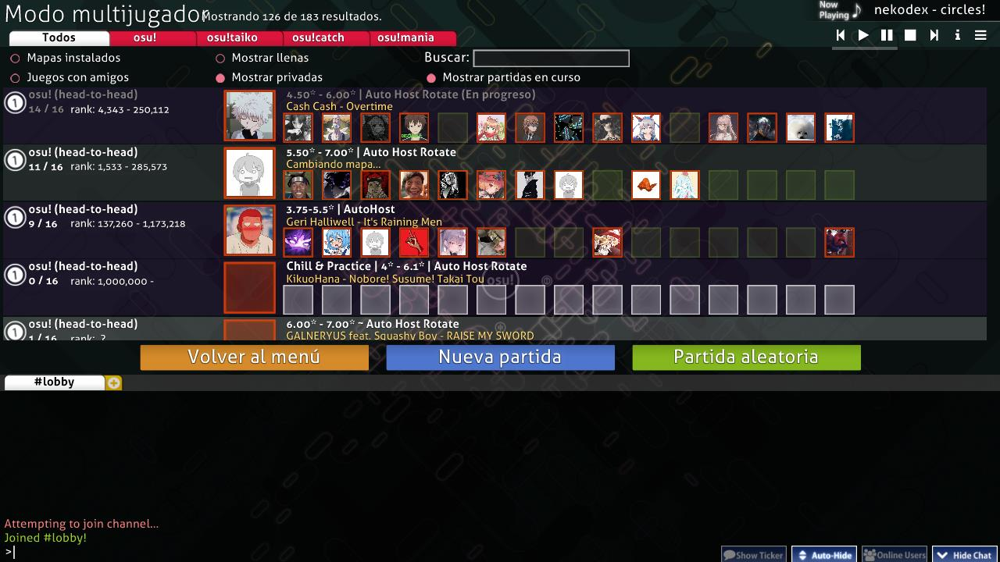
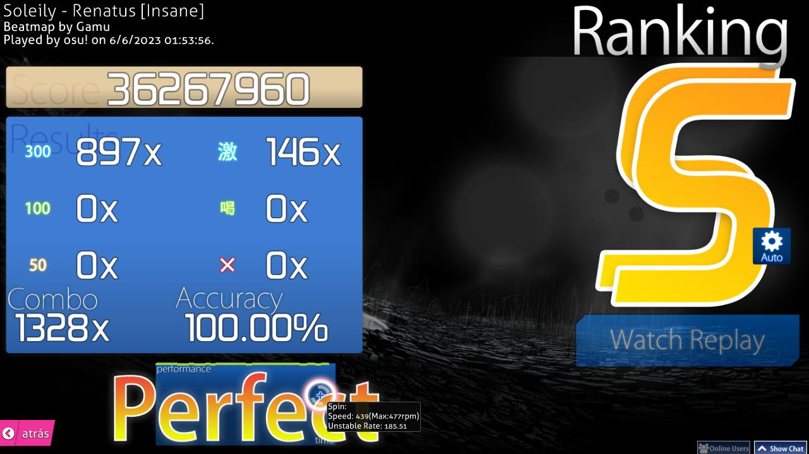
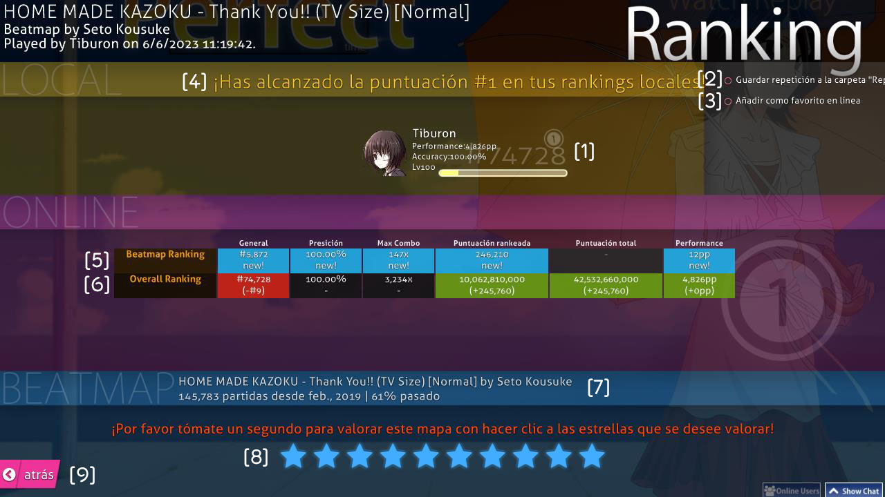
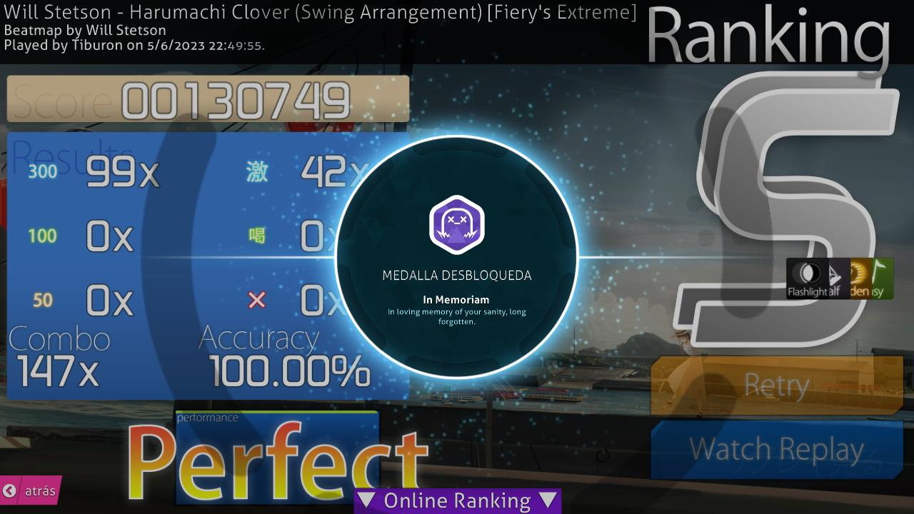

# Interfaz

Este artículo explica todo lo que necesita saber sobre cómo usar el cliente del juego de osu!. Aquí encontrará información sobre la pantalla de selección de canciones, la visualización de clasificaciones y la pantalla de resultados. Al iniciar el cliente del juego, puede ver la siguiente pantalla:

## Menú principal

- \[1\] La [osu! cookie](/wiki/Client/Interface/Cookie). Al hacer clic en ella, se abre el menú principal. Pulsa según el [BPM](/wiki/Music_theory/Tempo) de la música y las barras se extienden a su alrededor visualizando el espectro de audio. Si no se está reproduciendo ninguna canción, pulsa a una velocidad lenta de 60 BPM.
- \[2\] Haga clic en `Play` (o presione `P`) para jugar osu! ya sea para uno mismo o con los demás.
- \[3\] Haga clic en `Edit` (o presione `E`) para editar un [mapa](/wiki/Beatmap).
- \[4\] Haga clic en `Options` (o presione `O`) para abrir la [barra lateral de opciones](/wiki/Client/Options).
- \[5\] Haga clic en `Exit` (o presione `Esc`) para salir del juego.
- \[6\] Un [consejo](/wiki/Client/Menu_tips) útil al azar.
- \[7\] El logotipo [ppy](https://ppy.sh/) junto con la información de derechos de autor. Al hacer clic en él, se accede al [sitio web de osu!](https://osu.ppy.sh/home).
- \[8\] Cuando surgen problemas de conexión con el [servidor de Bancho](/wiki/Bancho_(server)), aquí se muestra un eslabón de cadena roto.
- \[9\] El [chat](/wiki/Client/Interface/Chat_console) y, a su izquierda, un botón para la ventana de chat extendida, que enumera los usuarios actualmente en línea. También se pueden alternar con `F8` y `F9` respectivamente.
- \[10\] La rocola. En el menú principal, reproduce canciones en orden aleatorio. Vea a continuación para obtener más información sobre los botones de este menú.
- \[11\] El número de las [dificultades de los mapas](/wiki/Beatmap/Difficulty) disponibles (a pesar de lo que dice), cuánto tiempo ha estado jugando y el reloj de su sistema.
- \[12\] Tu perfil. Al hacer clic en él, se muestran las [opciones de usuario](#opciones-de-usuario).

---

La rocola tiene los siguientes botones:

| Botón | Descripción |
| :-: | :-- |
|  | Pista anterior |
|  | Reproducir |
|  | Pausar |
|  | Detiene y restablece la canción actual a su comienzo |
|  | Pista siguiente |
|  | Alterna entre mostrar permanentemente la información de la canción actual o que desaparezca después de un rato. |
|  | Saltar a una canción específica. Puede buscar canciones o filtrar por colección. |

La rocola también se puede controlar mediante [atajos de teclado](/wiki/Client/Keyboard_shortcuts#jukebox).

## Opciones de usuario

Acceda a esta pantalla haciendo clic en su perfil en la parte superior izquierda del menú principal. Puede seleccionar cualquier elemento pulsando su número correspondiente:

- `1. Ver perfil`: Ver su página de perfil en el sitio web.
- `2. Cerrar sesión`: Cierra sesión en su cuenta. Después de cerrar sesión, el juego le pedirá que vuelva a iniciar sesión.
- `3. Cambiar foto de perfil`: Abre la [página de edición de avatar](https://osu.ppy.sh/home/account/edit#avatar) en el sitio web.
- `4. Cerrar`: Cierra este cuadro de diálogo.

## Menú de juego

Después de seleccionar `Play` en el menú principal, puede elegir entre tres opciones:

- Haga clic en `Solo` (o presione `P`) para jugar por su cuenta. Esto lo lleva a la [pantalla de selección de canciones](#selección-de-canciones).
- Haga clic en `Multi` (o presione `M`) para jugar con otras personas. Será dirigido a la sala de [Multijugador](/wiki/Client/Interface/Multiplayer).
- Haga clic en `Back` para volver al menú principal.

## Sala multijugador

*Página principal: [Multijugador](/wiki/Client/Interface/Multiplayer)*

La sala multijugador le permite jugar con y contra otros jugadores.

## Selección de canciones

El icono del [modo de juego](/wiki/Game_mode) actualmente seleccionado se puede ver en las opciones de la parte inferior izquierda, arriba de `Mode`. El icono del modo también se ve débilmente en el centro de la pantalla. Estos son los cuatro que verá:

-  es [osu!](/wiki/Game_mode/osu!)
-  es [osu!taiko](/wiki/Game_mode/osu!taiko)
-  es [osu!catch](/wiki/Game_mode/osu!catch)
-  es [osu!mania](/wiki/Game_mode/osu!mania)

Antes de continuar, esta pantalla tiene demasiados elementos para anotar con números fácilmente perceptibles. Las subsecciones a continuación se centrarán en una parte de la pantalla a la vez, comenzando de arriba a abajo y de izquierda a derecha.

### Información del mapa

Esta área muestra **información sobre la dificultad del mapa seleccionada actualmente.** Al ingresar a la pantalla de selección de canciones, la canción que se está reproduciendo en la rocola se selecciona de forma predeterminada. El ícono superior izquierdo muestra la [categoría del mapa](/wiki/Beatmap/Category), donde este en particular está [clasificado](/wiki/Beatmap/Category#ranked).

El título de la canción normalmente se muestra romanizado (imagen inferior), pero si selecciona `Mostrar datos de canciones en su idioma original` en las [Opciones](/wiki/Client/Options), se mostrará el título Unicode (imagen superior). El nombre de la dificultad del mapa se muestra entre corchetes (`[]`). El creador que mapeó el mapa se muestra debajo del título, e incluso se incluye más información a continuación. De izquierda a derecha, los valores son los siguientes:

- **Duración**: La duración total del mapa, de principio a fin, incluidos los descansos. No debe confundirse con el [tiempo de drenaje](/wiki/Beatmap/Drain_time).
- **BPM**: *Beats Por Minuto*, el tempo de la canción. Si hay dos valores de BPM además de uno entre paréntesis, significa que el BPM cambia a lo largo de la canción. Muestra el BPM más lento y el más rápido, y el valor entre paréntesis es el BPM más común en el mapa.
- **Objetos**: La cantidad total de [objetos de golpeo](/wiki/Gameplay/Hit_object) en el mapa.
- **Círculos**: La cantidad total de [círculos de golpeo](/wiki/Gameplay/Hit_object/Hit_circle) (osu! y osu!taiko), [frutas](/wiki/Gameplay/Hit_object/Fruit) (osu!catch), o notas regulares (osu!mania) en el mapa.
- **Deslizadores**: La cantidad total de [deslizadores](/wiki/Gameplay/Hit_object/Slider) (osu!), redobles de tambores (osu!taiko), [corrientes de jugo](/wiki/Gameplay/Hit_object/Juice_stream) (osu!catch), o notas para sostener (osu! mania) en el mapa.
- **Ruletas**: La cantidad total de [ruletas](/wiki/Gameplay/Hit_object/Spinner) (osu!), dendens (osu!taiko), o [lluvia de plátanos](/wiki/Gameplay/Hit_object/Banana) (osu!catch) en el mapa.
- **OD**: La [dificultad general](/wiki/Beatmap/Overall_difficulty) del mapa.
- **HP**: La [tasa de drenaje de HP](/wiki/Beatmap/HP_drain_rate). Véase el artículo sobre la [salud](/wiki/Gameplay/Health) para obtener más detalles.
- **Estrellas**: La [clasificación de estrellas](/wiki/Beatmap/Star_rating) del mapa. La cantidad de estrellas también es fácilmente visible en el carrusel del mapa.

### Agrupar y Ordenar

Haga clic en una de las pestañas para **ordenar su lista de canciones según el criterio seleccionado**.

#### Agrupar

Estas opciones organizan los mapas en varios grupos expandibles:

| Agrupamiento | Descripción |
| :-: | :-- |
| `Sin ordenar` | Los mapas no se agruparán, pero aún se ordenarán en el orden especificado por Ordenar. |
| `Por Dificultad` | Los mapas se agruparán por su calificación de estrellas, redondeada a un número entero. |
| `Por Artista` | Los mapas se agruparán por el primer carácter del nombre del artista. |
| `Recién jugados` | Los mapas se agruparán según la última vez que los jugaste. |
| `Colecciones` | Esto mostrará las colecciones que ha creado. *¡Tenga en cuenta que esto ocultará los mapas que no figuren en una colección!* |
| `Por BPM` | Los mapas se agruparán según su BPM en múltiplos de 60. |
| `Por Creador` | Los mapas se agruparán por el primer carácter del nombre del creador del mapa. |
| `Por Fecha de adición` | Los mapas se agruparán según el momento en que se agregaron, desde hoy hasta hace más de 5 meses. |
| `Por Duración` | Los mapas se agruparán según su duración: 1 minuto o menos, 2 minutos o menos, 3, 4, 5, 10, y 10 minutos o más. |
| `Por Modo` | Los mapas se agruparán según su modo de juego. |
| `Por Rango obtenido` | Los mapas se agruparán por el [rango](/wiki/Gameplay/Grade) más alto alcanzado en ellos. |
| `Por Título` | Los mapas se agruparán por el primer carácter del título. |
| `Favoritos` | Solo se mostrarán los mapas que haya marcado como favoritos en línea. |
| `Mis mapas` | Solo se mostrarán los mapas que haya mapeado (es decir, cuyo creador coincida con su nombre de perfil). |
| `Estado de aprobación` | Los mapas se agruparán por su estado: clasificado, pendiente, no enviado, desconocido, o amado. |

Las primeras cinco agrupaciones están disponibles en las pestañas debajo de Agrupar y Ordenar.

#### Ordenar

Ordena los mapas en un orden determinado.

| Criterio de orden | Descripción |
| :-: | :-- |
| `Por Artista` | Los mapas se ordenarán alfabéticamente por artista. |
| `Por BPM` | Los mapas se ordenarán de menor a mayor por su BPM. Para los mapas con BPM cambiantes, se utilizará el más alto. |
| `Por Creador` | Los mapas se ordenarán alfabéticamente por creador. |
| `Por Fecha de adición` | Los mapas se ordenarán según el momento en que se agregaron, del más antiguo al más nuevo. |
| `Por Dificultad` | Los mapas se ordenarán por calificación de estrellas, del más fácil al más difícil. *¡Tenga en cuenta que esto dividirá las dificultades del mapa!* |
| `Por Duración` | Los mapas se ordenarán por duración, del más corto al más largo. |
| `Por Rango obtenido` | Los mapas se ordenarán por el rango más alto alcanzado en ellos, de peor a mejor. |
| `Por Título` | Los mapas se ordenarán alfabéticamente por el título de la canción. |

### Buscar

*Nota: No puede tener la consola del chat o la barra lateral de opciones abiertas si desea buscar. De lo contrario, todo lo que escriba se percibirá como texto de chat o como una consulta de búsqueda de opciones.*

Solo se mostrarán los mapas que coincidan con los criterios de su búsqueda. De forma predeterminada, cualquier búsqueda se comparará con los artistas, títulos, creadores y etiquetas de los mapas.

Además de buscar en estos campos, puede usar filtros para buscar en otros metadatos al combinar uno de los filtros admitidos con una comparación con un valor (por ejemplo, `ar=9`).

Filtros compatibles:

| Filtro | Descripción |
| :-: | :-- |
| `artist` | Nombre del artista |
| `creator` | Nombre del creador del mapa |
| `title` | Nombre de la pista |
| `difficulty` | Nombre de la dificultad del mapa |
| `ar` | [Velocidad de aproximación](/wiki/Beatmap/Approach_rate) |
| `cs` | [Tamaño del círculo](/wiki/Beatmap/Circle_size) |
| `od` | [Dificultad general](/wiki/Beatmap/Overall_difficulty) |
| `hp` | [Tasa de drenaje de HP](/wiki/Beatmap/HP_drain_rate) |
| `key`, `keys` | Número de teclas (solo osu!mania y mapas convertidos) |
| `star`, `stars` | [Clasificación de estrellas](/wiki/Beatmap/Star_rating) |
| `bpm` | Beats por minuto |
| `length` | Duración en segundos |
| `drain` | [Tiempo de drenaje](/wiki/Beatmap/Drain_time) en segundos |
| `mode` | Modo de juego. Puede ser `osu`, `taiko`, `catch` o `mania`, o `o`/`t`/`c`/`m` para abreviar. |
| `status` | Estado del mapa. El valor puede ser `ranked`, `approved`, `pending`, `notsubmitted`, `unknown` o `loved`, o `r`/`a`/`p`/`n`/`u`/` l` para abreviar. |
| `played` | Tiempo desde la última jugada en días |
| `unplayed` | Muestra solo los mapas no jugados. Se debe usar una comparación sin valor establecido (por ejemplo, `unplayed=`). La comparación en sí se ignora. |
| `speed` | Velocidad de desplazamiento guardada de osu! mania. Siempre 0 para mapas no jugados o si la opción [`Recordar la velocidad de desplazamiento de cada mapa en osu!mania`](/wiki/Client/Options#gameplay) está desactivada. |

Comparaciones compatibles:

| Comparación | Descripción |
| :-: | :-- |
| `=` o `==` | Igual a |
| `!=` | No igual a |
| `<` | Menor que |
| `>` | Mayor que |
| `<=` | Menor que o igual a |
| `>=` | Mayor que o igual a |

También puede ingresar el número de la ID de la dificultad o del mapa en su búsqueda para obtener un solo resultado.

### Clasificaciones

Una variedad de cosas pueden aparecer en este espacio:

- Un cuadro de `Not Submitted` denota a un mapa que no se ha subido al sitio web de osu! utilizando el [sistema de envío de mapas](/wiki/Beatmapping/Beatmap_submission) o fue eliminado por el mapeador.
- Un cuadro de `Update to latest version` aparece si hay una nueva versión del mapa disponible para descargar. Haga clic en el botón para actualizar.
  - *Aviso: una vez que actualice el mapa, se borrarán las puntuaciones locales. Las repeticiones de las puntuaciones locales se pueden exportar haciendo clic con el botón derecho en ellas.*
- Un cuadro de `Latest pending version` significa que el mapa ha sido subido al sitio web de osu! pero aún no está clasificado.
- Si existen repeticiones que coincidan con la configuración de vista del mapa, se mostrarán en lugar de un cuadro que indique el estado clasificado/jugado del mapa. Esto se muestra en la imagen de arriba.
  - En las clasificaciones públicas (por ejemplo, Global, Amigos, etc.), su puntaje más alto se mostrará en la parte inferior, así como su posición en la tabla de clasificación.
- Un cuadro de `No records set!` significa que no hay repeticiones para la configuración de vista actual (esto generalmente se ve en la configuración de vista local si acaba de descargar o editar el mapa).

Estos son los ajustes de vista:

- Ranking local
- Ranking nacional\*
- Ranking mundial
- Ranking mundial (mods actuales)\*
- Ranking entre amigos\*

\*Requiere [osu!supporter](/wiki/osu!supporter).

Haga clic en el icono de la burbuja de palabras para acceder a la pantalla de **acceso web rápido** para el mapa seleccionado:

- Presione `1` o haga clic en `Puntuaciones del mapa` para ver la página del mapa para la dificultad seleccionada en tu navegador.
- Presione `2` o haga clic en `Hilo del mapa` para ver la página de [modeo](/wiki/Modding) del mapa.
- Presione `3` o `Esc` o haga clic en `Cancelar` para volver a la pantalla de selección de canciones.

### Carrusel de mapas

El carrusel de mapas muestra todos los mapas disponibles. Diferentes mapas pueden tener cuadros de diferentes colores:

| Color del cuadro | Descripción |
| :-: | :-- |
| **Rosa** | Este mapa aún no se ha jugado. |
| **Naranja** | Se ha completado al menos una dificultad del mapa. |
| **Celeste** | Otras dificultades en el mismo mapa, mostradas cuando se expande un mapa. |
| **Blanco** | Dificultad actualmente seleccionada. |

Puede navegar por la lista de mapas usando la rueda del ratón, usando las teclas de flecha arriba y abajo, arrastrándola mientras mantiene presionado el botón izquierdo del ratón o haciendo clic en el botón derecho del ratón (conocido como desplazamiento absoluto), que moverá la barra de desplazamiento a la posición Y de su ratón. Haga clic en un mapa para seleccionarlo, luego vuelva a hacer clic en él, presione `Enter` o haga clic en la osu! cookie en la esquina inferior derecha para jugar el mapa.

### Caja de herramientas de juego

Esta sección se puede llamar la caja de herramientas de juego. Cubriremos el uso de cada botón de izquierda a derecha.

Pulse `Esc` o haga clic en el botón `Atrás` para volver al menú principal.

Haga clic en el botón `Mode` para abrir una lista de modos de juego disponibles en osu!. Alternativamente, puede presionar `Ctrl` y `1` (osu!), `2` (osu!taiko), `3` (osu!catch), o `4` (osu!mania) para cambiar el modo de juego. Cambiar a otro modo también cambiará sus [tablas de clasificación](/wiki/Ranking), como se puede observar al ver el cambio de rango mostrado.

Haga clic en el botón `Mods` o presione `F1` para abrir la **[pantalla de selección de mods](/wiki/Gameplay/Game_modifier)**.

En esta pantalla, puede aplicar modificaciones ("mods" para abreviar) al juego. Algunos mods reducen la dificultad y aplican un multiplicador que reduce la puntuación que logra. Por el contrario, algunos mods aumentan la dificultad, pero aplican un multiplicador que aumenta la puntuación que logra. Finalmente, algunos mods modifican el juego de una manera diferente. [Relax](/wiki/Gameplay/Game_modifier/Relax) y [Auto Pilot](/wiki/Gameplay/Game_modifier/Autopilot) entran en esa categoría.

Coloque su ratón sobre el icono de un mod para ver una breve descripción de su efecto. Haga clic en un icono para seleccionar o deseleccionar ese mod. Algunos mods, como Double Time, tienen múltiples variaciones: haga clic en el mod nuevamente para recorrerlas. El valor del multiplicador de puntuación muestra el efecto combinado que todos los mods seleccionados tendrán en su puntuación. Haga clic en `Desactivar todos` o presione `1` para anular la selección de todos los mods seleccionados actualmente. Haga clic en `Cerrar` o presione `2` o `Esc` para volver a la pantalla de selección de canciones.

Haga clic en el botón `Random` o presione `F2` para que el juego **se desplace aleatoriamente por todos sus mapas y elija uno.**

*Nota: Puede presionar `Shift` + el botón `Random` o `F2` para volver al mapa que había seleccionado antes de aleatorizar su selección.*

Haga clic en el botón `Beatmap Options`, presione `F3` o haga clic con el botón derecho del ratón mientras se desplaza sobre el mapa para que aparezca el **menú de opciones de un mapa para las opciones en el mapa actualmente seleccionado**.

- Presione `1` o haga clic en el botón `Gestionar las colecciones` para que aparezca el administrador de colecciones. Aquí, puedes administrar colecciones preexistentes, así como agregar o eliminar el mapa o conjunto de mapas seleccionado actualmente hacia o desde una colección.
- Presione `2` o haga clic en `Eliminar...` para eliminar la \[1\] dificultad seleccionada actualmente, \[2\] eliminar el mapa seleccionado actualmente, o \[3\] eliminar **todos los mapas VISIBLES**.
  - Tenga en cuenta que los mapas eliminados se mueven a la Papelera de reciclaje.
- Presione `3` o haga clic en `Marcar como jugado` para marcar un mapa no jugado como jugado (es decir, cambie el color de su cuadro de rosa a naranja).
- Presione `4` o haga clic en `Borrar puntuaciones locales` para eliminar todos los registros de las puntuaciones que ha logrado en este mapa.
- Presione `5` o haga clic en `Editar` para abrir el mapa seleccionado en el editor de osu!.
- Presione `6` o `Esc` o haga clic en `Cerrar` para volver a la pantalla de selección de canciones.

Haga clic en **su panel de usuario** para acceder al **menú de opciones de usuario**.

Haga clic en la **[osu! cookie](/wiki/Client/Interface/Cookie)** para **comenzar a jugar el mapa seleccionado**.

## Pantalla de resultados

Esta es la pantalla de resultados que se muestra después de haber pasado con éxito el mapa. Puede acceder a sus resultados en línea desplazándose hacia abajo o presionando el botón obvio.

A continuación se muestran las pantallas de resultados de los otros modos de juego.

### Pantalla de resultados extendida

Esta es su tabla de clasificación en línea. Puede ir aquí desplazándose hacia abajo desde la pantalla de resultados. Su marcador local mostrará su nombre y la puntuación como de costumbre.

- \[1\] Su panel de usuario. Muestra sus [puntos de rendimiento (pp)](/wiki/Performance_points), clasificación global, puntuación total, [precisión](/wiki/Gameplay/Accuracy) general y barra de nivel.
- \[2\] `Guardar repetición a la carpeta "Replays"`: Puede ver la repetición más tarde abriéndola desde una tabla de clasificación local, o yendo al directorio `Replays` y haciendo doble clic en ella.
- \[3\] `Añadir como favorito en línea`: Incluye el mapa en su lista de favoritos, que se encuentra en su página de perfil de osu! en la sección `Mapas`.
- \[4\] Tabla de clasificación local: Todos sus resultados se almacenan en su computadora. Para verlos, navegue hasta la [pantalla de selección de canciones](#selección-de-canciones) y seleccione `Ranking local` en el menú desplegable sobre el marcador.
- \[5\] Sección de `Beatmap Ranking`. Disponible solo para mapas con tablas de clasificación en línea ([calificado](/wiki/Beatmap/Category#qualified), [clasificado](/wiki/Beatmap/Category#ranked), o [amado](/wiki/Beatmap/Category#loved)). También necesita estar en línea para ver esta sección. Vea a continuación para obtener más detalles.
- \[6\] Sección de `Overall Ranking`. Está disponible solo para mapas con tablas de clasificación en línea. También necesita estar en línea para ver esta sección. Vea a continuación para obtener más detalles.
- \[7\] Información sobre el mapa con su número de jugadas y tasa de aprobación al pasarlo.
- \[8\] Valoración del mapa. Use su discreción personal en función de si disfrutó el mapa o no. Es mejor dejarlo en paz si no puede decidir.
- \[9\] Haga clic aquí para volver a la pantalla de selección de canciones.

---

Las categorías en el panel de clasificación son las siguientes:

| Categoría | Beatmap Ranking | Overall Ranking |
| :-: | :-- | :-- |
| `General` | Su posición en la tabla de clasificación del mapa. Tenga en cuenta que las puntuaciones con [mods](/wiki/Gameplay/Game_modifier) también aparecen en esta misma tabla de clasificación. | Su [clasificación global](/wiki/Ranking#performance-points-ranking) contra todos en el mundo. |
| [`Precisión`](/wiki/Gameplay/Accuracy) | Con qué precisión jugaste el mapa. Esto solo se cuenta cuando se supera su puntuación anterior. |
| `Max Combo` | El combo más largo en el mapa que jugaste. | El combo más largo de todos los mapas que hayas jugado. |
| [`Puntuación rankeada`](/wiki/Gameplay/Score/Ranked_score) | Su [mejor resultado](/wiki/Gameplay/Score/Ranked_score) en el mapa. | La cantidad de puntos obtenidos de todos los mapas clasificados que haya jugado alguna vez, y cada mapa se cuenta exactamente una vez. |
| [`Puntuación total`](/wiki/Gameplay/Score/Total_score) | No se tiene en cuenta, ya que no afecta a su posición en las clasificaciones en línea. | Igual que la puntuación rankeada, pero tiene en cuenta todos los mapas disponibles en el sitio web de osu!, incluidos los mapas infrautilizados o fallidos. Esto cuenta para su [nivel](/wiki/Gameplay/Score/Total_score#level). |
| [`Performance`](/wiki/Performance_points) | La cantidad de [pp no ponderados](/wiki/Performance_points#why-didn't-i-gain-the-full-amount-of-pp-from-a-map-i-played?) que recibirá por la jugada. | Su cantidad total de puntos de rendimiento, y cuánto pp valió la jugada enviada. |

### Medallas

*Página principal: [Medallas](/wiki/Medals)*

A veces, cuando se cumplen condiciones específicas, puede recibir una medalla.
