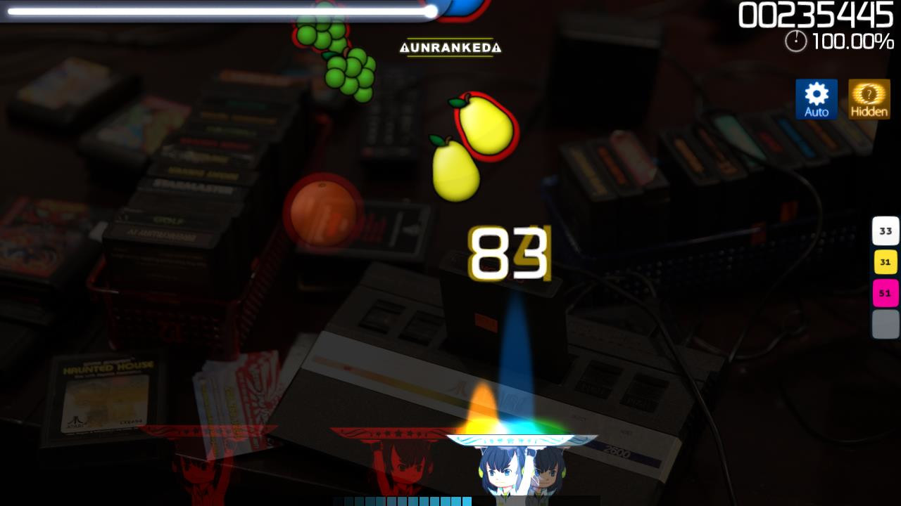

# Hidden (Mod)

 Modsymbol")

*Für die vollständige Liste aller Mods, siehe: [Spielmodifikationen](/wiki/Game_modifier)*\
*Nicht zu verwechseln mit [Fade In (Mod)](/wiki/Game_modifier/Fade_In) oder [Flashlight (Mod)](/wiki/Game_modifier/Flashlight).*

## Übersicht

- Abkürzung: HD
- Typ: Erhöhung der Schwierigkeit
- Score-Multiplikator:
  - ![][osu!] ![][osu!taiko] ![][osu!catch]: 1,06x
  - ![][osu!mania]: 1,00x
- Standard-Tastenkürzel: `F`
  - Standard-Tastenkürzel ([osu!mania](/wiki/Game_mode/osu!mania)): `F` `F` oder `Shift` + `F`
- Untertitel:
  - ![][osu!]: `Spiele ohne Approach Circles und mit Circles, die kurz darauf wieder verschwinden.`
  - ![][osu!taiko]: `Die Hit Objekte verschwinden, bevor du auf sie klickst.`
  - ![][osu!catch] `Spiele ohne Approach Circles und mit Circles, die kurz darauf wieder verschwinden.`
  - ![][osu!mania]: `Die Hit Objekte verschwinden, bevor du auf sie klickst.`
- Kompatible Spielmodi: ![][osu!] ![][osu!taiko] ![][osu!catch] ![][osu!mania]
- Variante (osu!mania): [Fade In](/wiki/Game_modifier/Fade_In)

## Beschreibung

Die Mod **Hidden** ist eine [Spielmodifikation](/wiki/Game_modifier), die die Schwierigkeit von Beatmaps erhöht, indem die Approach-Circles entfernt werden und [Hit-Objekte](/wiki/Hit_object) verblassen, nachdem sie auf dem Bildschirm erscheinen.

### osu!

In [osu!](/wiki/Game_mode/osu!) unterdrückt die Mod Hidden die Approach-Circles und sorgt dafür, dass die Hit-Objekte kurz nach dem Erscheinen wieder verblassen, wodurch Spieler dazu gezwungen sind, das Timing mehr oder weniger auswendig zu lernen und — in geringerem Maße — die Platzierung und den Sliderpath.

Es sollte jedoch angemerkt werden, dass die Mod Hidden unter den Top-Spielern aufgrund der Kontinuität, wann Hit-Objekte erscheinen und verschwinden, als die einfachste Mod zur Erhöhung der Schwierigkeitsstufe gilt. Infolge dieser Kontinuität ist es sehr wohl möglich, anhand des Erblassens zu lernen, wann Hit-Objekte angetippt werden müssen.

### osu!taiko

In [osu!taiko](/wiki/Game_mode/osu!taiko) verblassen die Noten ab etwa der Hälfte des Bildschirms, wodurch sich die Spieler das Timing und die Farbe merken müssen. Jedoch überqueren Slider und Dendens dennoch die gesamte Zeitleiste und verschwinden nicht, unter der Bedingung, dass Dendens keine Approach-Circles besitzen, damit das Trefferfenster nicht angezeigt wird.

Auf Beatmaps mit hoher allgemeiner Schwierigkeit wird von erfahrenen Spielern zur Erhöhung des Scores die Mod Hidden anstatt der Mod [Hard Rock (HR)](/wiki/Game_modifier/Hard_Rock) verwendet, da HR die Timing-Fenster gelegentlich zu klein macht.

Anders als bei osu! wird die Mod Hidden typischerweise als viel schwerer zu lesen oder sich daran zu gewöhnen angesehen, aufgrund dessen, dass der Spieler sich merken muss, welche Farbe als nächstes kommt.

### osu!catch

In [osu!catch](/wiki/Game_mode/osu!catch) sorgt die Mod Hidden dafür, dass die Fruits etwa auf halber Höhe des Bildschirms verschwinden.

Die Effekte auf die Schwierigkeit für osu!catch im Bezug auf die Mod Hidden unterscheiden sich von Beatmap zu Beatmap, aber es wird allgemein davon ausgegangen, dass Beatmaps mit einer [Approach-Rate (AR)](/wiki/Beatmapping/Approach_rate) von 9 oder höher nur einen geringen Unterschied im Anstieg der Schwierigkeit machen.

### osu!mania

In [osu!mania](/wiki/Game_mode/osu!mania) dient die Mod Hidden als das Gegenstück zur Mod Fade In, da die Notes ausgeblendet werden, bevor sie getroffen werden sollen.

, bei einer 326er Combo (oben in der Mitte), bei einer 516er Combo (oben rechts / unten links) und bei einer 900er Combo (unten rechts) in osu!mania")

## Trivia

- Die Mod Hidden wurde erstmals in Ouendan 2 veröffentlicht, welches das zweite japanische DS-Spiel in der Serie [Osu! Tatakae! Ouendan](https://en.wikipedia.org/wiki/Osu!_Tatakae!_Ouendan) ist (die Serie, auf der osu! basiert).
- Wenn eine Beatmap erfolgreich mit der Note S oder SS und der aktivierten Mod Hidden abgeschlossen wird, dann erhält man stattdessen die Silbervariante der Note.
- Standardmäßig ist in [osu!](/wiki/Game_mode/osu!) der [Approach-Circle](/wiki/Hit_object/Approach_circle) des ersten [Hit-Objekts](/wiki/Hit_object) beim Start der Beatmap temporär sichtbar, um den Spielern zu helfen, besser abzuschätzen, wann sie das Hit-Objekt antippen müssen. Das kann in den Einstellungen unter `Gameplay` deaktiviert werden.
- In osu!mania ist die Mod Hidden eine Variante der Mod [Fade In](/wiki/Game_modifier/Fade_In).
- Die aktuelle Version der Mod Hidden in osu!mania war früher eine separate Mod namens [Fade Out](/wiki/Game_modifier/Fade_Out).

[osu!]: /wiki/shared/mode/osu.png "osu!"
[osu!taiko]: /wiki/shared/mode/taiko.png "osu!taiko"
[osu!catch]: /wiki/shared/mode/catch.png "osu!catch"
[osu!mania]: /wiki/shared/mode/mania.png "osu!mania"
