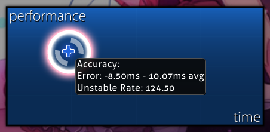

---
tags:
  - converted unstable rate
  - converted UR
  - cv UR
  - cv. UR
  - error
  - hit error
  - timing
  - UR
  - tasa inestable convertida
  - UR convertido
  - acierto
  - error de golpeo
  - sincronización
---

# Tasa inestable

La **tasa inestable** (***UR***) es una medida para la variación de los errores de golpeo a lo largo de una jugada. Se calcula como la [desviación estándar](https://es.wikipedia.org/wiki/Desviación_típica) de los errores de golpeo, que se muestran en décimas de milisegundo. Un UR más bajo indica que los golpes del jugador tienen errores más similares, mientras que un UR más alto indica que están más separados.

Los jugadores que se especializan en conseguir una [precisión](/wiki/Gameplay/Accuracy) alta a menudo logran un UR que está significativamente por debajo de lo que se requiere para obtener una [SS](/wiki/Gameplay/Grade). La tasa inestable puede ser una métrica particularmente útil para ayudar a juzgar estas puntuaciones con mayor detalle que los [juicios](/wiki/Gameplay/Judgement) normales.

Ten en cuenta que el UR mide la consistencia entre los errores de golpeo, y no la cantidad de error. Si bien un UR bajo suele ser el resultado de una jugada precisa, es posible obtener un UR muy bajo al mismo tiempo que una precisión muy baja. Por ejemplo, un jugador podría golpear cada [objeto](/wiki/Gameplay/Hit_object) lo suficientemente tarde como para obtener un [50](/wiki/Gameplay/Judgement/osu!), pero con un error consistente.

## En la pantalla de resultados



Al pasar el cursor sobre el gráfico de rendimiento en la [pantalla de resultados](/wiki/Client/Interface#pantalla-de-resultados), se muestra información sobre el error de golpeo promedio y la tasa inestable de la jugada. Esto solo se mostrará si la puntuación acaba de ser realizada, observada o reproducida.

## Con mods que cambian la velocidad

Los errores de golpeo usados para calcular la tasa inestable se miden según el tiempo del [beatmap](/wiki/Beatmap) durante el juego, no el tiempo del mundo real. Esto significa que cuando se usan [mods](/wiki/Gameplay/Game_modifier) ​​que cambian la velocidad del beatmap, como [Double Time](/wiki/Gameplay/Game_modifier/Double_Time) o [Half Time](/wiki/Gameplay/Game_modifier/Half_Time), el UR de las entradas del jugador en el mundo real se multiplica efectivamente por ese cambio de velocidad.

Al comparar los valores de UR entre jugadas con diferentes mods, la gente suele confiar en el concepto no oficial de **tasa inestable convertida** (***cv. UR***), definida como el UR con el cambio de velocidad de los mods dividido:

```
cv. UR para Double Time = UR / 1.5
cv. UR para Half Time   = UR / 0.75
```

### En versiones de lazer

A partir de la versión [2023.1130.0](https://osu.ppy.sh/home/changelog/lazer/2023.1130.0) de [lazer](/wiki/Client/Release_stream/Lazer), el UR se mide usando el tiempo del mundo real independientemente de los mods utilizados, eliminando la necesidad del UR convertido.
