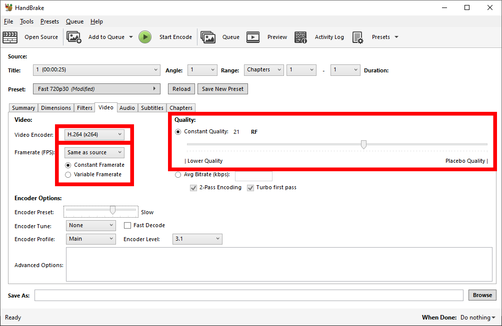
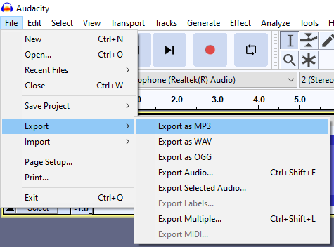
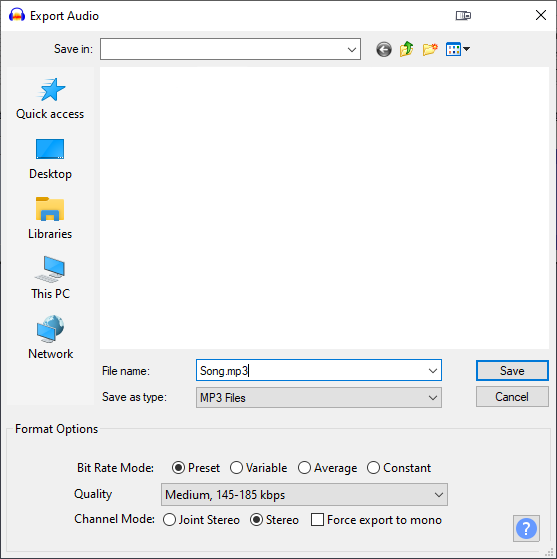

# Compressing files

Each beatmap has a file size limit dictated by it's total length and any video and audio content must meet requirements for formats, resolutions, and bit rates.

This guide will help you get your beatmap under that limit and meet such requirements.

## Introduction

There are 2 types of compression. **Lossless** and **Lossy** compression.

- **Lossless** compression implies that the quality never degrades and can thus be repeatedly compressed and decompressed.
- **Lossy** compression uses certain powerful techniques to reduce file size at the expense of quality.

To convert, or reduce either file size, average bitrate, or resolution of a audio or video file requires a process called **re-encoding**, or more known as **transcoding**. Transcoding an already lossy-compressed audio or video using lossy compression can result in varying degrees of further quality reduction depending on the settings used.

Due to that reason, re-encoding should be avoided except if the source audio or video file is any of the following:

- Too large in file size
- Too high of a resolution or average bit rate
- Encoded in a incompatible format

If you have to re-encode, it is suggested to use the highest quality source file available (e.g. highest resolution and/or bit rate) from which to be re-encoded from.

## Video

Videos encoded in the H.264 format is supported usually using the .mp4 file extension. Other formats such as H.265, VP9 and AV1 and file extensions such as .mkv and .mov are currently not supported.

The [Ranking Criteria](/wiki/Ranking_Criteria#video_and_background) specifies a maximum video resolution with a width of 1280 pixels and height of 720 pixels, or 1280x720 in the 16:9 aspect ratio.

### Using Handbrake

This section will show you how to remove audio from videos using [Handbrake](https://handbrake.fr/) to reduce the file size of the video file.

1. Open Handbrake and import your video file. You can drag and drop your file into Handbrake or manually import by clicking the `File` option.


2. Select the `Fast 720p30` preset.


3. Select the `Audio` tab and remove all audio tracks. Do the same for any subtitles by going into the `Subtitles` tab and removing all entries.


4. Go into the `Video` tab and make sure the video codec is set as `H.264 (X264)`. Change the `Constant Quality` to between 20–25. Smaller values will produce larger file sizes but with a higher video quality.
5. If you are willing to spend more time encoding, change the `Encoder Preset` under `Encoder Options`. Slower presets deliver better video quality and may also reduce video file size, but do not go down to placebo as it takes much longer than `VerySlow` for very little improvement in quality. Set the framerate to be the same as the source and set it to constant framerate.



6. To resize the image of the video file, go to the `Dimensions` tab and change the width to `1280` and change the height to `720`.


7. Lastly, pick the file location you want to save your result to, then click `Start Encode`.


### Using FFmpeg

This section will show you how you can use [FFmpeg](https://ffmpeg.org/) to reduce video file size. FFmpeg is a program used through a [command-line interface (CLI)](https://en.wikipedia.org/wiki/Command-line_interface), meaning it does not have any [graphical user interface (GUI)](https://en.wikipedia.org/wiki/Graphical_user_interface) by itself. While this may seem intimidating, FFmpeg can offer more flexibility than other tools, such as being able to re-encode multiple video files more quickly and easily.

If you are on Windows, first [download FFmpeg](https://ffmpeg.org/download.html) and add its directory to your `PATH` environment variable. On MacOS, you can alternatively install it using [brew](https://brew.sh/). Most Linux distributions already have FFmpeg installed, but it can often be easily installed through their respective package managers.
   
Open a terminal and paste in the following command, changing the values as needed:

```
ffmpeg -i input -c:v libx264 -crf 20 -preset slower -profile:v high -vf scale=-1:720 -an -sn -map_metadata -1 -map_chapters -1 output.mp4
```

- `-i input`: Your source file. If the file name contains spaces, wrap it around double quotes (`"`).
- `-c:v libx264`: Specify that the video should be encoded using the x264 encoder, producing video in the H.264 format.
- `-crf 20`: The compression quality, where lower values give better quality at the expense of larger files and vice versa. The recommended range is around 20-25.
- `-preset slower`: Specify an encoding preset, with recommended values ranging from `ultrafast` to `veryslow`. Slower presets allow the encoder to give you higher quality for the same bitrate, or lower bitrate for the same quality. More information about available presets can be found on [FFmpeg's official website](https://trac.ffmpeg.org/wiki/Encode/H.264#Preset).
- `profile:v high`: Specify that the video should be encoded with the H.264 High profile.
- `-vf scale=-1:720`: Downscale the video to a height of 720 pixels. The `-1` lets FFmpeg automatically determine the width of the new video based on the aspect ratio of the source.
- `-an -sn`: Remove audio and subtitles if present.
- `-map_metadata -1 -map_chapters -1`: Remove metadata and chapters if present.
- `output.mp4`: Your output file. If the file name contains spaces, wrap it around double quotes (`"`).

## Audio

Audio encoded in either MP3 or OGG (Vorbis) formats are supported with .mp3 and .ogg file extensions, respectively. Other formats such as AAC and OGG (Opus) and any lossless formats are not supported.

The [Ranking Criteria](/wiki/Ranking_Criteria#audio) specifies that average bit rate must be below 192kbps and above 128kbps. As reference, osu! Featured Artists songs are encoding with a constant bit rate of 192kbps.

### Using Audacity

1. Import the audio file into Audacity.


2. Export the audio as MP3.



3. Change the export options to help compress your file. Use `Preset` and select the quality as `Medium, 145-185 kbps`. If you want, you can enter in the metadata in the next dialog. When ready, click `OK`.



### Using FFmpeg

Paste the following command into your terminal and change the values as needed:

```
ffmpeg -i input -c:a libmp3lame -q:a 4 -vn -sn -map_metadata -1 -map_chapters -1 output.mp3
```

- `-i input`: Your source file. If the file name contains spaces, wrap it around double quotes (`"`).
- `-c:a libmp3lame`: Specify that the audio should be encoded using the LAME MP3 encoder.
- `-q:a 4`: Use the same variable bitrate range as in the Audacity example, where a lower number means higher bitrate. If you want constant bitrate, you would instead use for instance `-b:a 128k` for a constant 128kbps bitrate.
- `-vn -sn`: Remove video and subtitles if present.
- `-map_metadata -1 -map_chapters -1`: Remove metadata and chapters if present.
- `output.mp3`: Your output file. If the file name contains spaces, wrap it around double quotes (`"`).

## Verify

Optionally, after transcoding your audio or video files, it is recommended to check the technical information of such files to confirm that it has been processed in a way you expected, and in a way that would meet bit rate and other requirements.

Software such as [MediaInfo](https://mediaarea.net/en/MediaInfo) can be used to see such information.

### Using MediaInfo

MediaInfo is very easy to use; after installing, open MediaInfo then open your file, and done. The technical information about that file will then appear.

1. Open MediaInfo, and open the video or audio file you want to check.

After opening MediaInfo, go into `File`, then `Open` and `Open file(s)...`.

2. Change view from text to HTML.

Once the file is opened, a condensed series of information about that file will appear but to see more, go into `View` and change it to `HTML`.

3. Scroll down to the appropriate section.

For video, scroll down to the `Video` section. For audio, instead scroll down to the `Audio` section.

Here, you want to confirm certain things such as the format, resolution, and frame rate, or bit rate to see if it is what you have expected.
