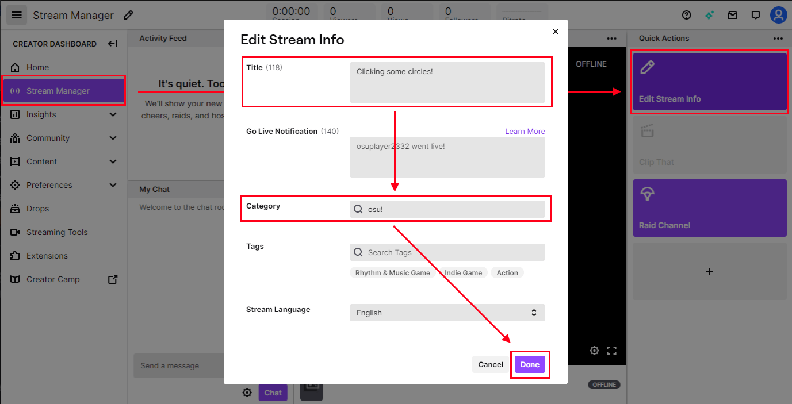
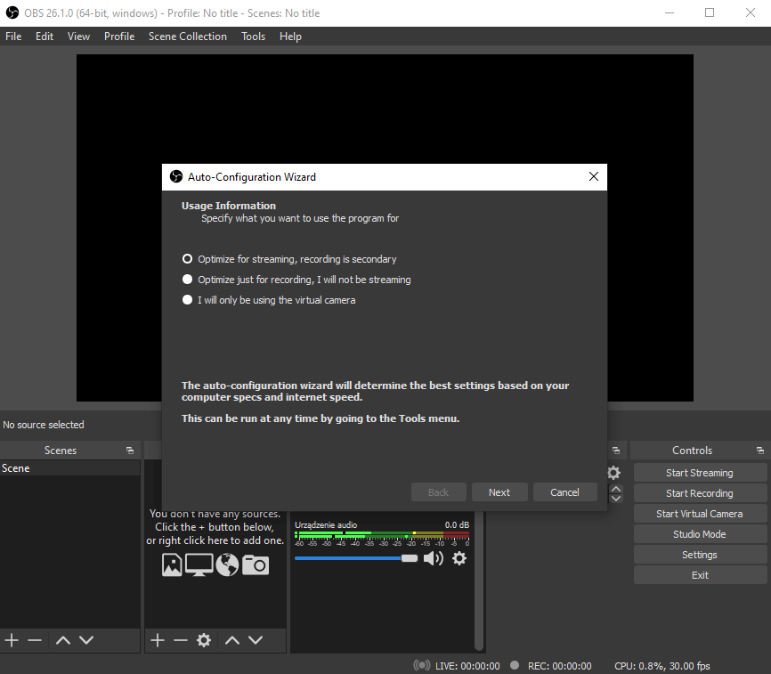
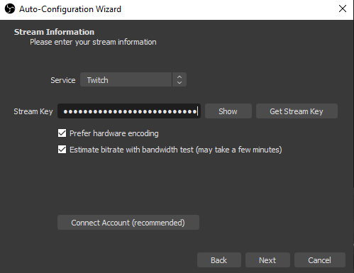
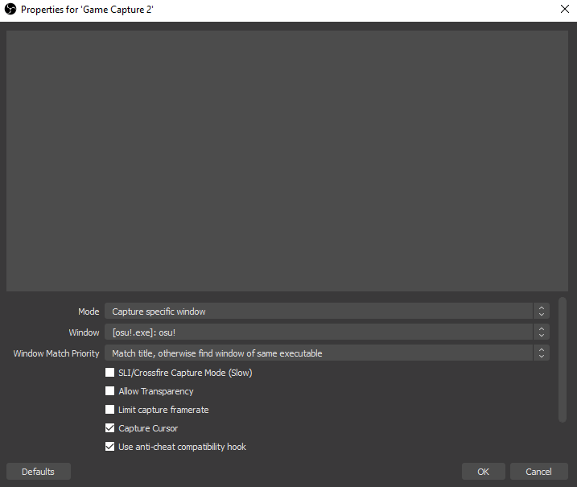

# Streamer osu!

Ce guide vous montrera comment faire du stream d'osu! sur Twitch en utilisant [OBS Studio](https://obsproject.com/). C'est relativement simple, bien que cela nécessite un ordinateur puissant capable d'exécuter et de diffuser en continu osu! en même temps.

## Twitch

Si vous ne l'avez pas encore fait, créez un [compte Twitch](https://www.twitch.tv/signup).

Maintenant, vous devez configurer votre compte pour le livestreaming d'osu!. Sur la page principale, cliquez sur votre avatar en haut à droite et sélectionnez `Tableau de bord du créateur` dans la liste.

Le tableau de bord du créateur est l'endroit où vous pouvez configurer les informations relatives à votre stream, la modération du chat, les informations sur votre profil, etc. Pour l'instant, nous allons nous concentrer sur les informations du stream. Depuis la page principale du tableau de bord, cliquez sur le bouton `Stream Manager` sur la gauche, puis choisissez l'option `Edit Stream Info` sur la droite.

Une boîte de dialogue s'ouvre alors pour vous permettre de saisir les informations relatives à votre stream. Vous pouvez remplir les champs comme vous le souhaitez ; cependant, le titre doit comprendre le sujet du stream et être invitant pour les personnes qui consultent la liste des streams disponibles. La catégorie doit correspondre au jeu auquel vous jouez en ce moment, c'est-à-dire `osu!`.

---

Après avoir modifié les informations de votre stream, cliquez sur le bouton `Done`. Cliquez maintenant sur le bouton `Préférences` à gauche, puis sur `Canal`. Recherchez le champ `Primary Stream key` et cliquez sur `Copier`. **Ne partagez pas cette clé, elle permet de diffuser sur votre chaîne**. Pour l'instant, collez la clé du stream dans un bloc-notes.

## OBS Studio

Après avoir créé et configuré votre compte Twitch, la prochaine chose dont vous aurez besoin est une application de streaming. Ce guide utilise OBS Studio, mais vous êtes libre de choisir une autre application (par exemple [XSplit Broadcaster](https://www.xsplit.com/broadcaster)).

Allez sur le [site web d'OBS Studio](https://obsproject.com/) et téléchargez le programme d'installation pour votre système d'exploitation. Ouvrez le programme d'installation et suivez les étapes pour installer l'application.

### Configurer OBS Studio

Lorsque vous lancez OBS Studio pour la première fois, l'assistant d'auto-configuration s'ouvre. Choisissez `Optimiser pour le streaming, l'enregistrement est secondaire` et cliquez sur `Suivant`.

La section suivante à configurer est celle des paramètres vidéo. Choisissez la résolution de votre écran dans le champ `Résolution de base (Canvas)` (elle devrait être détectée automatiquement), et `Soit 60 ou 30, mais préférez 60 si possible` dans le champ `FPS`.

Enfin, vous devrez configurer les informations du stream pour qu'OBS Studio puisse faire du livestream sur Twitch. Cliquez sur le bouton `Use Stream Key`, et entrez la clé de streaming qui a été copiée plus tôt dans ce champ. Laissez les autres options cochées comme elles le sont, et cliquez sur `Next`.

Après cela, OBS Studio se configurera automatiquement pour trouver les meilleurs paramètres pour votre appareil. Cliquez sur `Appliquer les paramètres` lorsque cela est terminé.

### Ajouter une scène

La dernière chose dont vous aurez besoin pour commencer le streaming est une scène contenant la fenêtre d'osu!. Pour en créer une, faites un clic droit sur la boîte `Scenes` dans la fenêtre principale d'OBS Studio et sélectionnez `Add` pour être invité à ouvrir une fenêtre de création de scène. Nommez-la "osu!", et cliquez sur `OK` pour continuer.

Maintenant, OBS Studio a besoin d'une source pour capturer osu!. D'abord, ouvrez osu!, puis dans OBS Studio, faites un clic droit sur la boîte `Sources` et sélectionnez `Add` -> `Game Capture`. Cela ouvrira le dialogue de sélection de la source. Vous pouvez la nommer "osu!", mais cela peut être ce que vous voulez, puis cliquez sur `OK`. Sélectionnez `Capture specific window` dans le menu déroulant `Mode` puis sélectionnez `[osu!.exe]: osu!` dans la liste `Window`.

Si tout va bien, vous devriez voir la fenêtre d'osu! dans l'aperçu.

## Quelle est la prochaine étape ?

Maintenant, après avoir configuré OBS Studio et votre compte Twitch, cliquez sur `Start Streaming` dans OBS Studio pour faire un livestream. Votre streaming apparaîtra sur [Twitch](https://www.twitch.tv/directory/game/osu!) et sur [la liste des livestreams du site osu!](https://osu.ppy.sh/community/livestreams) après quelques minutes. C'est tout ce que vous devez savoir pour vous lancer dans le streaming. Bien entendu, nous n'avons abordé que les bases du livestreaming et il vous reste encore de nombreuses choses à faire, les plus importantes étant les suivantes :

- **Trouvez les meilleurs paramètres de stream.** Les paramètres configurés automatiquement par OBS Studio peuvent ne pas être adaptés à votre appareil. Vérifiez donc si votre livestream fonctionne correctement et ce qui doit être amélioré pour offrir la meilleure expérience à vos spectateurs.
- **Construisez une communauté.** C'est probablement le plus difficile, car créer sa propre communauté à partir de rien demande une quantité folle de dévouement et de temps.
- **Améliorer la qualité du livestream.** Cela peut inclure l'ajout de nouveaux overlays, la capture de caméra, les effets de transition de scène, les plugins spécifiques à osu!, l'affichage du tchat sur Twitch, l'intégrité de Twitch, et bien plus encore. Vous pouvez également améliorer l'apparence de votre chaîne en définissant un avatar, une bannière et des informations générales.
- ...et surtout, amusez-vous !
