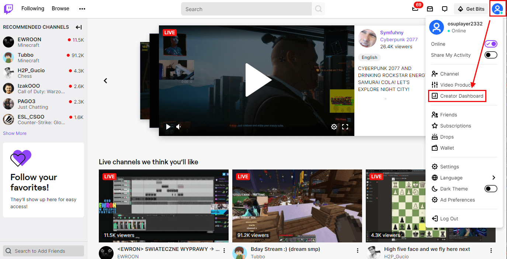

# Как начать стримить osu!

Это руководство покажет вам, как транслировать osu! на Twitch с помощью [OBS Studio](https://obsproject.com/). Сделать это относительно просто, хотя для этого может потребоваться мощный компьютер, способный запускать и транслировать osu! одновременно.

## Twitch

Если вы еще этого не сделали, [зарегистрируйте аккаунт на Twitch](https://www.twitch.tv/signup).

Теперь вам нужно настроить свою учетную запись для прямой трансляции osu!. На главной странице нажмите на свой аватар в правом верхнем углу и выберите из списка `Личный кабинет автора`.

Личный кабинет автора - это место, где вы можете настроить информацию о стриме, модерацию чата, информацию профиля и многое другое. Пока мы сосредоточимся на информации о стриме. На главной странице личного кабинета нажмите кнопку `Диспетчер стриов` слева, а затем выберите опцию `Редактировать информацию о стриме` справа.

Откроется диалоговое окно для ввода информации о вашем стриме. Вы можете заполнить поля, как хотите; тем не менее, название должно говорить о теме трансляции, а также привлекать людей, просматривающих список доступных стримов. Категория должна быть связана с игрой, в которую вы играете в данный момент, в данном случае это `osu!`.

---

После редактирования информации о потоке нажмите кнопку `Готово`. Теперь нажмите на кнопку `Настройки` слева, затем `Канал`. Найдите поле ёКлюч оснновного потока` и нажмите кнопку `Копировать`. **Не делитесь этим ключом — он позволяет запускать стрим от вашего имени.** Сейчас просто вставьте скопированный ключ стрима в блокнот.

## OBS Studio

После создания и настройки учетной записи Twitch следующее, что вам понадобится, это приложение для запуска стрима. В этом руководстве будет использоваться OBS Studio; тем не менее, вы можете проверить любые другие альтернативы (например, [XSplit Broadcaster](https://www.xsplit.com/broadcaster)).

Перейдите на [веб-сайт OBS Studio](https://obsproject.com/)  и загрузите установщик для вашей операционной системы. Откройте установщик и следуйте инструкциям по установке приложения.

### Настройка OBS Studio

При первом запуске OBS Studio откроется мастер автоматической настройки. Выберите `Оптимизировать для стрима, запись является вторичной` и нажмите кнопку `Далее`.

Следующим разделом, который необходимо настроить, являются параметры видео. Выберите разрешение экрана для поля 	`Базовое (холстовое) разрешение` (должно определяться автоматически) и `Либо 60, либо 30, но предпочитайте 60, когда это возможно` в поля `FPS`.

Наконец, вам нужно будет настроить передачу в OBS Studio для прямой трансляции на Twitch. Нажмите кнопку `Использовать ключ стрима` и введите в поле ключ основного потока, скопированный ранее. Оставьте остальные параметры без изменений и нажмите кнопку `Далее`.

После этого OBS Studio автоматически настроит себя, чтобы найти лучшие настройки для вашего устройства. Нажмите кнопку `Применить параметры`, когда все будет завершено.

### Добавление сцены 

Последнее, что вам нужно, чтобы начать стрим, это сцена, содержащая окно с osu!. Чтобы создать её, щелкните правой кнопкой мыши поле `Сцены` в главном окне OBS Studio и выберите `Добавить`, чтобы появилось окно создания сцены. Назовите его "osu!" и нажмите `OK`, чтобы продолжить.

Теперь OBS Studio нужен источник для захвата osu!. Сначала откройте osu!, затем — в OBS Studio — щелкните правой кнопкой мыши на поле `Источники` и выберите `Добавить` - `Захват игры`. Откроется диалоговое окно выбора исходного кода. Вы можете назвать источник "osu!", но это может быть все, что вы хотите, затем нажмите `OK`. Выберите `Окно захвата` в раскрывающемся списке `Режим`, затем выберите `[osu!. exe]: osu!` из списка `Окно`.

Если все пойдет хорошо, вы должны увидеть осу! в окне предварительного просмотра.

## Что дальше? 

Теперь, после настройки OBS Studio и учетной записи Twitch, нажмите кнопку `Начать стрим` в OBS Studio, чтобы сделать прямую трансляцию. Ваш стрим появится на [Twitch](https://www.twitch.tv/directory/game/osu!) и [разделе osu! с прямыми трансляциями](https://osu.ppy.sh/community/livestreams) за пару минут. Это все, что вам нужно знать, чтобы начать свое стрим-путешествие. Конечно, мы рассмотрели только основы прямой трансляции, и есть много вещей, которые вы все еще можете сделать, причем наиболее важными из них являются:

- **Найдите лучшие настройки потоковой передачи. **Автоматически настроенные параметры, предоставляемые OBS Studio, могут не подходить для вашего устройства. Поэтому проверьте, работает ли ваша прямая трансляция нормально и что необходимо улучшить, чтобы обеспечить лучший опыт для ваших зрителей.
- **Создайте сообщество.** Это, вероятно, самое сложное, так как создание собственного сообщества с нуля требует безумного количества самоотверженности и времени.
- **Улучшайте качество прямых трансляций.** Это может включать в себя добавление новых наложений, захват камеры, эффекты перехода сцены, плагины, специфичные для osu!, дисплей чата Twitch, интеграции с Twitch и многое другое. Вы также можете улучшить внешний вид своего канала, установив аватар, баннер и общую информацию.
- ...и самое главное, веселитесь!
