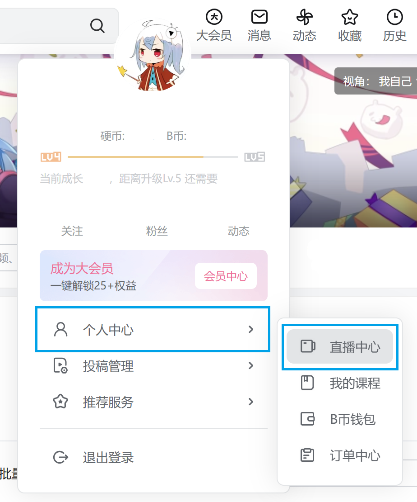
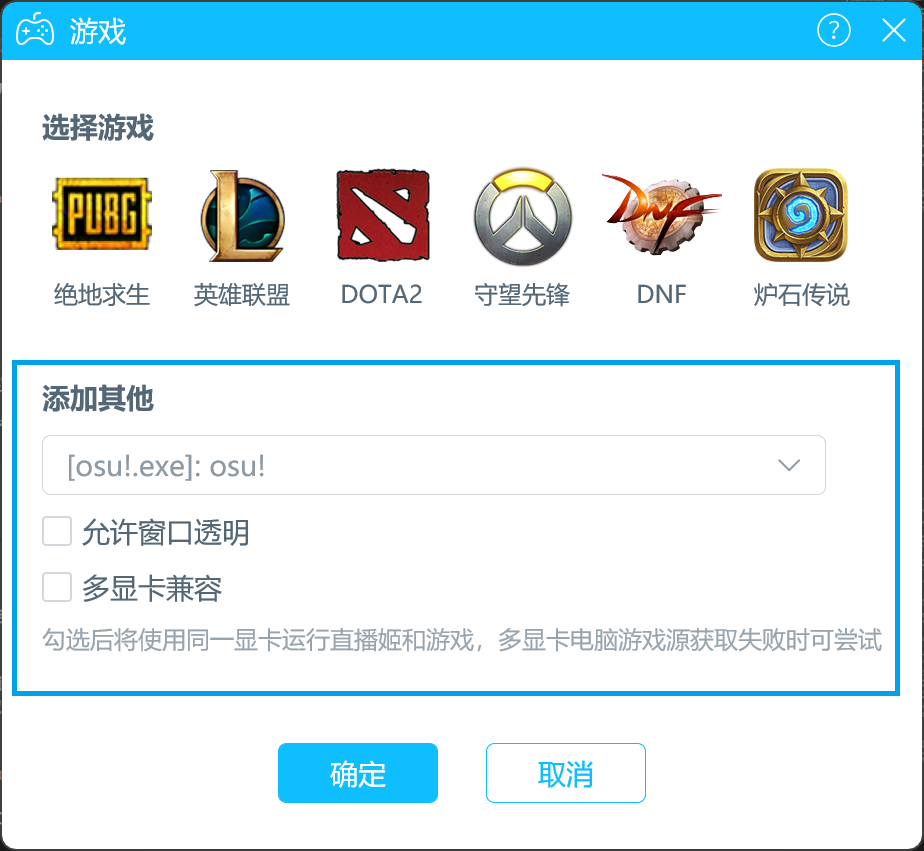

# 直播 osu!

本教程会向你展示使用 [OBS Studio](https://obsproject.com/) 在哔哩哔哩与 Twitch 上直播 osu! 的方法。这个过程相对简单，需要一台能同时运行和直播 osu! 的高性能电脑。

## 哔哩哔哩

哔哩哔哩支持使用多种方式直播 osu!。关于配置直播的具体流程、以及直播过程中可能遇到的问题，参见[哔哩哔哩直播帮助中心](https://link.bilibili.com/p/help/index#/live-hime)。

### 配置账户

如果你还没有注册[哔哩哔哩账户](https://www.bilibili.com)，可以先注册一个。

你需要确保账号通过了实名认证，直播功能可以正常使用。

进入直播中心后，转到`我的直播间 -> 开播设置`，选择直播分类并填写直播间标题。你也可以填写公告、添加标签与简介、上传封面等，以提高直播曝光率。

例如，直播分类可选择`网游`或`单机游戏`等，个人标签、房间名中可添加 `osu!` 等字样。

除此之外，哔哩哔哩直播姬客户端中也提供了相关信息的设置功能，可在主界面上部设置。

### 使用哔哩哔哩直播姬直播

可以使用[哔哩哔哩直播姬](https://link.bilibili.com/p/eden/download)在 Windows 设备进行直播。

与 OBS Studio 稍有不同的是，哔哩哔哩直播姬有固定的 3 个场景，但来源依然需要手动添加。

在打开 osu! 客户端后，点击直播姬`场景`标签页下方的`+ 素材`按钮，随后选择`游戏进程`。在`添加其他`小节的下拉菜单中找到并选择`[osu!.exe]: osu!`，并点击`确定`。

如果一切正常，你应该会在预览画面中看到 osu! 窗口。

### 使用 OBS Studio 直播

关于 OBS Studio 的具体使用细节，请参见[下方的“配置 OBS Studio”](#配置-obs-studio)小节。

对于 OBS Studio，请在哔哩哔哩直播中心的`开播设置`页面，点击`开始直播`按钮、将给出的服务器地址与推流码输入后，即可进行推流直播。

## Twitch

如果你还没有注册 [Twitch 账户](https://www.twitch.tv/signup)，可以先注册一个。

现在你需要将你的账户设置成直播 osu!。在主页中点击右上方的头像，从列表中选择`创作者仪表板 (Creator Dashboard)`。

")

在创作者仪表板 (Creator Dashboard) 中，你可以设置直播信息、聊天控制与个人档案信息，以及一些其他的设置。最重要的一步是设置直播信息。点击仪表板主页左侧的`直播管理器 (Stream Manager)` 按钮，然后选择右侧的`编辑直播信息 (Edit Stream Info)` 选项。

会打开一个对话框，要求输入直播信息。你可以按个人喜好填写各字段；然而，标题应该包括直播主题，能够吸引浏览直播列表的人。栏目也应该设置为要直播的游戏，这种情况下是 `osu!`。

---

在编辑好信息后，点击`完成 (Done)` 按钮。现在点击左侧的`首选项 (Preferences)` 按钮，然后点击`频道 (Channel)`，找到`主串流密钥 (Primary Stream key)` 字段，点击`复制 (Copy)`。**不要将此密钥与他人共享——它允许别人以你的名义直播。** 现在，把复制好的密钥粘贴到记事本中。

## OBS Studio

在创建并配置好你的 Twitch 账户后，下一步是获取直播软件。本教程只会介绍使用 OBS Studio 直播的方法，但你也可以考虑用别的软件（比如 [XSplit Broadcaster](https://www.xsplit.com/broadcaster)）。

登陆 [OBS Studio 网站](https://obsproject.com/)，下载对应操作系统的安装程序。启动安装程序，按照指示步骤进行安装。

### 配置 OBS Studio

当你首次启动 OBS Studio 时，会打开自动配置向导。选择`优先优化串流，其次为录像`然后点击`下一步`。

下一步是配置视频设置。`基础（画布）分辨率`一项选择你的屏幕分辨率（应该被自动检测），`FPS` 选择 `60 或 30，但尽可能选择 60`。

最后，你需要在 OBS Studio 中输入直播信息来将其连接到你的 Twitch 频道。点击`使用串流密钥`按钮，将先前复制好的主串流密钥输入此字段。其他选项保留原样，点击`下一步`。

在此之后， OBS Studio 会自动配置，找到与你的设备相符的最佳配置。当此过程完成后，点击`应用设置`。

### 添加场景

建立好含有 osu! 窗口的场景是开始直播需要做的最后一件事。右击 OBS Studio 主窗口中的`场景`框，选择`添加`，会提示添加场景。把名字设置为 “osu!”，点击`确定`继续。

现在 OBS Studio 需要一个用于采集 osu! 的“来源”。首先打开 osu!，然后在 OBS Studio 中右击`来源`框，选择`添加` -> `游戏源`。这会打开来源选择对话框。你可以将来源命名为 “osu!”，但也可以是你想取的任何名字，然后点击`确定`。从`模式`下拉框中选择`采集特定窗口`，然后从`窗口`列表中选择 `[osu!.exe]: osu!`。

如果一切正常，你应该会在预览画面中看到 osu! 窗口。

## 接下来做什么？

现在，在配置好 OBS Studio 和你的哔哩哔哩或 Twitch 账户后，在 OBS Studio 中点击`开始推流`来开始直播。几分钟后，你的直播就会出现在 [Twitch](https://www.twitch.tv/directory/game/osu!) 与 [osu! 网站的直播列表](https://osu.ppy.sh/community/livestreams)上；如果你在使用哔哩哔哩直播，则会显示在你的哔哩哔哩账户资料页。以上就是你开始直播之旅需要了解的所有事情了。当然，这篇教程只包括直播的基本流程；你还有很多方式继续进步、改善你的直播。因此，请考虑这些重要的事：

- **找到最佳直播设置。** OBS Studio 提供的自动配置对你的设备来说可能并不完美。因此，请检查一下你的直播是否很好。如果不太好，就看看应该改善什么来为观看者提供最佳体验。
- **建立社群。** 这件事很有挑战性，因为从头开始建立你自己的社群需要很高程度的付出、投入和时间。然而，这可以为你的努力带来最丰厚的回报。
- **提高直播质量。** 你可以添加新的指示器、摄像头画面、转场效果、osu! 特定的插件、Twitch 聊天显示与集成，还有很多很多。你也可以设置头像、头图和基本信息来改善频道的外观。
- ...最重要的是，玩得开心！
