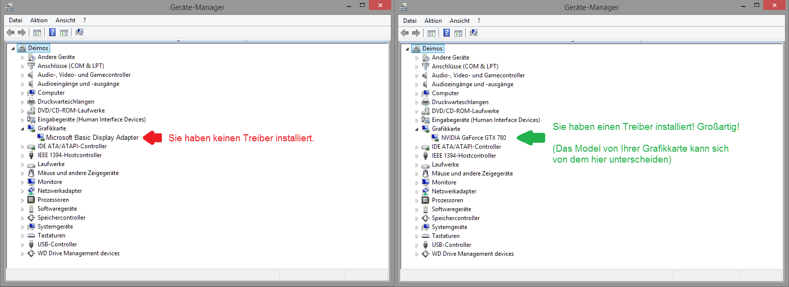

# Probleme mit GL Unterstützung

Die nächste große Veröffentlichung von osu! (kommt in August-September 2015) entfernt die DirectX Unterstützung, um unser Framework zu vereinfachen. Wenn du diesen Artikel siehst, bedeutet es, dass du, wenn der neue Build veröffentlich wurde, nicht in der Lage bist osu! auf deinem derzeitigen System zu spielen. Bitte lese dir die folgenden Informationen gründlich durch und versuche sie aus.

## Fehlender oder alter Treiber

Wenn du nicht den richtigen Grafikkartentreiber installiert hast, wird Windows den "Microsoft Basic Display Adapter" als Ersatztreiber verwenden, welcher für DirectX Spiele **funktioniert**, aber sehr langsam. Bei OpenGL wird es nicht funktionieren, daher solltest du auf Nummer sichergehen und den richtigen Treiber verwenden.

Als erstes überprüfe, ob dies auf dich zutrifft:

- Rechtsklick auf 'Dieser PC' und wähle 'Eigenschaften' aus oder drücke `Windows-Taste + Pause` auf Ihrer Tastatur.
- Wähle Geräte-Manager auf der linken Seite aus.

Überprüfe, ob du Microsoft Basic Display Adapter wie im folgenden Bild benutzt:

Bitte lade dir den Treiber von der Webseite des Herstellers deiner Grafikkarte herunter. Hier ein paar allgemeine Links:

- [AMD / ATI](https://amd.com/de/support)
- [NVIDIA](https://nvidia.de/Download/index.aspx?lang=de)
- [Intel Grafikkartentreiber](https://downloadcenter.intel.com/de/product/81500/Intel-HD-Grafik-3000)

## Falsche Bittiefe

Dein Treiber mag vielleicht richtig sein, aber die Farbbittiefe kann dennoch möglicherweise falsch sein. Windows wird dann den Ersatztreiber verwenden, [wenn die Farbbittiefe nicht 32bpp ist](https://opengl.org/discussion_boards/showthread.php/145008-Why-my-OpenGL-program-uses-Microsoft-GDI-renderer-instead-of-my-GeForce-5200). Das Ändern [der Farbbittiefe zu 32bpp sollte das Problem lösen](https://windows.microsoft.com/en-us/windows/getting-best-display-monitor#getting-best-display-monitor&section_2).

## Zusätzliche Hilfe

Wenn dein Problem nach den genannten Lösungen immernoch besteht, dann erstelle dir bitte ein Thread im [Hilfe-Forum](https://osu.ppy.sh/community/forums/5) mit dem Output von [diesem Programm](http://realtech-vr.com/home/glview) und deiner `gl\_info.txt`, wenn du den `Cutting Edge` Build benutzt.
