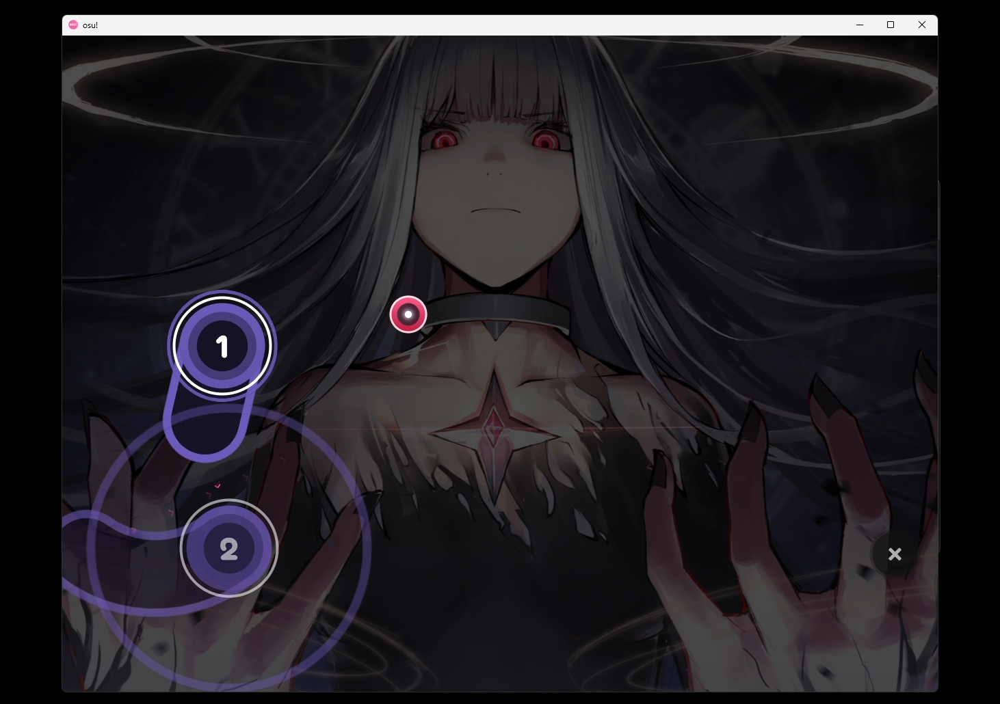

# 简版上架标准

*对于完整版谱面上架标准 (RC)，请参见： [谱面上架标准](/wiki/Ranking_criteria)*

完整版的[谱面上架标准 (RC)](/wiki/Ranking_criteria) 很复杂。它包含[谱面](/wiki/Beatmap)从创建到[上架](/wiki/Beatmap_ranking_procedure#上架)所需要遵守的所有规定和准则，以及大多数谱师从未遇到过的*许多*罕见情况。

**简版上架标准**这篇文章是为了让谱师更清楚地了解制作符合上架标准的谱面所需要遵守和参考的：

- 大多数谱面遵守的简化版规定和准则
- 谱师上架谱面时需要考虑的主观标准

## 谱面

::: Infobox

:::

- **谱面长度至少 30 秒。**
- **谱面最早只能结束在 [80% 标记](./img/percent.png)处。** 如果你想更早结束谱面，请截短歌曲。

### 难度梯度

- **难度名必须有等级之分。** 
  - 默认方案是 Easy -> Normal -> Hard -> Insane -> Expert。
  - 像 Seed -> Sprout -> Tree 这样符合事物发展逻辑的命名方案也可以。
  - **例外情况：**谱面的主难（最高难度）可以自定义命名。例如 Normal -> Hard -> *Melancholy*。
- **不要跳过难度。** 例如，你制作了 Normal 和 Insane 难度，那么也需要制作 Hard 难度。
- **[谱面主（谱面拥有者）](/wiki/Beatmap/Beatmap_host) 制作的难度数量必须大于等于[客串谱师](/wiki/Beatmap/Guest_difficulty)制作的数量。**
- **根据游戏模式和歌曲长度，谱面所需的最低难度必须大于等于：**

| [掉血时间](/wiki/Beatmap/Drain_time) | osu! | osu!taiko |
| --: | :-: | :-: |
| **0:30 到 3:30** | Normal | Futsuu |
| **3:30 到 4:15** | Hard | Muzukashii |
| **4:15 到 5:00** | Insane | Oni |

| [掉血时间](/wiki/Beatmap/Drain_time) | osu!catch | osu!mania |
| --: | :-: | :-: |
| **0:30 到 2:30** | Salad | Normal |
| **2:30 到 3:15** | Platter | Hard |
| **3:15 到 4:00** | Rain | Insane |

### 音效

- **谱面必须[下音效](/wiki/Beatmapping/Hitsound)。**osu!mania 谱面除外。
- **所有可点击的物件必须能让玩家听到（有足够的反馈）。**

### 时间轴

::: Infobox

:::

- **谱面时间轴（红线）必须精确。** BPM 和拍子记号也必须准确。
- **所有难度必须使用同一套时间轴（红线）。**
- **不要为了更改滑条速度而调整时间轴（红线）。**
- **物件必须放置在节拍细分线上。**
- **同一时间点只能有一个物件。** osu!mania 谱面除外。

## 元数据

- **元数据（歌曲信息）必须准确无误。**
  - 使用[主要元数据来源](/wiki/Beatmap/Primary_metadata_source)。
  - 如果谱面的歌曲已经存在于上架 (Ranked) 或社区喜爱谱面 (Loved) 中，并且它们的元数据没有明显的错误，那么需要使用它们的元数据。
- **使用[修正平文式罗马音方案](https://zh.wikipedia.org/wiki/%E5%B9%B3%E6%96%87%E5%BC%8F%E7%BD%97%E9%A9%AC%E5%AD%97)作为日文罗马音方案。**

### 标签

  - **添加为谱面做出贡献的玩家名。** 这不包括摸图的玩家。
  - **添加歌曲的[曲风和语言](/wiki/Beatmap/Genre_and_language)。**
  - **如果歌曲存在于[精选艺术家列表](https://osu.ppy.sh/beatmaps/artists)内，添加 `featured artist`。**
  - **其他标签必须与谱面或歌曲相关。**

### 曲名

  - **在 TV 上播放的歌曲必须添加 `(TV Size)`**。
  - **将所有“游戏版”标签替换成 `(Game Ver.)`。**
  - **将所有“短版”标签替换成 `(Short Ver.)`**。
  - **如果歌曲是非官方剪辑版，添加 `(Cut Ver.)`。**
  - **如果歌曲是非官方延长版，添加 `(Extended Edit)`。**
  - **如果歌曲是非官方提速版，添加`(Sped Up Ver.)` 。** 对于某些曲风，也可以添加 `(Nightcore Mix)`。

### 来源

- **如果歌曲来自于其他媒体（比如游戏或电影），将媒体的名称填写至来源字段。**

## 文件

- **不要使用不适合的歌曲或背景。** 参见[歌曲内容规定](/wiki/Rules/Song_content_rules)和[视觉内容注意事项](/wiki/Rules/Visual_content_considerations).
- **不要在谱面文件夹内遗留未使用的文件。**

### 歌曲

- **使用 `.mp3` 或 `.ogg` 文件格式。**
  - `.mp3` 文件的码率至多 192 kbps。
  - `.ogg` 文件的码率至多 208 kbps。
  - 所有文件码率至少 128 kbps。
- **所有难度必须使用同一个歌曲文件。**
- **所有难度必须使用同一处歌曲预览点。**

### 音效

::: Infobox

:::

- **音效文件必须长于 25ms，并使用 `.wav` 或 `.ogg` 文件格式。**
  - 不要使用 `.mp3`。
  - **例外情况：**使用[这个文件](https://up.ppy.sh/files/blank.wav)作为完全没有声音的音效。
- **音效开头不能留有[空白](./img/delay.png)（不得延迟）。**

### 背景

- **所有难度的背景必须符合以下要求：**
  - **最小宽度：** 160px
  - **最小宽度：** 120px
  - **最小宽度：** 2560px
  - **最小宽度：** 1440px
  - **最大文件大小：** 2.5MB
- **在谱面介绍里标出背景的来源。**

### 视频

- **视频必须符合以下要求：**
  - **最大分辨率：** 1280x720
  - **视频编码格式：** H.264
- **视频不能含有音轨。**

## 游戏模式特有

**若想查阅[游戏模式](/wiki/Game_mode)特有的谱面上架标准，请参阅：[osu!](../osu!)、[osu!taiko](../osu!taiko)、[osu!catch](../osu!catch)、[osu!mania](../osu!mania)。*

### osu!

::: Infobox

:::

- **在游戏处于 4:3 纵横比下，谱面物件不能超出游戏窗口区域。**
- **[Auto 模组](/wiki/Gameplay/Game_modifier/Auto)必须在所有转盘上获得奖励分。** 否则太短。
- **至少使用两种连击色。**

### osu!taiko

- **避免背景图中的重点被太鼓游玩区域遮挡住。** 你能在 [`.osu` 文件](/wiki/Client/File_formats/osu_(file_format))内调整背景图的垂直偏移。
- **避免频繁地开关 [kiai](/wiki/Gameplay/Kiai_time)**。
- **在 1/4 或更密集的节奏内，只在末尾使用大音符。**
- **在较低的难度内，尽量避免调整滑条速度（变速）。**
- **每个难度必须遵守对应的休息段长度准则：**

| 难度 | 休息段 | 物件连续排列的段落长度 |
| --: | :-: | :-: |
| **Kantan** |  | 每 32-36 拍需要一个休息段 |
| **Futsuu** |  | 每 32-36 拍需要一个休息段 |
| **Muzukashii** (选项 1) |  | 每 16-20 拍需要一个休息段 |
| **Muzukashii** (选项 2) |  | 每 16-20 拍需要一个休息段 |
| **Oni** |  | 每 16-20 拍需要一个休息段 |

### osu!catch

- **[Auto 模组](/wiki/Gameplay/Game_modifier/Auto)必须能 SS。**
- **[跳](/wiki/Gameplay/Dash)和[红果跳](/wiki/Gameplay/Hyperdash)的后一个物件不应过于靠近游戏区域的左右边缘。** 可以放置在 x = 16 和 x = 496 之间。
- **[分数因子 (OD)](/wiki/Beatmap/Overall_difficulty) 应完全匹配[下落速度 (AR)](/wiki/Beatmap/Approach_rate)**。

### osu!mania

- **[难度梯度 (Spread)](#难度梯度) 规则应在每一个键位模式或[游玩方式](/wiki/Ranking_criteria/osu!mania#常用术语)上得以体现。** 比如，你的谱面内含有 4K 和 7K 的难度，那么你需要两套难度分布。
- **只能上架 4-10、12、14、16、18 键的谱面。** 大于等于 10 键的谱面需要符合[特定游玩方式](/wiki/Beatmapping/osu!mania_10K_plus_playstyles)。
- **不能出现空轨道。**
- **不允许在 Insane 或更低的难度中，出现同时按下 6 个键的情况。**
- **使用 [N+1 游玩方式](/wiki/Ranking_criteria/osu!mania#常用术语)的难度必须启用 Song Setup 标签页下的 Advanced 标签中的 `Use special style (N+1 style) for mania` 选项。**

## 表现歌曲

*注意：这一段文章基于主观作图视角撰写，而不是上架标准。*

**谱面的所有元素都应该起到表现歌曲的作用。**

这个原则听起来很简单，但它可能是上架谱面时最容易引起讨论的方面！没有完全固定的方式来解读一首歌曲，因此，每个玩家的理解也不会完全相同。[谱面审核成员 (BN)](/wiki/People/Beatmap_Nominators) 会决定你的表现方式是否适用于一张上架的谱面。

虽然无法准确解释如何表现歌曲，但以下这些提示应该能够引导你前往正确的方向：

- **将谱面和歌曲的强度对应起来。**
  - **节奏：** 相较于平静段，高潮段的节奏应该更密集。
  - **间距：** 相较于平静段，高潮段的物件间距应该更大。
  - **滑条速度 (SV)：** 相较于平静段，高潮段的滑条速度应该更快。
  - **设计：** 相较于平静段，高潮段的物件排列应该更复杂。
  - 在歌曲的强度逐渐变化时，也在谱面中表现出以上四点逐渐变化的过程。
- **通过谱面的前后对比，表示出歌曲的变化。**
  - 在作图之前时，先构思出一些核心概念和风格。
  - 在歌曲进入不同的部分时，根据歌曲的情绪来改变作图概念和风格。
  - 如果歌曲中含有只出现一两次的特定声音，可以在这里，使用与其他部分完全不同的作图概念和风格，达到画龙点睛的效果。
- **在合理的范围内，保持一致性。**
  - 如果歌曲某些部分重复出现，那么你的谱面排列也应该重复出现。
  - 但是，如果只是简单地复制粘贴这些排列，那就太无聊了。所以如果出现以上情况，你可以在不改变作图概念和风格的同时，适当调整某些排列的位置和方向。
- **问问你自己，谱面内的物件是否全部符合 *”谱面的所有元素都应该起到表现歌曲的作用“* 这条原则。**
  - **例子 1：** ”这个物件是如何表现歌曲中出现的声音的？“
  - **例子 2：** “这一部分物件是如何表现歌曲这部分的大致情绪的？”
- **考虑其他玩家会如何解读你的谱面。** 如果你的表现方式不够直观和清晰，那很可能会让其他玩家认为你并没有很好地表现歌曲！
