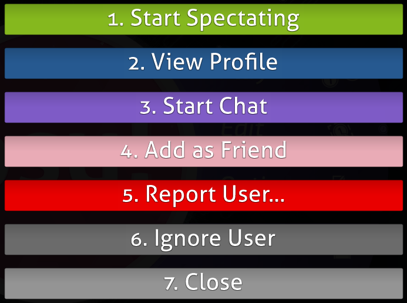

# Signaler un mauvais comportement

osu! a [une équipe de modérateurs](/wiki/People/The_Team/Global_Moderation_Team) qui s'efforce de garder le jeu et son écosystème propres et sûrs. Si vous constatez un comportement contraire aux règles ou un contenu inapproprié, signalez-le en utilisant l'une des méthodes décrites ci-dessous. Vous pouvez également contacter directement l'un des modérateurs en ligne si votre report n'a pas été traité correctement dans un délai raisonnable, mais uniquement en dernier recours.

Les reports accidentels sont ignorés. Les utilisateurs qui envoient délibérément des reports non valides risquent d'être [réduits au silence](/wiki/Silence).

## Cas particuliers

| Nature de l'infraction | Point de contact |
| :-- | :-- |
| Messages privés offensants | **Aucun** : [ignorez l'utilisateur](/wiki/Chat_Console#la-liste-des-commandes). Pour un effet permanent, utilisez la liste d'ignorés du jeu située dans les [options](/wiki/Options). |
| Infractions liées au modding et/ou au mapping | NAT, via le site web [NAT/BN Management](https://bn.mappersguild.com/reports) |
| Comportement inapproprié d'un membre de la [NAT](/wiki/People/The_Team/Nomination_Assessment_Team) ou de la [GMT](/wiki/People/The_Team/Global_Moderation_Team). | L'[équipe de support aux comptes](/wiki/People/The_Team/Account_support_team) à [support@ppy.sh](mailto:support@ppy.sh) |
| Abus sexuel ou mauvais comportement extrême | Voir [Signaler un abus](/wiki/Reporting_Bad_Behaviour/Abuse) |

Pour tout le reste, voir les instructions ci-dessous.

## Tchat en jeu

### La commande !report


La mauvaise conduite dans les tchats est l'infraction la plus courante. Pour la signaler, utilisez la commande [`!report`](https://osu.ppy.sh/community/forums/topics/34843), de préférence dans le canal où l'infraction a eu lieu. **Ne vous sentez pas stressé** : si votre message commence par `!report` et un espace, **il n'est visible que par les modérateurs** et par personne d'autre dans le tchat. Vous pouvez également utiliser la fonction de report via la [superposition dans le jeu](#superposition-en-jeu) comme illustré ci-dessous si vous êtes toujours inquiet.

La syntaxe de la commande a deux formes :

```
!report username
!report username (une description libre suit)
```

S'il y a des espaces dans le nom d'utilisateur, remplacez-les par des caractères de soulignement :

```
!report bad_user spam dans #osu
```

### Superposition en jeu




Cette option fonctionne si l'utilisateur fautif est en vue :

1. Cliquez sur leur nom d'utilisateur et appuyez sur le bouton rouge intitulé `Signaler l'utilisateur...`.
2. Sélectionnez la catégorie et ajoutez des détails (facultatif).

## Site web

### Page de profil


1. Appuyez sur le bouton avec trois points verticaux et sélectionnez `Signaler`.
2. Sélectionnez la catégorie et ajoutez des détails (facultatif).

### Forum


1. Passez le curseur sur le message.
2. Dans une rangée de boutons qui apparaissent dans le coin supérieur droit du message, cliquez sur le bouton avec un signe d'avertissement.
3. Sélectionnez la catégorie et ajoutez des détails (facultatif).

### Section commentaire


1. Sous le commentaire, cliquez sur le lien `signaler`.
2. Sélectionnez la catégorie et ajoutez des détails (facultatif).

### Beatmap


1. Appuyez sur le bouton avec trois points verticaux et sélectionnez `Signaler`.
2. Sélectionnez la catégorie et ajoutez des détails (facultatif).

### Beatmap discussion


1. Sous le message de discussion, cliquez sur le lien `signaler`.
2. Sélectionnez la catégorie et ajoutez des détails (facultatif).

### Liste des scores


#### Profil de l'utilisateur

1. Faites défiler jusqu'à la section `Classements`, ou `Historique` pour les parties récentes, et localisez le score.
2. Sur le côté droit du score, appuyez sur le bouton avec trois points verticaux et sélectionnez `Signaler le score`.
3. Sélectionnez la catégorie et ajoutez des détails (facultatif).

#### Liste des scores d'une beatmap


1. Passez le curseur sur le score.
2. Sur le côté droit du score, appuyez sur le bouton avec trois points verticaux et sélectionnez `Signaler le score`.
3. Sélectionnez la catégorie et ajoutez des détails (facultatif).
