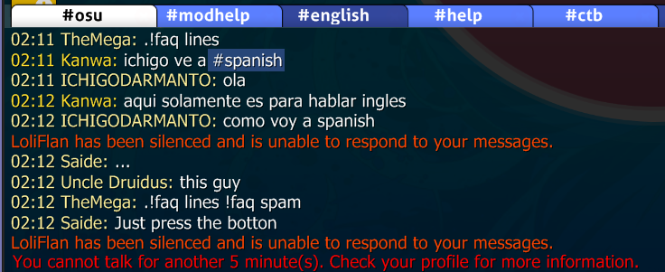

# Silencio

**Silencio** es el término usado para describir el castigo de limitar los medios de comunicación de un usuario dentro de la comunidad de osu!. Los miembros del [Global Moderation Team](/wiki/People/Global_Moderation_Team) y del [Nomination Assessment Team](/wiki/People/Nomination_Assessment_Team) suelen dar estos silencios para mantener un ambiente limpio, tanto en el sitio web como en el juego.

## Limitaciones

::: Infobox

:::

Un usuario que tiene un silencio activo no puede hacer lo siguiente:

- Usar el [chat](/wiki/Client/Interface/Chat_console) en línea (público y privado), tanto en el juego como en el sitio web.
- Publicar en cualquiera de los foros de osu!.
- Publicar comentarios en cualquier parte del sitio web (beatmaps, registro de cambios, noticias).
- Participar en las [discusiones de beatmaps](/wiki/Beatmap_discussion).
- Editar los detalles del perfil, cambiar el avatar, la portada y la página de usuario.
- Enviar y actualizar beatmaps.
- Participar en partidas [multijugador](/wiki/Client/Interface/Multiplayer).

::: Infobox

:::

Una vez que se aplique un silencio a un usuario, se eliminarán todos sus mensajes en el chat y se mostrará una alerta en el lugar del campo de entrada del chat con la duración del silencio activo.[^chat-cleanup]

## Duraciones

La duración de un silencio comienza con 5 minutos y generalmente se duplica por cada infracción posterior, hasta un máximo de 28 días, pero la duración inicial puede variar dependiendo de la infracción cometida y de los antecedentes del usuario. Los factores que se tienen en cuenta para determinar la duración de un silencio son los siguientes:

- **Atmósfera:** El estado actual del entorno del chat.
- **Frecuencia:** Repetitividad, sin tener en cuenta los silencios previos dados.
- **Historial:** Registros de infracciones anteriores.
- **Gravedad:** La gravedad de la infracción cometida.

En algunos casos, los usuarios pueden recibir una última advertencia antes de que se les imponga una [restricción de la cuenta](/wiki/Help_centre/Account_restrictions), ofreciéndoles la oportunidad de poner fin a la conducta infractora.

## Razones comunes de los silencios

Algunas razones comunes por las que los usuarios son silenciados en el chat público incluyen, pero no se limitan a:

- **Varios mensajes sin sentido a la vez o escribir en varias líneas:** Se explica por sí mismo.
- **ABUSO DE LAS MAYÚSCULAS:** CHATEAR CON TODAS LAS LETRAS EN MAYÚSCULAS.
- **Conductas/conversaciones inapropiadas:** El chat público no es un lugar para discusiones que no sean apropiadas para todas las edades, ni para temas subidos de tono.
- **Racismo:** Discriminación u odio por motivos de raza, religión, sexo, orientación sexual, etc.
- **Publicidad:** Promoción de productos o servicios. Esto incluye enlaces de invitación a Discord y enlaces de transmisiones como Twitch y YouTube.
- **Contenido no deseado:** Sitios web que contengan piratería, screamers, referidos y similares.

También se pueden dar silencios a los usuarios por otras razones, tales como (pero no limitadas a):

- **Envío inapropiado de un beatmap:** Los detalles como los metadatos, las etiquetas, los nombres de las dificultades y las imágenes de fondo.
- **Conducta inapropiada:** En lugares como los foros, discusiones y comentarios de los beatmaps.
- **Perfil inapropiado:** Contenido como los avatares, las portadas y los detalles del perfil.

## Apelar un silencio

Si bien los silencios se aplican para mantener un entorno positivo en la comunidad, pueden producirse errores. Si crees que el silencio que se te ha dado es un error o está injustificado, ponte en contacto con el [equipo de soporte de cuentas](/wiki/People/Account_support_team#accounts@ppy.sh) en [accounts@ppy.sh](mailto:accounts@ppy.sh) y explícales la situación.

Ten en cuenta que debes usar la dirección de correo electrónico asociada a tu cuenta de osu! y mencionar tu nombre de usuario para confirmar que eres tú.

## Referencias

[^chat-cleanup]: [Publicación del blog de ppy (17/12/2012) «This Week in osu!»](https://blog.ppy.sh/post/38114063519/this-week-in-osu-5)
