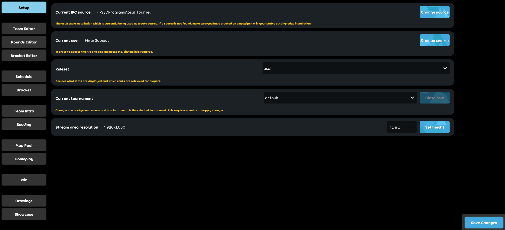

# Cliente para torneos de osu!

El **cliente para torneos de osu!** es el cliente oficial que se superpone a [osu!tourney](/wiki/osu!_tournament_client/osu!tourney) con escenas suplementarias e información relevante para un torneo de osu! durante una transmisión en vivo.

Los usuarios que tengan problemas con el cliente pueden [crear un problema en GitHub](https://github.com/ppy/osu/issues) o enviar un correo electrónico a [tournaments@ppy.sh](mailto:tournaments@ppy.sh).

## Configuración

Para iniciar el cliente, necesitas especificar un argumento de lanzamiento al ejecutable de [osu!(lazer)](/wiki/Client/Release_stream/Lazer). Para hacer esto, crea un nuevo acceso directo en el escritorio y establece su ubicación en `%LOCALAPPDATA%/osulazer/osu!.exe --tournament`. Esto hará que ese acceso directo específico inicie osu!(lazer) en el modo del cliente para torneos.

Dado que el cliente para torneos es solo una superposición para osu!tourney, también habrá que configurarlo. Establece el canal de lanzamiento de osu!tourney en `Cutting Edge (Experimental)` y crea un archivo vacío llamado `ipc.txt` dentro de la carpeta de instalación de osu!tourney. Después de eso, sigue la [guía de configuración de osu!tourney](/wiki/osu!_tournament_client/osu!tourney/Setup).

Abre el cliente para torneos de osu! y verás esta pantalla de configuración:

- Asegúrate de que `Current IPC source` coincida con la ubicación de la instancia de osu!tourney que usarás.
- Inicia sesión en osu!(lazer) haciendo clic en `Change Login`.
- Establece el conjunto de reglas correcto usando el menú desplegable.
- Cambia la altura para que coincida con el parámetro `Height` establecido en el archivo `tournament.cfg` de osu!tourney.

## Gestión de torneos

Las configuraciones de torneos para [osu!(lazer)](/wiki/Client/Release_stream/Lazer) se almacenan en `%APPDATA%/osu/tournaments`. Al iniciar el cliente por primera vez, se crea un directorio llamado `default` dentro de esta carpeta. Un usuario puede mantener múltiples configuraciones de torneos y cambiar entre ellas según sea necesario para aplicar las personalizaciones adecuadas.

Para crear una nueva configuración para un torneo, crea un nuevo directorio en el directorio `tournaments` con el nombre de tu torneo.

Dentro de la configuración de un torneo, se pueden proporcionar los recursos necesarios para mostrar banderas, vídeos e iconos de mods para la mappool. Cada categoría de los recursos tiene su propia carpeta:

- tu-torneo
  - Banderas
  - Mods
  - Vídeos

## Personalización

El cliente para torneos de osu! puede personalizarse añadiéndole banderas personalizadas, iconos de mods y archivos de vídeo. Estos se mostrarán en las escenas respectivas según sea necesario.

### Banderas

Por defecto, el cliente para torneos de osu! proporciona banderas incorporadas para los países del mundo. Se puede hacer referencia a estos mediante sus [códigos de país ISO 3166 Alpha-2](https://www.iso.org/iso-3166-country-codes.html) en el editor de equipos.

Para banderas personalizadas, se aceptan archivos `.jpg` y `.png`. Las imágenes de las banderas deben tener al menos 140 x 94 y mantener una relación de aspecto cercana a esta especificación para obtener mejores resultados.

Las banderas deben colocarse en `<tu-torneo>/Flags`. Luego, se puede hacer referencia a las banderas en el editor de equipos por sus nombres de archivo sin la extensión del archivo.

### Mods

Para iconos de mods personalizados, se aceptan archivos `.jpg` y `.png`. La resolución puede ser cualquier cosa y el cliente la ajustará en el panel del beatmap. Como referencia, un panel de un beatmap a 1920x1080 equivale a 563x60 píxeles.

Los iconos de los mods deben colocarse en `<tu-torneo>/Mods`. Luego, se puede hacer referencia a los mods por sus nombres de archivo sin la extensión del archivo en el editor de rondas y en el editor de resultados de la semilla.

### Vídeos

Se pueden mostrar vídeos en bucle en el fondo de cada escena.

Nota: El cliente decodifica archivos de vídeo mediante decodificación de software, así que, dependiendo del escenario que se use, el rendimiento puede variar.

Los archivos deben cumplir con las siguientes especificaciones:

- Relación de aspecto de 16:9, por ejemplo 1280x720 o 1920x1080
- Extensión de archivo `mp4`, `m4v` o `avi`
- Códec de vídeo: H.264, Códec de audio: ninguno

Los archivos de vídeo deben colocarse en `<tu-torneo>/Videos` y se requieren nombres específicos para la funcionalidad correcta.

| Escena | Archivo(s) |
| :-- | :-- |
| Calendario | `schedule` |
| Introducción de los equipos | `teamintro` |
| Clasificación de grupos | `seeding` |
| MapPool | `mappool` |
| En una partida | `gameplay` |
| Pantalla de resultados | `teamwin-red`, `teamwin-blue` |
| Sorteo de los equipos | `main` |
| Presentación | `showcase` |
