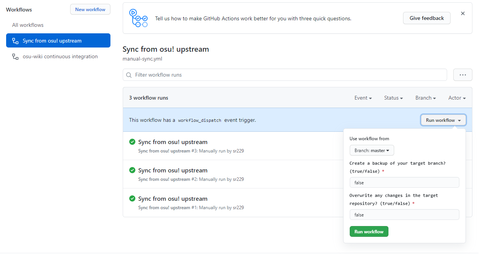

# Best practices

This page covers tasks and chores that you may face while contributing. The approaches mentioned here are designed to make the process easier and may be applied to other projects hosted on GitHub or similar platforms.

## Introduction

**Git** is a version control system which helps manage changes to files. The osu! wiki's data and history of changes are stored in a Git repository. **GitHub** is a platform for development that provides a web interface for Git repositories and offers a set of tools for project management.

## Syncing the fork

In order to make changes to a repository located on GitHub, a potential contributor needs to obtain a controlled copy of it called a *fork*. When you create your fork of the `osu-wiki` repo, you take a snapshot of its contents at this very moment. To make a meaningful contribution, **always sync your fork** before making a set of changes—this can be done directly from GitHub:

1. Go to your fork of the `osu-wiki` repo.
2. Select the `master` branch from the dropdown.
3. Click `Fetch upstream`, and select `Fetch and merge`.

Now your branch is up-to-date with the original repository.

---

This solution works fine in most cases, although the feature itself has limited capabilities. For example, it doesn't allow you to overwrite any unwanted changes on the branch, as it only merges the upstream `master` branch.

If you encountered any problems while using the GitHub tool or you want to overwrite your branch's contents, you can use the workflow written by the osu! wiki contributors.

1. Open **your fork** and go to the `Actions` tab.
2. In `Workflows`, look for `Sync from osu! upstream`.
3. Click `Run workflow` and fill in the options:

- **Use workflow from**: name of the branch you want to sync. By default, it is set to `master`.
- **Overwrite any changes in the target repository**:
  - `true`: replace the contents of your branch with a clean copy of the `master` branch from `ppy/osu-wiki`.
  - `false` (default): merge your changes with the ones on `ppy/osu-wiki`.
- **Create a backup of your target branch**:
  - `true`:  make a branch called `backup-{name of your branch}` before changing it.
  - `false` (default): do not make any backups.

4. Click the `Run Workflow` button and wait for the workflow to complete. If you're curious about how the tool works, click on the `Sync from osu! upstream` workflow task.

## Making edits

Within your fork of the osu! wiki, you are free to make any changes and save them. **Commits** are individual "save points" of the repository. **Branches** are workspaces, which let you switch between multiple versions of the repository. To make your workflow easier and keep the history of the wiki clean and free from noise, follow these guidelines:

- [Sync the `master` branch](#syncing-the-fork).
- Always start the work by creating a new branch off `master`, and only keep your changes in there. Give it a meaningful name, such as `update-staff-log`.<!-- https://www.atlassian.com/git/tutorials/comparing-workflows/forking-workflow is the explanation, but it doesn't really fit in here -->
- Commit your work when you've made reasonably sized changes. It's better to commit an article as a whole rather than 10 small edits.
- **Use short and meaningful commit messages**, as they let others know what's in the box. Something like `Rewrite the section about jump patterns` says a lot more than `Update en.md`.

## Opening a pull request

A pull request shows other people how your edits will affect the files. Add some information to your pull request to explain your intentions:

- `Title`: a very short descriptive title for your changes in English, together with the article's name. In case of a translation, start with the two-letter language name of your translations in brackets. Examples:
  - ``[FR] Add `BBCode` ``
  - ``Update `Beatmapping` and `Beatmap/Difficulty` ``
- `Description`: anything you want to signal to the maintainers and other potential reviewers. Examples:
  - A short summary of the changes, especially if they affect several articles
  - The pull request's completeness, or ideas related to it
  - [Automatic resolution of relevant issues](https://docs.github.com/en/issues/tracking-your-work-with-issues/linking-a-pull-request-to-an-issue)
- Make sure to tick the `Allow edits from maintainers` checkbox—it will allow the wiki maintainers to help you improve the pull request when necessary

## Resolving conflicts

There are two reasons for why a conflict could have happened:

- You edited a file when your branch was out of date.
- There was poor communication between you and another person, so you two were editing the same article but that person's changes were merged before yours (causing your edited files to become out of date).

Depending on the severity of the conflicts, you have two options on how to fix this:

1. If your pull request has the `Resolve conflicts` button, click on that. This will open a slightly different version of the web editor.
   1. GitHub will highlight the conflicting areas. Find one of them.
   2. Everything from `<<<<<<<` to the `=======` is your changes, whereas everything from `=======` to `>>>>>>> master` is what's in the `ppy/master` branch.
   3. From here, you will need to manually fix the conflict and delete the lines with the `<<<<<<<`, `=======`, and `>>>>>>> master` markings.
   4. Repeat the process for all conflicts.
   5. When completed, click `Mark as resolved` (this is only available when all conflicting parts of the file are resolved).
2. If the `Resolve conflicts` button is blocked due to the conflicts being too complicated for GitHub, you are out of luck and will need to [update your branch](#syncing-the-fork) and make your changes again.
   - *Note: This is only true if you are limited to using the GitHub web interface.* There are still ways to fix it, but they don't belong to the scope of this article. Moreover, it is probably not worth the effort to do so, because you will overwrite and revert the conflicting changes.
