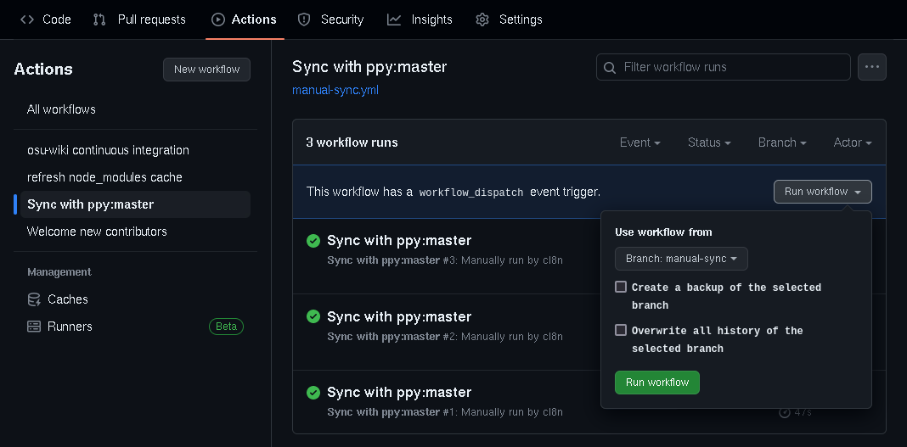
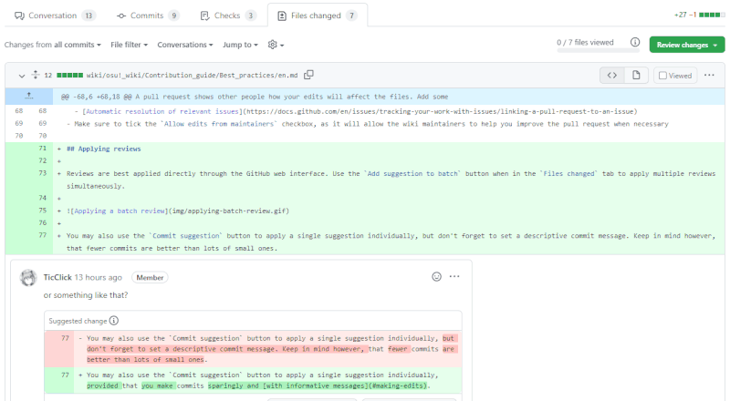

# Các gợi ý để làm công việc của bạn tốt hơn

Bài viết này sẽ nói về một số khó khăn có thể bạn sẽ gặp phải khi đang làm việc. Các phương pháp được đề cập ở đây làm cho công việc dễ dàng hơn và có thể được áp dụng cho các dự án khác được quản lý trên GitHub hoặc các phương tiện tương tự.

## Mở đầu

*Để biết thêm thông tin về Git và GitHub, hãy xem [Tài liệu GitHub](https://docs.github.com).*

**Git** là một máy chủ điều khiển các phiên bản giúp quản lý các thay đổi của các tập tin. Dữ liệu và lịch sử thay đổi của osu! wiki được chứa trong một kho (repository) Git. **GitHub** là một phương tiện cho việc lập trình, đóng vai trò cung cấp giao diện web cho repository Git và tạo ra một bộ công cụ để quản lý các dự án.

## Đồng bộ fork

Để thay đổi nội dung trong một  ở GitHub, một người đóng góp tiềm năng phải có một bản sao repository, được gọi là một "fork". Khi bạn tạo fork từ repo `osu-wiki` cho riêng mình, bạn đang nắm trong tay tất cả nội dung của nó tại thời điểm đó. Để làm việc hiệu quả, **luôn luôn đồng bộ fork** trước khi chỉnh sửa thêm — điều này có thể được làm trực tiếp qua GitHub:

1. Đi tới fork của bạn từ repository `osu-wiki`.

2. Chọn nhánh (branch) `master` từ .

3. Bấm `Fetch upstream`, và chọn `Fetch and merge`.

   

Bây giờ các tài liệu trong branch sẽ giống repository gốc.

---

Giải pháp này hoạt động được ở hầu hết các trường hợp, mặc dù khả năng của tính năng này cũng có hạn. Ví dụ, nó không cho phép bạn ghi đè những thay đổi không mong muốn trên branch, mà nó chỉ hợp nhất từ  `master` branch.

Nếu bạn gặp vấn đề khi đang sử dụng công cụ GitHub hoặc bạn muốn ghi đè lên nội dung trong branch của bạn, bạn có thể sử dụng workflow (luồng công việc) viết bởi những người đóng góp cho osu! wiki.

1. Mở **fork của bạn** và đi tới thẻ `Actions`.
2. Ở thanh bên trái, tìm `Sync with ppy:master`.
3. Nhấn `Run workflow` và điền vào các thiết lập:

- **Use workflow from**: Branch đích bạn muốn đồng bộ. Mặc định sẽ là `master`.
- **Create a backup of the selected branch**: Tạo một bản sao của branch đích tại `{branch name}-backup` trên fork của bạn trước khi thử cập nhật nó.
- **Overwrite all history of the selected branch**: Thay thế branch đích bằng `ppy:master`, loại bỏ tất cả commit khác. Mặc định, `ppy:master` sẽ được merge vào branch đích.

4. Nhấn nút `Run Workflow` và chờ nó hoàn thành. Nếu bạn tò mò xem công cụ này hoạt động ra sao, nhấn vào `Sync with ppy:master`.

## Chỉnh sửa

*Xem thêm: [Forking Workflow | Hướng dẫn Atlassian Git](https://www.atlassian.com/git/tutorials/comparing-workflows/forking-workflow)*

Trong phạm vi bản fork của bạn, bạn có thể tuỳ ý chỉnh sửa và lưu chúng. **Commits** là từng "phiên bản" của repo. **Branches** là không gian làm việc, bạn có thể chuyển đổi các phiên bản của repo. Để làm quá trình làm việc dễ dàng hơn và đảm bảo lịch sử sửa đổi của wiki sạch sẽ và không lộn xộn, lưu ý các điều sau:

- [Đồng bộ branch `master`](#đồng-bộ-fork).
- Luôn luôn bắt đầu công việc bằng cách tạo branch từ `master`, và bạn chỉ giữ những thay đổi ở đây. Hãy cho branch một cái tên có nghĩa, như `update-staff-log`.
- Lưu công việc (commit changes) khi bạn đã làm đủ một lượng thay đổi hợp lý. Lưu cả một bài viết sẽ tốt hơn lưu 10 lần chỉnh sửa nhỏ.
- **Viết câu nhận xét ngắn và có ý nghĩa về công việc** để làm mọi người biết bên trong có gì. Ví dụ như `Rewrite the section about jump patterns` có ý nghĩa hơn `Update vi.md`.

## Mở một pull request

Một pull request cho người khác biết chỉnh sửa của bạn có kết quả tới dữ liệu như thế nào. Thêm một số thông tin sau vào pull request để giải thích mục đích của bạn:

- `Title`: một câu ngắn gọn có thể mô tả sự thay đổi của bạn bằng tiếng Anh cùng với tên của bài viết. Trong trường hợp dịch thuật, hãy bắt đầu với tên viết tắt của ngôn ngữ bạn dịch trong dấu ngoặc. Ví dụ:
  - ``[VI] Add `BBCode` ``
  - ``Update `Beatmapping` and `Beatmap/Difficulty` ``
- `Description`: mọi thứ bạn muốn truyền tải đến người quản lý và những người nhận xét. Ví dụ:
  - Tóm tắt nhanh sự thay đổi, đặc biệt nếu nó ảnh hưởng đến nhiều bài viết
  - Sự hoàn thiện của pull request, hoặc ý tưởng liên quan tới nó
  - [Tự động đóng issue/pull request](https://docs.github.com/en/issues/tracking-your-work-with-issues/linking-a-pull-request-to-an-issue)
- Hãy nhớ chọn `Allow edits from maintainers`, nó cho phép những người quản lý wiki giúp bạn cải thiện pull request nếu cần thiết.

## Chỉnh sửa theo đánh giá

Cách tốt nhất để sửa theo đánh giá là qua giao diện web của GitHub. Bấm `Add suggestion to batch` khi trong tab `Files changed` để sửa theo nhiều đánh giá cùng một lúc.

Bạn có thể bấm `Commit suggestion` để sửa từng gợi ý một, miễn là bạn commit với số lượng ít và [với lời nhắn có nghĩa](#chỉnh-sửa).

Sử dụng các tính năng sẽ tự động đánh dấu là đã xử lý. Khi sửa theo đánh giá bằng tay (ví dụ khi người đánh giá không thêm một gợi ý trực tiếp), hãy nhớ đánh dấu là đã xử lý *sau khi thực hiện thay đổi* để tránh quên bất cứ thứ gì. Để GitHub tự động sửa theo đánh giá được ưu tiên hơn hơn vì nó bảo đảm các gợi ý được sửa đúng cách và tránh lỗi sao chép bằng tay.

## Giải quyết xung đột (conflict)

Có hai lý do khiến việc này xảy ra:

- Bạn sửa một tệp khi branch của bạn bị lỗi thời.
- Không có sự giao tiếp giữa bạn và một người khác, nên cả hai đã cùng sửa một nội dung, nhưng các thay đổi của họ được merge trước khiến các tệp bạn sửa đổi bị lỗi thời.

Tuỳ vào mức độ nghiêm trọng của các conflict, bạn có hai lựa chọn để khắc phục:

1. Nếu pull request của bạn có nút `Resolve conflicts`, nhấn vào đó. Trình duyệt sẽ mở ra một phiên bản hơi khác của trình soạn thảo trên web.
   1. GitHub sẽ đánh dấu những chỗ khác nhau. Tìm một trong số chúng.
   2. Mọi thứ từ `<<<<<<<` đến `=======` là những thay đổi của bạn, còn mọi thứ từ `=======` đến `>>>>>>> master` là thứ đang có ở branch `ppy/master`.
   3. Từ đây, sửa các conflict thủ công và xoá những dòng có đánh dấu `<<<<<<<`, `=======`, và `>>>>>>> master`.
   4. Lặp lại quá trình trên với mọi conflict.
   5. Khi hoàn thành, nhấn `Mark as resolved` (bạn chỉ có thể làm điều này khi mọi phần conflict trong tệp đã được xử lý).
2. Nếu nút `Resolve conflicts` bị khoá vì nó quá phức tạp đối với GitHub, bạn đã gặp xui xẻo nen cần phải [cập nhật branch của bạn](#đồng-bộ-fork) và thực hiện lại các thay đổi của bạn.
   - *Chú ý: Điều này chỉ đúng khi bạn làm việc giới hạn ở giao diện Web GitHub.*  Vẫn còn nhiều cách khác để sửa, nhưng chúng không nằm trong phạm vi của bài viết này. Hơn nữa, nó không đáng, bởi vì đằng nào bạn cũng sẽ phải ghi đè và hoàn tác lại các thay đổi bị conflict.
