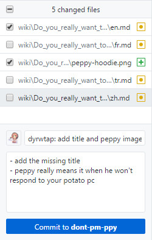

# GitHub Desktop

*Este artículo es la continuación de [la página principal](/wiki/osu!_wiki/Contribution_guide)* y asume que usará [GitHub Desktop](https://desktop.github.com). **Puede usar otros clientes de Git en sus propios términos.** Incluso si trabaja localmente, aún necesitará acceder a GitHub para crear solicitudes de cambios para que se realicen los cambios.

## Instalar GitHub Desktop

1. Instale [GitHub Desktop](https://desktop.github.com) si aún no lo tiene instalado.
2. Cuando se complete la instalación, GitHub Desktop le pedirá que inicie sesión, haga clic en `Sign in to GitHub.com`.
3. Complete las indicaciones tal como aparecen.
4. Continua a [Clonar](#clonar).

## Clonar

1. Haga clic en `Clone a repository`.

2. Esto mostrará una lista de sus repositorios; seleccione el repositorio `osu-wiki`.

3. Seleccione la ubicación de la clonación. No importa dónde clone el repositorio, solo recuerde dónde lo clonó.

   

4. Haga clic en `Clone`. Esto puede tomar un tiempo dependiendo de su entorno de red.

5. Continua a [Ramifición](#ramifición).

## Ramifición

Si bien la ramificación es técnicamente opcional, es [muy recomendable por un par de razones](https://www.atlassian.com/git/tutorials/comparing-workflows/forking-workflow). Por nombrar algunas:

- Las ramas aíslan diferentes cambios lógicos entre sí: puede trabajar en más de un artículo y revisarlos y fusionarlos por separado.
- Cuando sus cambios están fuera de la rama `master`, puede [sincronizarlos de forma segura](/wiki/osu!_wiki/Contribution_guide/Best_practices#syncing-the-fork) sin conflictos de fusión.

1. Haga clic en el menú desplegable `Current branch` ubicado en la parte superior del menú.

2. Introduzca el nombre de la rama. Se sugiere utilizar el resumen de sus cambios como nombre de la rama. Por ejemplo, editar el artículo `Foros` puede resultar en que la rama se llame `update-forums`.

   

3. Continua a [Edición](#edición).

## Edición

1. En la carpeta en la que clonó el repositorio, navegue hasta el archivo que desea editar. Los artículos están organizados por los nombres de las carpetas que son los nombres de los artículos y los archivos `.md` que son las traducciones.
2. Una vez que encuentre el archivo correcto, ábralo con su editor de texto favorito.
3. Ahora puede hacer sus cambios. Tómese un momento para pasar también por el [autocontrol](/wiki/osu!_wiki/Contribution_guide#self-check).
4. Continua a [Creando commits y enviando](#creando-commits-y-enviando).

### Mover archivos existentes

1. Use el Explorador de Windows para mover archivos.
2. Continua a [Creando commits y enviando](#creando-commits-y-enviando).

### Crear nuevos archivos

*Precaución: si va a crear archivos de artículos con el Explorador de Windows, asegúrese de que la opción `Extensiones de nombre de archivo` esté habilitada.* Véase [Extensiones de nombre de archivo comunes en Windows](https://support.microsoft.com/es-es/windows/extensiones-de-nombre-de-archivo-comunes-en-windows-da4a4430-8e76-89c5-59f7-1cdbbc75cb01) para obtener instrucciones.

1. Use Explorador de Windows, su editor de imágenes favorito y/o su editor de texto favorito para crear nuevos archivos. Si está creando nuevos artículos o traducciones, cambie el nombre del archivo para que siga las [configuraciones regionales en los criterios de estilo del artículo](/wiki/Article_styling_criteria/Formatting#locales).
2. Continua a [Creando commits y enviando](#creando-commits-y-enviando).

### Eliminar archivos

1. Use el Explorador de Windows para eliminar archivos.
2. Continua a [Creando commits y enviando](#creando-commits-y-enviando).

## Creando commits y enviando

1. Vuelva a GitHub Desktop. Debería verse algo similar a esto:

  

2. De manera predeterminada, GitHub Desktop seleccionará automáticamente todos sus cambios.
3. Es mejor separar cada acción «grande» como un solo commit.

Por ejemplo, como se muestra arriba, [pippi](/wiki/Mascots#pippi) agregó una imagen, modificó el archivo `en.md` para agregar un título y un enlace a la imagen, y marcó las traducciones como obsoletas. A partir de esto, podemos tener dos commits, una para los cambios que afectaron el archivo `en.md` y otra para marcar las traducciones como obsoletas.

4. Seleccione los archivos que se van a añadir al commit.
5. Escriba un resumen para el commit. Esto tiene un límite de 72 caracteres y **debe estar en inglés**.
6. Escriba una descripción. Esto es opcional, no tiene límite de caracteres y puede estar en cualquier idioma.

   

7. Haga clic en el botón azul `Commit to` y, si corresponde, reinicie desde el paso 4 para realizar los otros commits que desea realizar.

   

8. Una vez que haya terminado de hacer sus commits, haga clic en el botón `Publish branch` en la parte superior.

   

9. Continue a [Revisión](/wiki/osu!_wiki/Contribution_guide#revisión) para obtener la última información sobre su solicitud de cambios y cambios.
