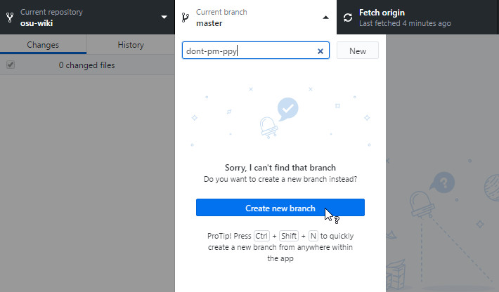

# GitHub 桌面客户端

*这篇文章是[父页面](/wiki/osu!_wiki/Contribution_guide)内容的后续*，并假设你要使用 [GitHub 桌面客户端](https://desktop.github.com)。**你也可以使用其他 git 客户端。** 即使你在本地工作，你仍然需要访问 GitHub 来开 Pull Requests，使你的修改生效。

## 安装 GitHub Desktop

1. 如果你还没有安装 GitHub Desktop，请先[安装](https://desktop.github.com)。
2. 当安装完成后，GitHub Desktop 会提示你登录，点击 `Sign into GitHub.com`。
3. 填写出现的字段。
4. 下一步：[克隆](#克隆)。

## 克隆

1. 点击 `Clone a repository`。

2. 这里会列出你的仓库；选择 `osu-wiki` 仓库。

3. 选择克隆的位置。克隆到哪里都可以，只需记住位置即可。

   

4. 点击 `Clone`。耐心等待一会儿，克隆时间取决于你的网络状况。

5. 下一步：[创建分支](#创建分支)。

## 创建分支

创建分支在技术上是可选的，但[出于一些原因](https://www.atlassian.com/git/tutorials/comparing-workflows/forking-workflow)高度建议你这么做，其中几点如下：

- 分支会将逻辑上不同的更改隔离开来：你可以同时处理多篇文章，它们可以分开接受审查与合并。
- 当你的更改不在 `master` 分支上时，你可以[安全进行同步](/wiki/osu!_wiki/Contribution_guide/Best_practices#同步分支-(fork))，不会出现合并冲突。

1. 点击菜单顶部的 `Current branch` 下拉菜单。

2. 输入分支名，建议使用你所做更改的概要信息。比如，如果你在编辑 `Forums` 文章，分支名就可以取作 `update-forums`。

   

3. 下一步：[编辑](#编辑)。

## 编辑

1. 在你的克隆仓库所在文件夹中，找到想要修改的文件。所有文章使用文件夹组织，其中文件夹名是文章名，`.md` 文件名则标明了语言。
2. 当你找到文件后，用你最喜欢的文本编辑器打开它。
3. 现在可以修改该文件了。你也要花点时间[自查一下](/wiki/osu!_wiki/Contribution_guide#自我检查)。
4. 下一步：[提交和推送](#提交和推送)。

### 移动已有文件

1. 使用 Windows 资源管理器移动文件。
2. 下一步：[提交和推送](#提交和推送)。

### 创建新文件

*注意：如果你想要用 Windows 资源管理器创建新文件，请确认 `文件扩展名` 选项已勾选。* 更多介绍：[如何显示或隐藏文件扩展名](https://support.microsoft.com/zh-cn/help/865219/how-to-show-or-hide-file-name-extensions-in-windows-explorer)。

1. 使用 Windows 资源管理器，你的图片编辑器，和你的文本编辑器创建新文件。如果你想要创建新文章或者添加新的文章翻译，文件命名请遵循[文章风格指南中的本地化要求](/wiki/Article_styling_criteria/Formatting#本地化语言)。
2. 下一步：[提交和推送](#提交和推送)。

### 删除文件

1. 使用 Windows 资源管理器删除文件。
2. 下一步：[提交和推送](#提交和推送)。

## 提交和推送

1. 回到 GitHub Desktop，看起来应该像这样：

  

2. 默认情况下，GitHub Desktop 会自动选择你的所有修改。

3. 最好把每一个“大”的修改作为一次提交。

   比如，如上图所示，[pippi](/wiki/Mascots#pippi) 已经添加了一个图片文件，修改了 `en.md` 文件（为图片添加标题和链接），并且将翻译标记为已过期。对于这种情况，我们可以进行两次提交，一次提交修改 `en.md` 文件，另一次标记过期翻译。

4. 选择将要提交的文件。

5. 输入提交概要。有 72 个字符的长度限制，并且**必须使用英文**。

6. 输入描述。这步是可选步骤，没有字数限制，可以使用任何语言。

   

7. 点击蓝色的 `Commit to` 按钮。提交成功后，如果你还有其他要提交的文件，回到第 4 步。

   

8. 完成提交后，点击最上面的 `Publish branch` 按钮。

   

9. 接下来，你可以继续阅读[审查](/wiki/osu!_wiki/Contribution_guide#审查)部分，获取与拉取请求和修改相关的信息。
