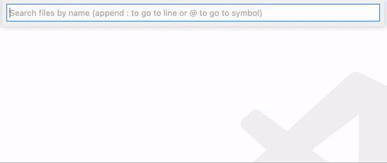

# Editor web de GitHub

*Nota: este artículo usa combinaciones de teclas de Windows.*\
*Véase también: [El editor basado en web de github.dev - Documentación de GitHub](https://docs.github.com/en/codespaces/the-githubdev-web-based-editor)*

[github.dev](https://github.dev) es una versión web disponible públicamente y adaptada a GitHub de [Visual Studio Code](https://code.visualstudio.com). En comparación con el propio editor web de GitHub, ofrece mucha más flexibilidad y control sobre el contenido del repositorio. github.dev es una forma recomendada de contribuir a la osu! wiki, especialmente mientras trabajas en varios artículos a la vez.

## Navegación

*Nota: Para trabajar con la osu! wiki, **[bifurca el repositorio `ppy/osu-wiki`](/wiki/osu!_wiki/Contribution_guide#editing-the-wiki).***

Para abrir la osu! wiki en el editor, reemplaza `github.com` en la URL de tu repositorio bifurcado por `github.dev`. Alternativamente, abre tu bifurcación en GitHub y presiona `.` (punto).

::: Infobox

:::

Si bien se puede acceder a todos los menús desde la interfaz del editor, la forma de navegación prevista es mediante la **paleta de comandos**:

- Presiona `F1` e ingresa el nombre de una configuración para abrir o una acción para realizar. Si no aparece nada, explora el menú desplegable (`≡`) en la esquina superior izquierda de la pantalla.
- Para abrir un archivo, presiona `Ctrl` + `P` e ingresa tu nombre.

## Ramificación

Después de haber leído [Prácticas recomendadas § Hacer cambios](/wiki/osu!_wiki/Contribution_guide/Best_practices#hacer-cambios), crea una nueva rama para almacenar tus cambios.

1. Haz clic en el nombre de la rama actual en la esquina inferior izquierda, o presiona `F1` y escribe `branch`.
   - Selecciona `Create new branch...`, ingresa el nombre de la rama y presiona `Entrar`.
   - Para ayudarte a recordar de qué se trata tu trabajo, elige un nombre descriptivo. Como ejemplo, para una traducción al español de [Beatmap Discussion](/wiki/Beatmap_discussion), podrías usar `es-modding-v2`.
2. Para volver a tus cambios, selecciona el nombre de la rama apropiada en el menú desplegable mencionado anteriormente.

## Edición

### Archivos existentes

1. Presiona `Ctrl` + `P` e ingresa el nombre del archivo que deseas abrir, luego presiona `Entrar`. Se admiten coincidencias flexibles: por ejemplo, al escribir `nominators veto en` aparecerá `wiki/People/The_Team/Beatmap_Nominators/Beatmap_Veto/en.md`.
2. Edita el archivo según sea necesario. Los cambios no confirmados se **almacenan en tu navegador** y puedes volver a ellos después de salir de `github.dev`.
3. Una vez que estés satisfecho con los artículos, [confirma los cambios](#confirmación-de-cambios).

### Nuevos artículos o traducciones

Los artículos se almacenan en carpetas con el texto original (`en.md`) y sus traducciones, que usan diferentes nombres de archivo basados ​​en los idiomas.

- Para agregar una nueva **traducción** para un artículo existente, haz clic derecho en su carpeta y crea un nuevo archivo `.md` usando [uno de los nombres de archivo admitidos](/wiki/Article_styling_criteria/Formatting#configuraciones-regionales).
- Para agregar un nuevo **artículo**, haz lo siguiente:
  - Crea una carpeta en una categoría adecuada siguiendo la [convención de nombres](/wiki/Article_styling_criteria/Formatting#estructura-de-carpetas-y-archivos). Si el artículo no pertenece a ningún lugar, crea su carpeta en el directorio `/wiki/`.
  - Agrega el archivo `en.md` con el texto del artículo a la nueva carpeta.

### Operaciones de archivos

- Abre el explorador de archivos integrado (`Ctrl` + `Mayús` + `E`).
- Mueve un archivo o directorio arrastrándolo. Mantén presionada la tecla `Ctrl` para seleccionar varios objetos.
- Para cambiar el nombre o eliminar archivos o directorios, usa el menú contextual o presiona `F2`.
- Para cargar un archivo, arrástralo a un lugar apropiado en el explorador de archivos.

## Confirmación de cambios

::: Infobox

:::

1. Abre la vista de control del código fuente (`Ctrl` + `Mayús` + `G`).
2. Haz clic en el botón `+` en los archivos que deseas guardar en un solo lote.
3. Ingresa el mensaje de confirmación en inglés. **Usa un mensaje de confirmación breve y significativo**, ya que permite que los demás sepan lo que hay en el cuadro.
4. Presiona `Ctrl` + `Entrar` o haz clic en el botón `✓` para confirmar y enviar tus cambios.

## ¿Qué sigue?

Cuando todo esté listo, usa [Prácticas recomendadas § Autocomprobación](/wiki/osu!_wiki/Contribution_guide#self-check) para revisar tus cambios. Después de eso, envía tus cambios para su revisión [abriendo una solicitud de cambios](/wiki/osu!_wiki/Contribution_guide#solicitudes-de-cambios) al repositorio `ppy/osu-wiki`.
